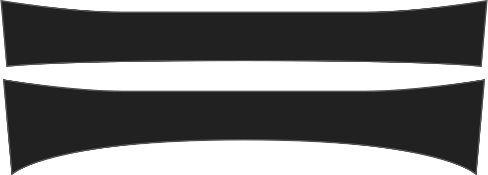

In hoeverre de kraag (aan de kant van de kraagstaander) gebogen is in plaats van recht.

<Note>

Dit beïnvloedt hoe de kraag tegen de kraagstaander ligt.

</Note>

## Effect of this option on the pattern
