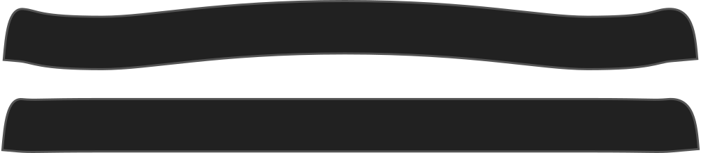

- - -
title: "Collar stand bend"
- - -

Wie sehr der Kragen in der Mitte steht, anstatt gerade zu sein. Dies beeinflusst die Halseinstellung um den Hals.

## Effekt dieser Option auf das Schnittmuster

