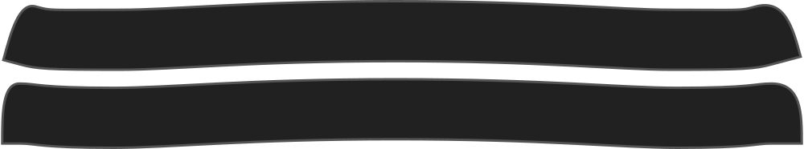
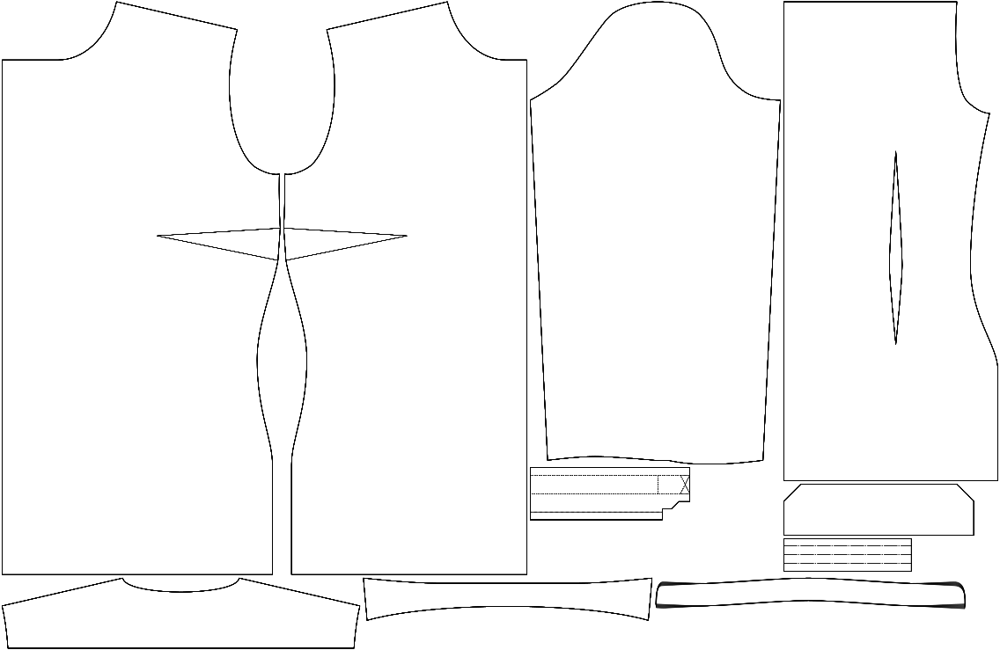

Hoeveel de kraagstaander omhoogbuigt aan de randen.

<Note>

Je kan dit aanpassen zodat de randen van je kraagstaander vooraan iets hoger staan of horizontaal.

</Note>

## Effect van deze optie op het patroon

