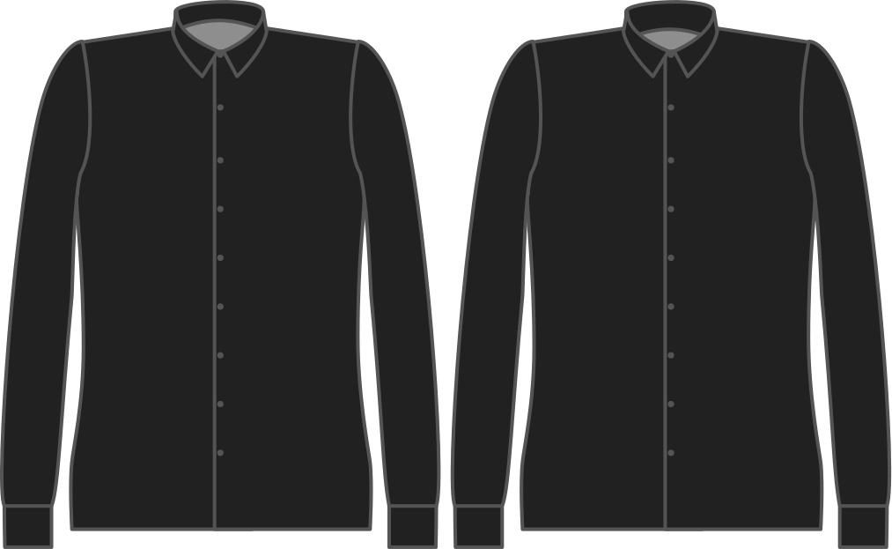

- - -
title: "Collar stand width"
- - -

Die Höhe Ihres Kragenständers.

<Note>

Dies ist der Hauptparameter um die Gesamthöhe des Kragens zu ändern. Dies wird auf einen modernen relativ schlanken Kragen abgestellt, aber man kann ihn bis zum Stil von Karl Lagerfeld hinaufschrauben.

</Note>

## Effekt dieser Option auf das Schnittmuster

