- - -
title: "Collar stand width"
- - -

La altura de tu soporte de cuello.

<Note>

Este es el parámetro principal para cambiar la altura total de su cuello. Esto por defecto es un cuello moderno, relativamente delgado, pero se puede aplicar hasta el estilo Karl Lagerfeld.

</Note>

## Efecto de esta opción en el patrón

