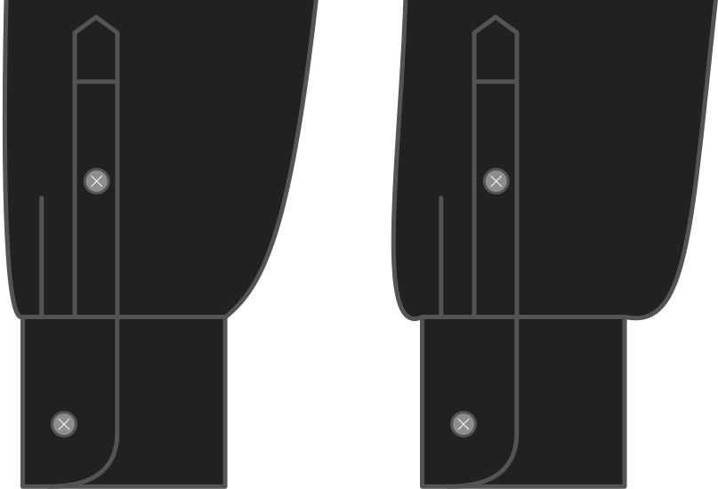

Hoeveel breder het uiteinde van de mouw is dan de polsomtrek.

<Note>

Dit verandert het uitzicht van de mouw een beetje.
More drape makes the sleeve wider and gives you a more _blousy_ effect, whereas less drape makes the sleeve more narrow.

Dit verschil wordt in de manchet verwerkt met plooien.

</Note>

## Effect van deze optie op het patroon

