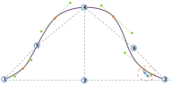

Cette option contrôle le décalage descendant dans le premier quadrant de la tête de manche.

<Tip>

Voir [comprendre la tête de manche](/docs/patterns/brian/options#understanding-the-sleevecap) pour une explication détaillée de la construction de la tête de manche et de l'influence des différentes options sur sa forme.

</Tip>

## Effet de cette option sur le motif

