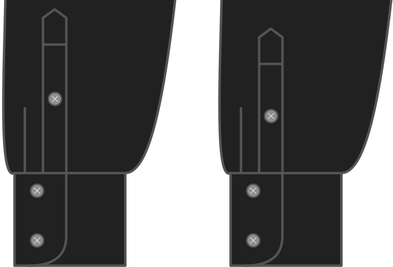

- - -
title: "Sleeve placket length"
- - -

¿Cuánto tiempo quieres que sea la placa de manga?

<Note>

Cuanto más larga sea la placa de manga, más fácil será salir de la camiseta.
También influye en cómo se verán las cosas cuando te despliegues

</Note>

## Efecto de esta opción en el patrón

