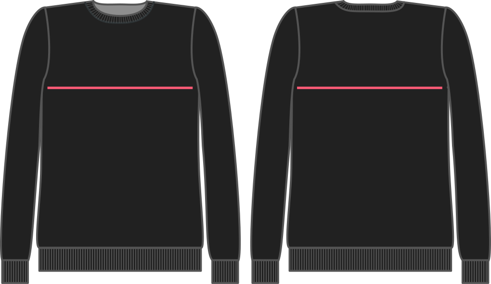

- - -
title: "Chest ease"
- - -

Wie viel Platz möchtest du an der Brust haben? Welcher Wert auch immer Sie hier angeben, wird beim Entwurf des Kleidungsstückes einfach zu Ihrer Brustumfangsmessung hinzugefügt.

## Effekt dieser Option auf das Schnittmuster

