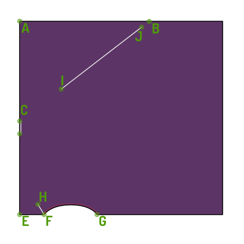

- - -
title: "Tamiko top: Sewing Instructions"
- - -

### Schritt 1: Beende die Rüstungsnaht

- Finish the armhole seam with a narrow hem.

### Schritt 2: Beende die Spitze

<Note>

Da Ihr Oberteil gefaltet ist, ist es eine gute Idee, beide Hälften zusammenzupinnen.
Auf diese Weise kann sich dein Oberteil nicht umdrehen, während wir es beenden.

</Note>

- Sew the three seamlines that are marked on your draft. F-H, C and I-J in the diagram, represented by lines and notches on the pattern.

### Schritt 3: Viel Spaß!

Now enjoy your new top and it's zero waste properties!
