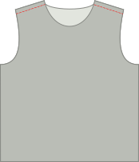

## Step 1: Close the shoulder seams

- Place the front and back on top of each other with [good sides together](/docs/sewing/good-sides-together). Align the shoulder seams.
- Serge the shoulder seams, or stitch them with a narrow (~2 mm) zigzag stitch at the standard seam allowance.

<Note>
Optional: In a drapier knit, you may choose to reinforce the shoulder seams by stitching clear elastic along the seam on the inside. On a T-shirt, the shoulder seams support most of the weight of the garment. Reinforcing is not required, but it can keep the shoulder seams from stretching over time.
</Note>

## Stap 2: Zet de mouwen in

- Leg je aan elkaar bevestigde voor- en achterpand neer met de goede kant naar boven.
- Identify the front and back sides of each of your sleeves. (This is how you separate the left sleeve from the right.) On your paper pattern piece, the front side of the sleeve is to the left.
- Place a sleeve on top of the front and back, with the good side down.
- Align the top of the sleevecap with the shoulder seam. Make sure that the front and back of the sleeve are aligned with the front and back pieces of your shirt.
- Speld de mouw op z'n plaats langs het hele armsgat. There’s a bit of sleevecap ease, which means that the sleevehead is slightly longer than the armhole. Ease in the top part of the sleeve head while pinning.
- Sew/serge your pinned sleeve in place.
- Repeat for the other sleeve.

## Step 3: Sew knit binding to the neck opening.

<!--- Tawni is also writing up additional instructions for installing a V-neck --->

<Tip>

A more extensive how-to on knit binding can be found in the [Aaron Instuctions](/docs/patterns/aaron/instructions).

</Tip>

- We are going to finish the arm and neck hole with [knit binding](/docs/sewing/knit-binding) (note: not a knit band. There’s a difference, and it’s explained [here](/docs/sewing/knit-binding)).

<Note>
This is the most complex step in making the Teagan T-shirt, but it just requires a bit of practice. Don’t worry, all you need to do is make a couple of these and you’ll be a pro in no time.
</Note>

### Positioneer (het begin van) je bies

- Put your T-shirt down with the back good side up, and place your binding strip on top of it with the good side down (as in, good sides together). Your binding should start at the center back of the neck opening.
- Leg de lange rand van je bies gelijk met de rand van je stof zodat de bies op de stof ligt (en niet in de opening). Leg de hoek van je bies op je startpunt.
- Leg nu je bies 1 cm voorbij je startpunt. Dit beetje extra garandeert dat we later de twee uiteindes aan elkaar kunnen bevestigen.

### Stik de bies vast

- Place your presser foot 3 cm along the knit binding, so a 3 cm tail will be left unstitched. This will help us join the ends of the binding later. Then, sew 1.5 cm from the edge around the neck opening, stretching the binding gently as you sew.  (Note: this is not the standard seam allowance.)
- Stop sewing 3 cm before the end, leaving a tail like we did at the beginning.

### Mark and sew binding ends

- With about 6cm left to go before we complete our circle, it’s time to sew the ends of the binding together.
- Take one of the edges, and stretch it along the 3cm separating it from the start point as you would while sewing. On the binding, mark where the binding reached the start point. Doe hetzelfde voor het andere uiteinde.
- Fold your T-shirt in whatever way makes it more easy for you to place both binding ends with good sides together, aligning the marks. Sew them together at the marks.

<Note>

6 cm is not much, but should be enough to get both edges comfortably under your sewing machine to sew them together.

</Note>

- Now that your binding ends are joined together, it’s time to finish the last 6cm of binding. Naai dit stukje, 1,5 cm van de rand, zoals eerder.

### Fold knit binding to the back and sew down

- Fold your binding fabric around the fabric of your T-shirt to the back. This is how we’ll sew it down.
- While the fabric is folded double at the front (hiding the fabric edge in the process), there’s no need for that at the back. We will merely trim back the edge later, given that knit doesn’t ravel. If we were to fold back the fabric at the back too, it would only add bulk.
- Now you’ll sew the binding down. Stik langs de goede kant van de stof langs je bies, langs de aanzetnaad (en zo ver mogelijk van de rand), zorg zeker dat je het stuk bies dat je naar achter geplooid hebt mee vaststikt.

<Note>
If you have a coverlock machine, that would be perfect for this seam.
</Note>

- You’ll have to, once again, stretch your binding a bit while doing this. But this time, there’s an extra caveat to look out for.

<Note>

##### Beware of the uneven feed
As your feed your binding through your sewing machine, the feed dogs will pull the bottom layer (back of your binding) forward.

In een ideale wereld zouden alle lagen gelijkmatig volgen. Maar meestal blijft de bovenste laag (de voorkant van je bies) wat achter. Dit zorgt dat je bies niet helemaal recht rond de randjes geplooid ligt, en lelijke rimpels maakt.

Dus let hierop, en als je het ziet gebeuren, rek dan de onderste laag een beetje uit om te compenseren. Een boventransportvoet op je naaimachine helpt ook met dit probleem.
On the inside of your T-shirt, trim back the knit binding just outside of your seam to finish up.

</Note>

## Step 4: Close the side seams and sleeves

- Fold your Teagan T-shirt double at the shoulder seams with good sides together.
- Align the side seams and sleeves and pin them together.
- Serge/sew the side seam and continue sewing to close the arms all the way to the sleeve hem.
- Repeat on the other side.

## Step 5: Finish hem and sleeves

- Fold the hem upwards, to the inside, and sew it down. Als je een coverlock hebt is dit het moment om hem te gebruiken. Indien niet, gebruik een tweelingnaald of een zigzagsteek zodat de zoom elastisch blijft.
- Repeat for the hem on each sleeve.

<Note>

##### Fold only once, to avoid bulk
Knitwear doesn’t ravel, so you can simply fold this over once and sew it down, then neatly trim back the fabric.

</Note>
