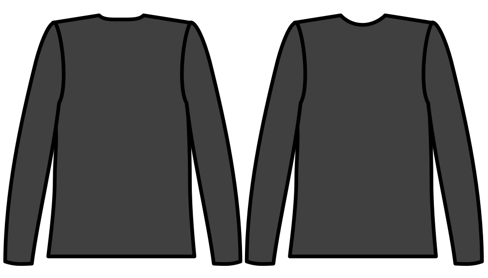

Contrôle la profondeur de l'encolure dans l'arrière du vêtement. En d'autres termes, l'augmentation de cette mesure déplacera l'ouverture du cou vers le dos.

## Effet de cette option sur le motif

