<Note>

Text ein bisschen trocken für dich? Ich versuche, Videos als Teil der Musterdokumentation zur Verfügung zu stellen.

In diesem speziellen Fall gibt es eine Menge Videomaterial, aber es wurde ursprünglich für eine frühere Version dieses Musters aufgenommen. Trotzdem gute Sachen.

</Note>

<YouTube id='PL1gv5yv3DoZOcmOJf6f0YWi522VXXv-mM' playlist />

<Note>

Viele der folgenden Schritte sind für beide Hosenbeine zu wiederholen.

Das ist nicht immer erwähnt, weil das Leben kurz ist und ständig schreiben _Vergessen Sie nicht, dies für beide Hosenbeine_ wird sehr bald müde.

</Note>

### Schritt 1: Füge die Faltlinien ein

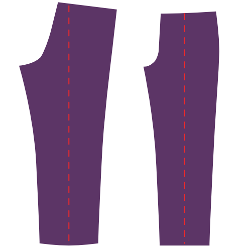

First thing to do is to  baste over the pleat line of your trouser legs. Do it on both front and back pieces for both legs.

### Schritt 2: Schließe die Hintergrunddarts und drücke

### Hintergrunddarts schließen

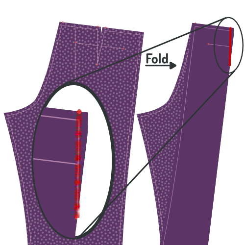

Fold piece 1 (back) double so that the notches of the dart on the waistband are aligned, and a sharp crease runs to the notch at the dart end. Feel free to briefly iron the crease, this will make it easier to sew the dart accurately.

Close the dart by sewing from the waistband down to the end of the dart.

Use a small stitch length, and let your stitch run completely to the end (and of) the dart, then backtrack making sure to veer into the seam allowance.

#### Dart an der Seite zurückdrücken

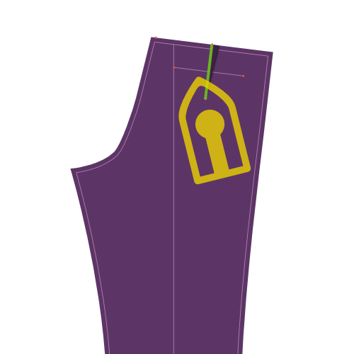

Press your back darts flat, folding the seam allowance to the side of your trousers.

### Schritt 3: Baue die hinteren Taschen

Construct the double welt pockets at the back of your trousers, including the pocket bag.

<Tip>

###### Doppelte Taschen

Eine doppelte Tasche zu bauen ist eine Technik, die verwendet wird ist verschiedene Kleidungen.
Aus diesem Grund habe ich es in eine eigene Dokumentationsseite verzweigt.

Es gibt sowohl schriftliche Dokumentation als auch eine Videoserie, die Ihnen zeigt, wie Sie es machen können so auch wenn Sie noch nie Welttaschen gemacht haben, sind Sie in Ordnung.

[Zur Welt Taschendokumentation](/docs/sewing/double-welt-pockets)

</Tip>

### Schritt 4: Optional: Schneiden Sie Ihr Futter mit rotierenden Scheren

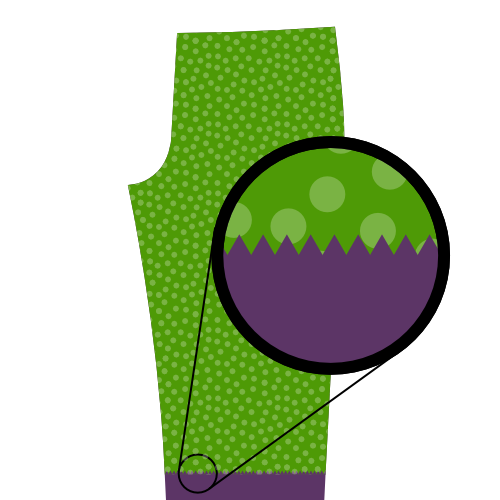

If you are going to line your trousers (it's optional), you'll need to finish the edge of your lining. To do so, trim the edge of the lining with pinking shears.

Note that you only need to do this for those edges of your lining that are not caught in a seam. In other words, only the bottom edge of your lining.

<Tip>

Wenn Sie keine rosa Scheren haben, können Sie eine weitere Oberfläche wie eine Zick-Zack-Nähte auftragen oder einen Serger verwenden. Jedoch sind rotierende Scheren am besten für dieses Szenario, da sie keine Menge hinzufügen, was wichtig ist, weil wir vermeiden wollen, dass der Rand der Futter einen Bumpf in Ihrer Hose bildet.

</Tip>

### Schritt 5: Schneiden Sie Teile für die Vordertasche

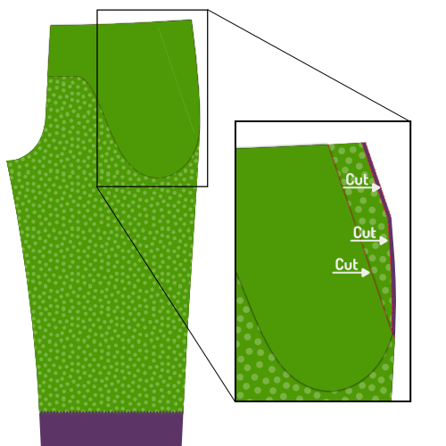

Align your front, lining and pocket bag on top of each other. Front and pocket back with their good side down, lining with the good side up.

Pin them together to make sure they don't move. Do so away from the pocket slant to not hinder yourself later.

Trim back the pocket bag (it should lie on top) exactly on the pocket slant line (marked on the pattern).

Now trim back the front piece (it should lie on the bottom) 3cm outwards from the slant line, parallel to it.

Finally, trim back your lining so that it stops 0.5 cm short of reaching the edge of your front.

<Tip>

Das Futter ist etwas kürzer geschnitten, so dass, wenn es zurückgefaltet wird, es nicht angezeigt wird. Aber es ist wirklich nicht so wichtig, es genau 0,5 cm kürzer zu bekommen.

</Tip>

### Schritt 6: Rückwärts und Nähen vor der Tasche schräg

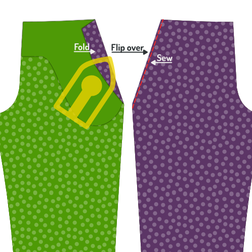

Fold back your lining and front piece along the pocket slant line (and thus along the trimmed edge of the pocket bag. Pin this down and press.

You are going to sew along the pocket slant, but make sure to flip everything over first so you can sew from the good side.

Topstitch a 0.5 cm from the fold, making sure to keep it parallel and not stretch your fabric.

<Tip>

Diese Aufsteckung wird immer angezeigt, also stellen Sie sicher, dass Sie die Fadenfarbe anpassen und sie hübsch machen.

</Tip>

<Tip>

Um zu verhindern, dass Ihre Taschen ausgebeutet werden, können Sie ein Stück nicht dehnbares Band zwischen dem Faltband platzieren. Beim Nähen fängt man auch dieses Band, so dass die Tasche nicht ausgeht.

</Tip>

### Schritt 7: Rand in der Vordertasche beenden

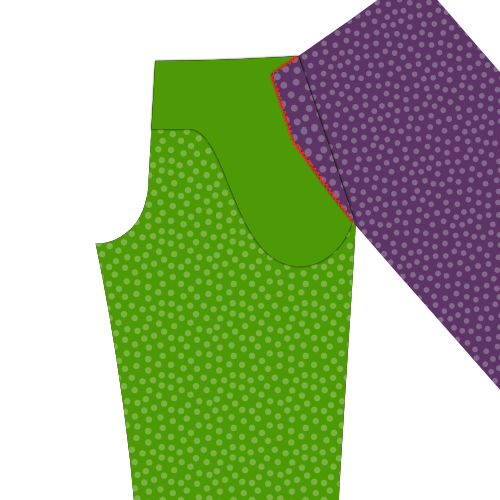

Fold away the main part of the front piece, so you can place the lining, pocket bag and folded edge of the front piece flat.

Zig-zag the edge of the folded-back front piece to finish it and secure it to the pocket back and lining.

### Schritt 8: Seitentasche drücken

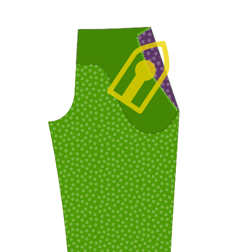

When you're done, place front piece, lining and pocket bag flat, and give it a good press.

<Tip>

Vielleicht ist dies ein guter Zeitpunkt, um Sie daran zu erinnern, dass jeder Schritt bis dahin für beide Beine getan werden musste.

Es ist nur eine freundliche Erinnerung, die nächsten Schritte müssen auch für beide Beine gemacht werden.

</Tip>

### Schritt 9: Befestige Seitenteil an Tasche

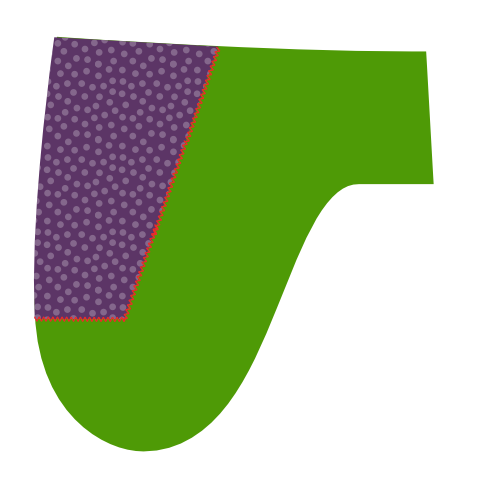

Place the other half of the pocket bag with the good side down, and align the side piece on it with the good side up.

Sew a zig-zag stitch along the edge of the side piece to finish it and attach it to the pocket bag.

### Schritt 10: Tasche schließen

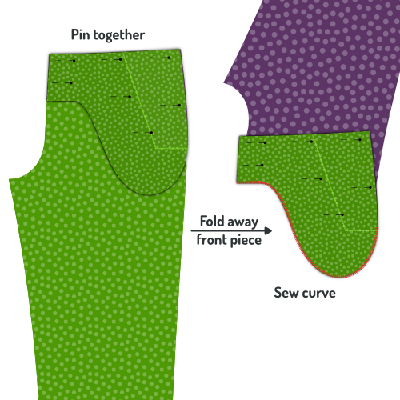

Place the front piece, lining and pocket bag with the pocket bag up.

Align the second pocket bag with the attached side piece facing down.

Pin all pieces together making sure to stay about the bottom curve of the pocket bag.

When everything is pinned together, fold away the front piece and lining, and close the bottom curve of the pocket bag.

<Tip>

Sew to bottom curve of the pocket bag up until the point where it reached the side piece

You can finish the pocket bag in a number of ways, including:

- Serge the sides together
- Finish the edge with bias tape
- Sew the sides together and finish the edge with a zig-zag stitch

</Tip>

### Schritt 11: Drücke die Vordertasche

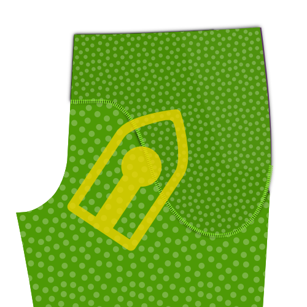

Put everything flat with the front piece at the bottom, and give it a good press.

### Schritt 12: Pin Front Tasche an Ort

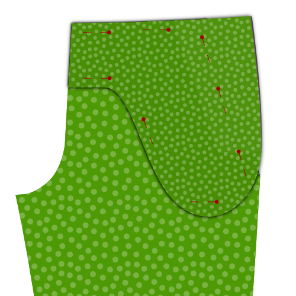

Pin the pocket down to the front piece along the slant and the edges of the pocket bag. This will prevent it from shifting around while we continue to work on our trousers.

### Schritt 13: Beende die Seitenkanten

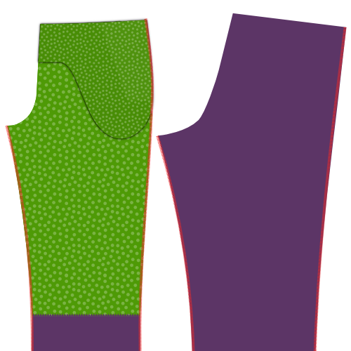

Before we are going to sew the side seams, finish the side edges by serging or running a zig-zag stitch along the sides of your front and back pieces, making sure to stay within the foreseen seam allowance.

<Tip>

Achten Sie darauf, die Auskleidungs- und Taschentaschenkanten zu berücksichtigen, da dies verhindert, dass sich die Dinge umdrehen, wenn wir die Seitennaht nähen.

</Tip>

### Schritt 14: Nähte die Seitennaht

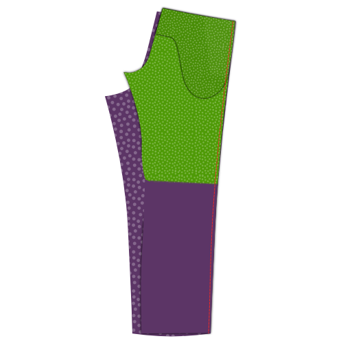

Place the front and back of each leg on top of each other, with the good sides together.

Align the side seam, more precisely the side seam on the outside, where there is no crotch curve.

<Tip>

You can pin the pieces together to make sure things stay in place while sewing this lengthy seam.

</Tip>

Sew the seam, starting from the waistband along the entire side of your trousers.

### Schritt 15: Öffne Naht drücken

Press open the seam allowance along the side seams. Do so from the back, and repeat from the good side of the fabric.

Take your time, making sure to use enough heat, but not too much. Use steam or spray on water for best effect.

<Tip>

Eine schöne flache Seitennaht sieht großartig aus, also nehmen Sie sich Zeit, um es richtig zu machen.

</Tip>

### Schritt 16: Nähen Fliegenschild um Teil zu fliegen

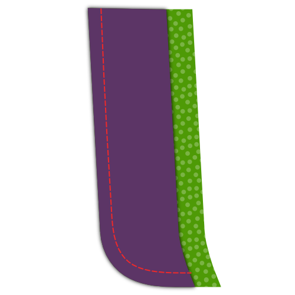

Place your fly piece on the fly shield with the good sides together, and align the edge with the biggest curve.

Sew along the curved edge, taking account the standard 1cm seam allowance, to join the two pieces together.

<Tip>

Wenn Ihr Futter überhaupt eine Dehnung hat, versuchen Sie es ein bisschen zu strecken, während Sie die Kurve nähen. Dadurch wird es leichter, das Futter später ohne Falten flach zu legen.

</Tip>

### Schritt 17: Drücke den Fliegenschild

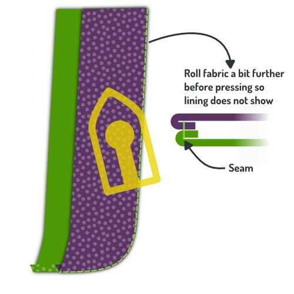

<Tip>

Bevor Sie Ihr Fliegenteil herunterdrücken, stellen Sie sicher, dass Sie die Naht ein bisschen rollen, damit Ihr Hosenfutter ein bisschen weiter sitzt, und das Futter beginnt nur etwa 2mm von der Kante. Dadurch wird verhindert, dass sich das Futter am Rand ausspuckt.

</Tip>

After you have sewed fly piece and fly shield together, turn them inside out and press the seam you just made.

### Schritt 18: Pin Reißverschluss nach rechts vorne

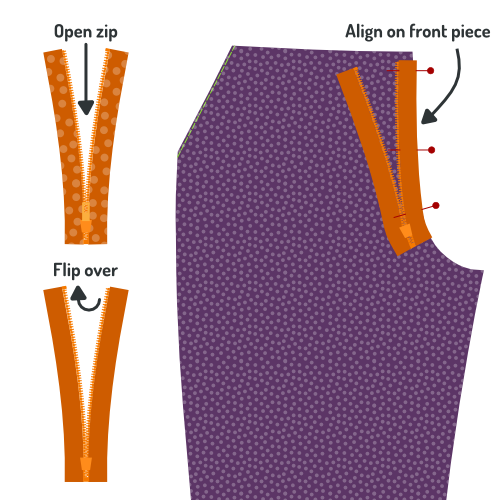

<Tip>

Schritte 18 bis 21 führen alle zu einer einzigen Heftreihe, die deine Reißverschluss nach vorne näht, beim Anbringen des Fliegenteils und fliegen Sie Schild in einem Weg.

Dies ist die schwierigste Naht im gesamten Bauprozess so nehme ich mir meine Zeit zu erklären und dies vor dem Nähen zu veranschaulichen.

</Tip>

Place your front piece for the right leg with the good side up. So that lining and front pocket bag sit underneath and lie flat.

Take your zip and open it (unzip it). Now turn it over so that it sits with the good side down. In other words, with the zipper puller down.

Align your zip with the crotch seam as shown in the illustration. Take the following into account:

- Das Ende deiner Reißverschluss sollte ganz oben auf deiner Hose sitzen, wo dein Taillenband beginnt. Achten Sie jedoch darauf, daran zu denken, dass es dort Nahtzuschüsse gibt so richten Sie es nicht mit dem oberen Teil des vorderen Stücks aus, sondern ziehen Sie 1cm Nahtzug.
- Passen Sie die Reißverschluss mit der Schneidnaht an. Haben Sie nichts gegen den Rand der Reißverschluss, da sie in verschiedenen Breiten kommen. Stellen Sie stattdessen sicher, dass Sie neben den Zähnen der Reißverschluss innerhalb der Naht des vorderen Stückes nähen können.

Pin the zip in place with a few pins perpendicular to your zip (as shown). In other words, don't pin along the zip, but across the zip.

<Tip>

Wenn Sie sich nicht sicher sind, ob Ihre Zip-Datei platziert wurde, stellen Sie sie so nah wie möglich an die Kante. Das bedeutet nur, dass Ihre Zip-Datei etwas länger unter der Fliege verklebt ist, so dass sie sicher nicht angezeigt wird.

</Tip>

### Schritt 19: Fliegenschild zum Reißen anpinnen

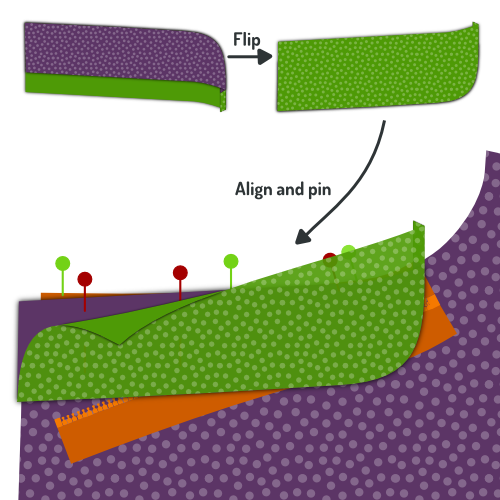

Take the fly shield/fly piece that you assembled in step 16 & 17, and place it with the fabric facing downward, and the lining upward.

Flip aside the top lining layer, and align the slightly curved edge of the fabric (where it is not sewn to the lining) with the edge of the fabric of your front piece.

<Tip>

Zur Klarheit, welche Seite des Fliegenschildes, der aufgesteckt werden soll, wird oben auf der Abbildung angezeigt, auf einer kleineren Skala.

</Tip>

Pin this layer in place with a few pins perpendicular to your zip (as shown in red). Make sure you catch all layers underneath, including the zip. This way, you can remove your pins from the step before (shown in green) when done.

<Tip>

Wenn Sie das alles gut halten, können Sie die Futter zurückfallen lassen und alles zusammen anpinnen, wie im nächsten Schritt gezeigt. Das ist etwas schneller, aber eher anfällig für Fehler, da sich die Dinge leichter bewegen können.

</Tip>

### Schritt 20: Fliegenschild entlang der Reißverschluss anpinnen

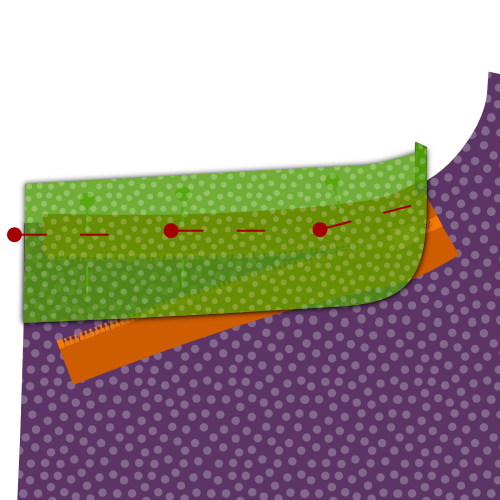

Let the lining fall back in place, and now pin all layers together along the zip.

When you are done, remove your earlier perpendicular pins.

### Schritt 21: Über Fliegenschild falten und nach unten anpinnen

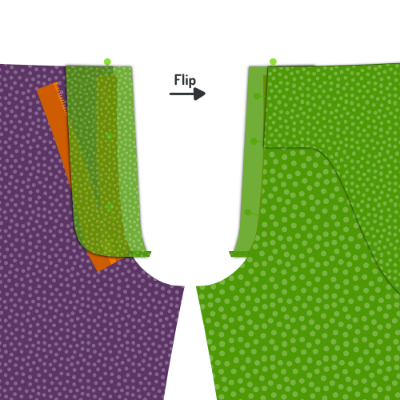 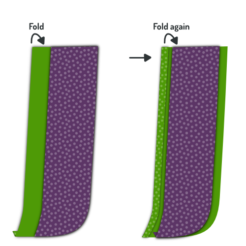

Flip everything over so that your fly shield lies at the bottom.

Fold the lining of the fly shield around the fly, front piece and fly piece, making sure to double-fold it so the raw edge is hidden inside.

Pin this down, and remove your previous pins.

### Schritt 22: Nähen Fliege an Ort entlang Reißverschluss

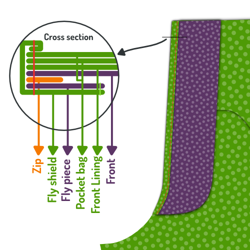

Now you can sew along the double folded fly piece. This will fix the front, zip, fly shield and fly piece all in place.

<Tip>

Sie werden an Ihrer Zippe nähen, also stellen Sie sicher, dass Sie Ihren Zipper Fuß dafür installieren.

</Tip>

### Schritt 23: Fliege zurück und drücke

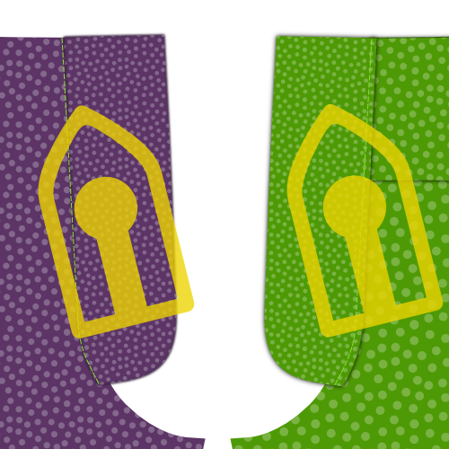

When you're done, fold back the fly so that it extends from the front piece, and give it a thorough press from the back. And a gentle press from the front.

### Schritt 24: Voreinstellung Klebeband auf zweite Fliege anwenden und drücken

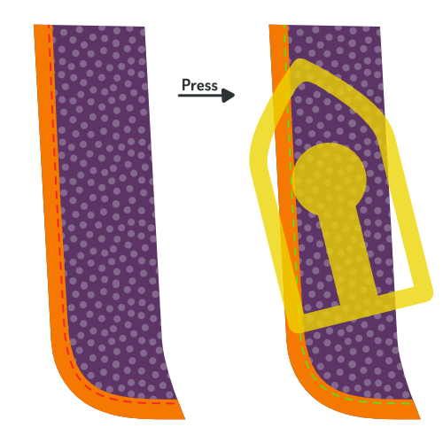

Apply bias tape to the edge with the large curve of your second fly piece.

Press the finished edge flat when you're done.

<Tip>

Bias Tape ist eine Möglichkeit, eine Naht zu beenden. Wenn Sie sich nicht sicher sind, was es ist oder wie es anzuwenden ist, lassen Sie es mich wissen.

</Tip>

### Schritt 25: Pin und Nähen Fliegenteil zu Schneidnaht

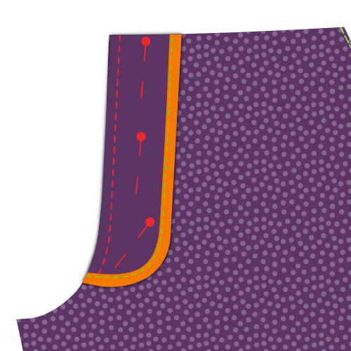

Place the left leg with the good side up. Place the second fly piece on top with the good side down, aligning the unfinished seam with the crotch seam.

Pin the fly piece in place, then sew it in place along the crotch seam.

<Tip>

Wenn Sie das Nähen an der Stelle, achten Sie darauf, dass die Vorderseite Futter.

</Tip>

Press the finished edge flat when you're done.

### Schritt 26: Rollen Sie das Fliegenteil auf den Rücken und drücken Sie die Naht

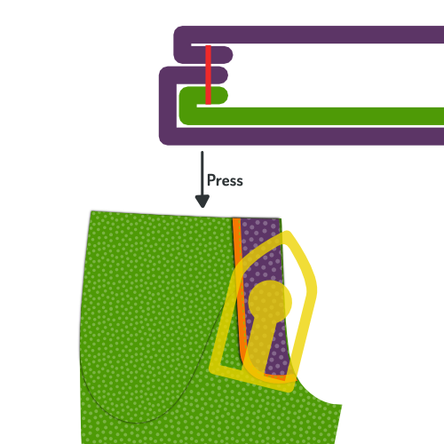

Fold the fly piece to the back. Before you press, make sure to roll the seam a bit backwards so that the front of the trousers sits a little further than the fly piece.

This way, the seam or fly piece will not show from the front.

Give it a good press from the back.

### Schritt 27: Pin und nähen Reißverschluss um Teil zu fliegen

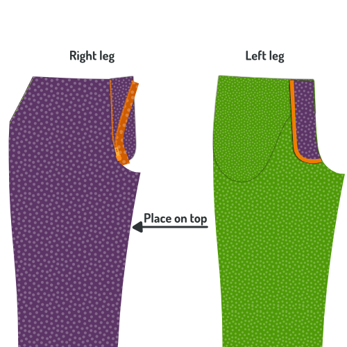 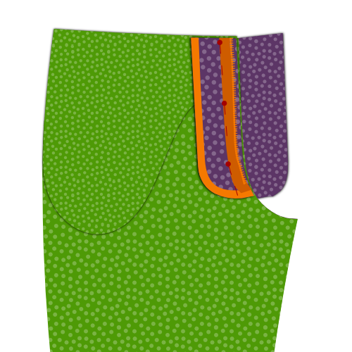 

Place the right leg down with the good side up. Place the leg on top of it with the good side down.

With the crotch seams aligned, pin the zip along the edge of the fly piece with the good side of the zip down.

Make sure to pin the fly only to the fly piece. Not to any other layers underneath.

<Tip>

Ich finde es einfacher, die Reißverschluss durch alle Ebenen zu pinnen, und dann, wenn sie sicher ist, fügen Sie zusätzliche Pins an, die sie nur zum Fliegenteil anpinnen. Wenn das erledigt ist, können Sie die Pins entfernen, die durch alle Ebenen gehen.

</Tip>

Last but not least, sew along the zip with your zipper foot to attach it to the fly piece.

<Tip>

When aligning the zip, make sure to take the following into account:

- The zip should be placed with the good side down
- The zip should sit a bit back from the edge of your fly piece
- Make sure to align the top of the zip with the other zip half on the right leg

</Tip>

### Schritt 28: Zig-zag die Reißverschlusskante zum Fliegenteil

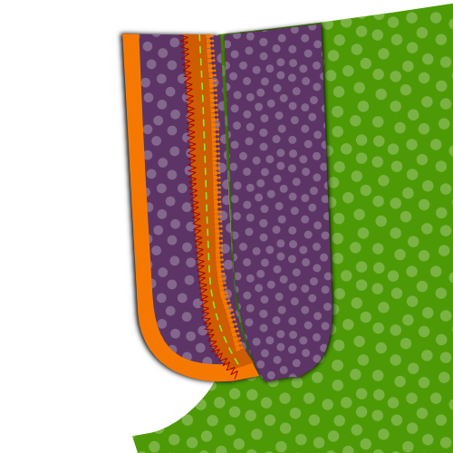

With the fly in place, run a zig-zag stitch along the edge of the zip to secure it to the fly piece.

### Schritt 29: Beide fliegen Stücke zusammen

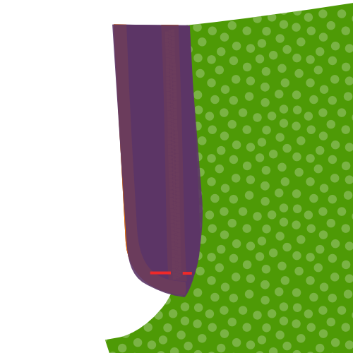

Place both fly pieces together, and move the front pieces out of the way.

Use a bar-tack to join them together at the bottom of the zip. Sew on both edges of the zip, and get as close to the zip as you can.

<Tip>

Wenn dein Reißverschluss zu lang ist, kannst du ihn unter die Balkenschale schneiden.

</Tip>

### Schritt 30: Treibernaht beitreten

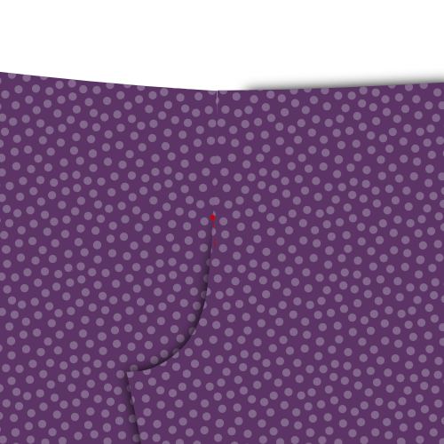 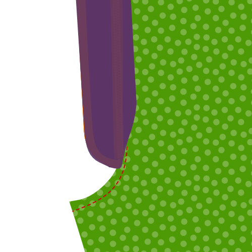

Place both fronts with the good sides up. They are now joined by the fly.

Make sure the fly is neatly tucked under, and pin together both fronts at the bottom of the fly, where you bar-tacked earlier. Make sure the pin is aligned to the fold of your front.

Fold the fronts with the good sides together, and pin them together along the crotch.

You'll need to get the fly shields out of the way, so if you've pinned through all layers before, remove that pin now, making sure to replace it with a horizontal pin. This will tell you how far to sew.

Sew the crotch seam, starting at the cross-seam point, and going up to your horizontal pin.

<Tip>

Ich finde diesen Schritt schwer zu erklären und schwer zu veranschaulichen. Ich hoffe, es macht Sinn, wenn du deine Fliege betrachtest. Wenn nicht, überprüfen Sie die Video-Anweisungen.

</Tip>

### Schritt 31: Fliege geschlossen pin und Fliegenkurve einfügen

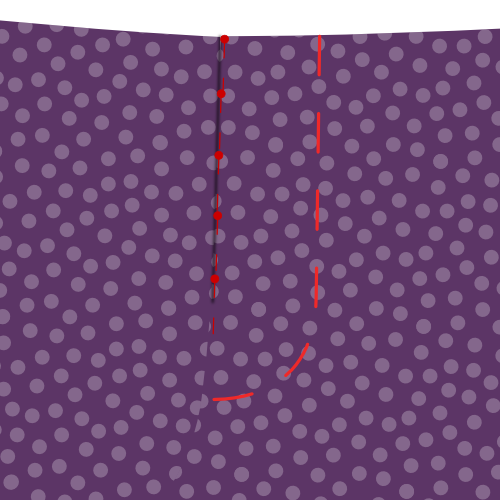

Close the fly, and pin the fronts together making sure the fly is neatly tucked away.

We will be topstitching the fly curve next, and it's a good idea to baste it first.

You should start a bit above your earlier bar tack, and make sure you catch only the fly shield of the left leg.

Curve upwards toward the edge of the fly shield, and then proceed in parallel with the zip.

### Schritt 32: Topstitch die Fliegenkurve

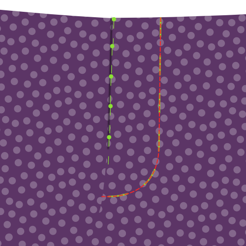

Now topstitch your fly curve, using your basting as a guide.

When doing so, you will be locking your front, fly piece, pocket bag and lining all together.

### Schritt 33: Pin die innere Beinnaht

Close the legs with the good sides together, and pin together the inner leg seam. Start at the cross seam point and work your way to the bottom of the legs.

Make sure to do this for both legs.

### Schritt 34: Nähen Sie die inneren Beinnähte

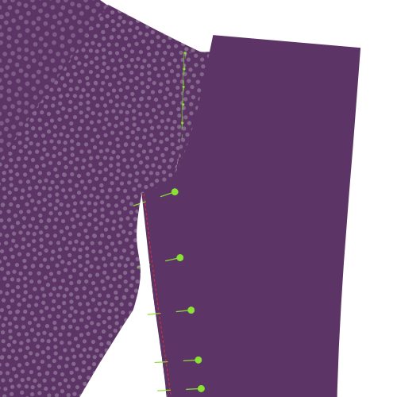

On both legs, sew the inner leg seams that you just pinned. Make sure to respect the seam allowance.

### Schritt 35: Öffne Naht der Naht der Innenbeinnaht

Place your leg inside-out on your ironing board, and press open the seam allowance of the inner leg seam.

### Schritt 36: Quernaht schließen

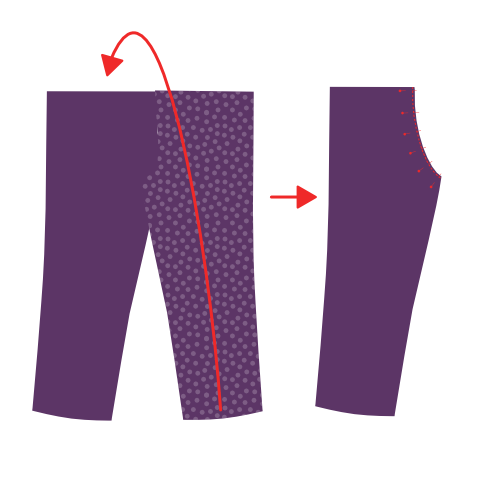

We are now going to close the cross-seam, from the bottom of your fly between your legs, up your bum to the center back of where you'll add the waistband later.

To do so, turn on of the legs inside out, so that that good side of the fabric is turned inside, and the bad side and lining sits on the outside.

The other leg should not be turned inside-out, but should just have its good side on the outside.

Now, put the leg that has the good side out (the normal leg) into the leg that has the bad side out (the inside-out leg).

This way, the good sides of both legs will sit against each other, and this is how you should sew the cross seam.

<Tip>

Achten Sie darauf, dass Ihr Bein nicht im anderen Bein verdreht wird. Wenn Sie Zweifel haben, drehen Sie das innere Bein nach außen wieder aus, nachdem Sie die Quernaht angeheftet haben, um sicherzustellen, dass es in Ordnung ist.

</Tip>

Pin the cross-seam in place, and then sew it close, starting at the side of the fly, and making sure to respect the seam allowance.

When done, press the seam allowance open.

### Schritt 37: Drücke die Beinschale an Ort

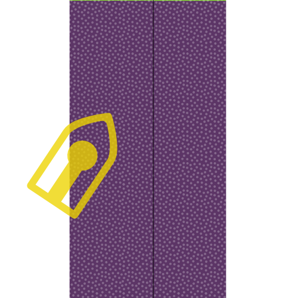

Turn your trousers good side out, and carefully place one leg on your ironing board so that it lies flat and folds exactly on the crease line your basted earlier.

When it's looking good, press the crease lines in your leg, front a back. Repeat for the other leg.

Give it a firm press because you want the pleats to still be there after you wash your trousers (so you can see where to press them again).

<Tip>

In der Industrie werden Chemikalien entlang der Schmelzlinie aufgetragen, bevor sie zusammengepresst werden. Einige Schneider verwenden eine Art Holzhammer und Amboss, um die Fasern in einer permanenten Spur zu schlagen.

</Tip>

Depending on your fabric, your crease might last longer, but ultimately, you can't expect to have a crease that can withstand a few washes without being reapplied.

<Tip>

Vielleicht ist das eine Selbstverständlichkeit, aber es gibt auch noch eine andere Option: Drücken Sie nicht die Brücke. Das verleiht Ihrer Hose einen informelleren Look.

</Tip>

### Schritt 38: Verbindung zur Taille

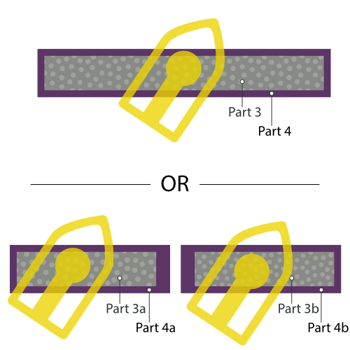

Fuse the waistband interfacing (Piece 3) to the waistband (Piece 4).

Align the interfacing in the middle of the waistband, and make sure to keep it nicely aligned as you fuse it in place with your iron.

### Schritt 39: Taille und Taillenband schließen

Join the waistband (Pieces 4a and 4b) by sewing both pieces good sides together.

Join the waistband lining (Pieces 5a and 5b) by sewing both pieces good sides together.

### Schritt 40: Nähen Taillenband zu Taillenband

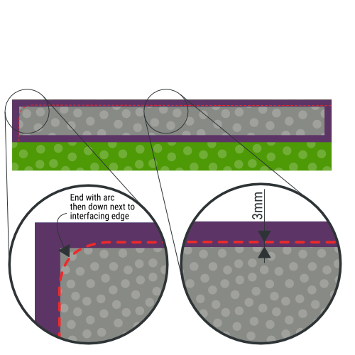

Place your waistband on the waistband lining, good sides together, so that the waistband interfacing is facing upwards.

Align the edge, and pin them together.

<Tip>

Wir werden am Rand der Schnittstelle nähen, aber wir nähen ca. 3mm oder 1/8 Zoll von der eigentlichen Schnittkante. Dadurch wird verhindert, dass das Futter später von vorne sichtbar wird.

</Tip>

On one side of the waistband, end with a curve and then go down vertically along the edge of the waistband interfacing. Check the illustration to make sure you do it on the correct side.

### Schritt 41: Roll Stoff um die Schnittkante und Pressband

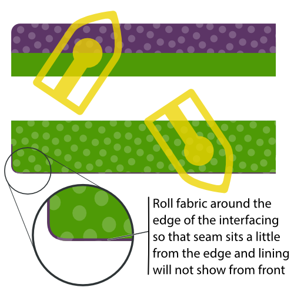

Before pressing the waistband, make sure to roll over the fabric around the edge of the interfacing.

Remember that in the previous step your sewed 3mm from the interfacing edge? You need to make the fold around the edge of the interfacing so that the actual seam sits 3mm more inwards.

This will make sure that our lining fabric is never on display from the front of your trousers.

### Schritt 42: Pin Taille zu Hosen

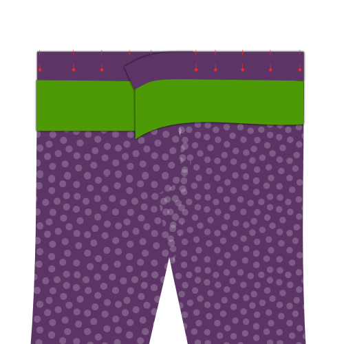

Pin the edge of your waistband (the side you did not sew the lining to) to the top of your trousers, good sides together.

Tuck the edge of your fly into the end of the waistband with the curved corner. On the other end of the waistband, it will be longer. In other words, your waistband will overlap here.

<Tip>

Achten Sie darauf, die vertikale Ausrichtung des Taillenbandes an der Reißverschlüsse anzupassen. Bei geschlossenem Reißverschluss sollten beide Seiten der Taille in gleicher Höhe sitzen. Dies ist leicht zu verpassen, wenn Sie es nicht überprüfen.

</Tip>

### Schritt 43: Nähen Bund zu Hose

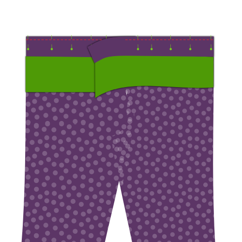

Now that the waistband is pinned to top of your trousers, sew it in place.

On the side with the curved corner, get as close to the edge as possible. On the other side, stop when you reach the edge of your fly.

### Schritt 44: Pressebund

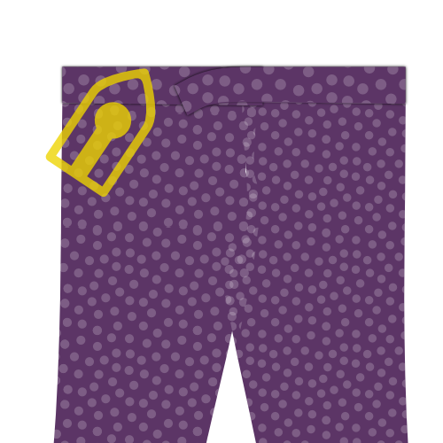

Give your newly sewn seam a good press. Do not press the seam open, instead press it towards the top (put both trousers and waistband seam allowance in the waistband).

### Schritt 45: Bereiten Sie die Riemenschleifen vor

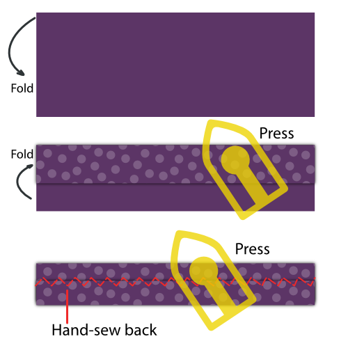

The belt loops are a part of your trousers where you can let your creativity run free. There's load of different ways to make and shape belt loops, not to mention that where you place them is also up to you.

That being said, here's what to do to make a standard belt loop:

Find the belt loop pattern part, a small rectangular piece of fabric. There should be 8 of them, and these will become your belt loops. For each of them, take these steps:

- Zig-Zag (oder Serge) entlang der längsten Kanten des Rechtecks
- Falte eine Seite entlang der Länge zurück und drücke
- Falte die andere Seite zurück, entlang der Länge und drücke
- Handnähen entlang der Rückseite der Gurtschleife, so dass die gefalteten Seiten an Ort bleiben aber die Nähte zeigen nicht vorne
- Gib ihm eine letzte gute Presse, wenn du fertig bist

<Tip>

Obwohl die Breite Ihrer Bandschleifen nicht so wichtig ist, ist es wichtig, dass sie alle gleich breit sind.

Um eine gleichmäßige Breite zu erleichtern, können Sie Ihre Gürtelschleifen um einen Kartonstreifen falten dickes Papier, oder Kunststoff der gewünschten Bandbreite.

Dieser Streifen kann Ihnen auch beim Nähen der Hand helfen. Halten Sie es in Ihrer Gürtelschleife und es wird verhindern, dass Ihre Nadel durch alle Schichten durchbricht und Ihr Faden wird nicht an der Vorderseite angezeigt.

</Tip>

### Schritt 46: Füge die Bandschleifen an: Unten

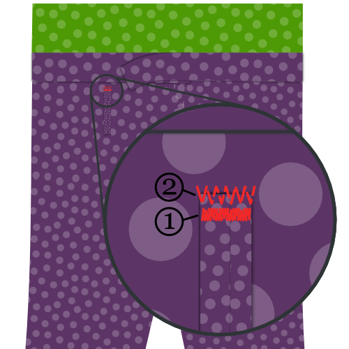

Attach the bottom of the belt loops to your trousers. Place them about 1.5 cm below your waistband, depending on your waistband width.

Place the good side of the belt loop down on the good side of the trousers (good sides together) and secure with a bar tack or narrow zig-zag.

Then, zig zag the edge of the belt loop to the trousers.

<Tip>

Dabei ist es wichtig, die Weste aus dem Weg zu räumen. Achten Sie darauf, die Gürtelschleifen nur an Ihre Hose zu befestigen und nicht an das Bauchbandfutter.

Du hast 8 Bandschleifen, also musst du sie um deinen Bund verteilen. Werfen Sie einen Blick auf ein bestehendes Paar, wenn Sie unsicher sind, wie Sie dies tun.

Achten Sie darauf, dass Sie Gurthaufen in der Nähe der Mitte hinten platzieren und nicht zu nah zueinander an der Vorderseite (für Gürtelschnallen).

</Tip>

### Schritt 47: Taillenband

The waistband facing needs to be cut out and attached to your waistband.

This will be a lot simpler to understand if you have a look at the relevant video:

@[youtube](https://www.youtube.com/embed/8dLOuOtb18U?list=PL1gv5yv3DoZOcmOJf6f0YWi522VXXv-mM)

### Schritt 48: Schnitt Taillenband Naht zulässig

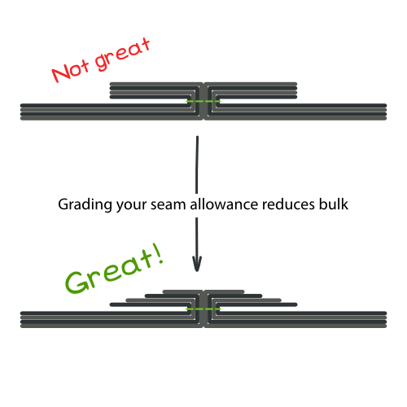

Before we finalize the waistband, we're going to trim back some of its seam allowance.

<Tip>

**About seam allowance grading**
When trimming back different layers of seam allowance, always try to cut them at different lengths so that the bulk is reduced in incremental steps.

Die Schicht, die der guten Seite des Kleidungsstückes am nächsten liegt, sollte die längste sein, also von dort zurück schneiden.

Dadurch wird es weniger wahrscheinlich, dass die Konturen der Nahtzuweisung von der guten Seite aus sichtbar sind.

</Tip>

### Schritt 49: Die Taille drücken und einfügen

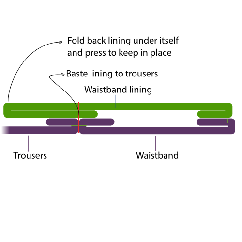

The waistband lining will be sewn from the front of the trousers on top of the seam that joins the waistband to the trousers (so called _stitch in the ditch_).

Doing so will catch the lining and secure it in place. However, since we'll be sewing this from the good side, the lining will lie beneath all other layers, and we won't see what we're doing.

That is why, to make sure it all lies clean and flat, we will first press and baste the lining.

The lining will extend downward from the top, and it needs to be folded back up under itself, so that it will get caught by the seam when we sew it in place later.

To make sure things look pretty, the distance between the top of our waistband and the (folded back) bottom edge of our lining should be constant. You can mark an even distance from the top of your trousers, and then pin back the lining at this line. Last but not least, press that fold in your lining.

When you're happy with how it looks, baste the lining in place just next to the seam joining the waistband and trousers.

<Tip>

Es ist am besten, sich neben der Naht, und nicht wirklich in der Naht. Dies wird es viel einfacher machen, deine Bast zu entfernen, wenn wir im letzten Schritt genäht haben.

</Tip>

### Schritt 50: Nähen Sie das Taillenband

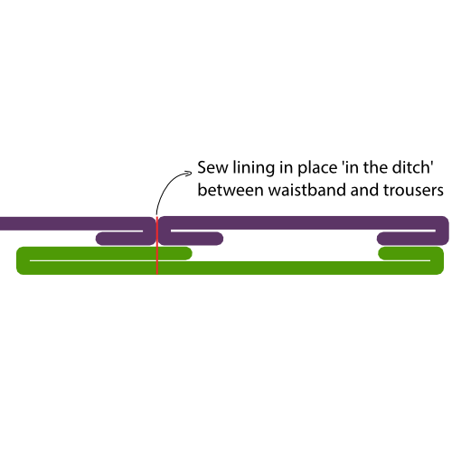

After you basted the waistband lining, sew it in place from the good side, exactly in the seam between the waistband and trousers.

### Schritt 51: Füge die Bandschleifen an: oben

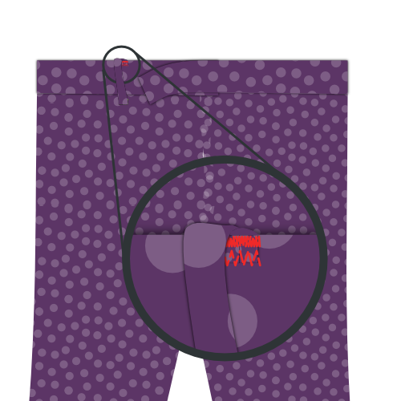

With your waistband and lining properly secured, it's time to attach the top of the belt loops.

Sew them in place just as you did at the bottom. That is, use a bar tack or close zig-zag to attach them, then zig-zag over the end to secure it.

<Tip>

Nähen Sie nicht die Oberseite der Gurtschleifen. Sie müssen den Fuß Ihrer Nähmaschine unter der Gürtelschleife bearbeiten, damit Sie nur das hintere Teil nähen.

Fühlen Sie sich frei, die Länge Ihrer Gürtelschleifen nach dem Trennen und vor dem Zick-Zack-Ende zurückzudrehen da sie zu lang sein könnten.

</Tip>

### Schritt 52: Beende den Beinrand

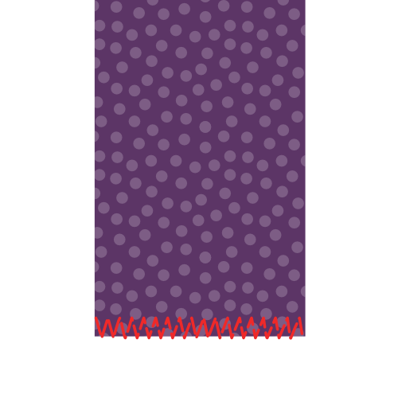

Before we hem the trousers, finish the raw edge of the legs with a zig-zag stitch or serger.

<Tip>

Dies wäre auch ein guter Zeitpunkt, um Ihre Hose zu probieren und genau zu markieren, wie lange Sie wollen, nachdem sie gehemmt sind.

</Tip>

### Schritt 53: (Optional) Nähen in einem Saum Band

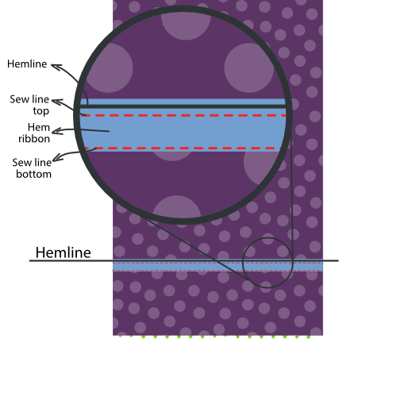

<Tip>

Das Saum Band ist ein Band, das auf der Innenseite deiner Hose sitzt. An der Stelle, wo Ihr Saum zurückklappt, muss der Stoff eine Menge Missbrauch aus dem Stoßen in Schuhe und andere Dinge nehmen.

Das Einlegen eines Balles in den Saum schützt Ihren Stoff in gewissem Maße und ist eine saubere Oberfläche.

</Tip>

Mark the hemline on your trousers (good side out).

Place the ribbon as shown in the illustration making sure that it extends a few mm above the hemline. Sew it in place all the way around the leg, making sure to sew close but not on the hemline.

### Schritt 54: Drücke den Saum

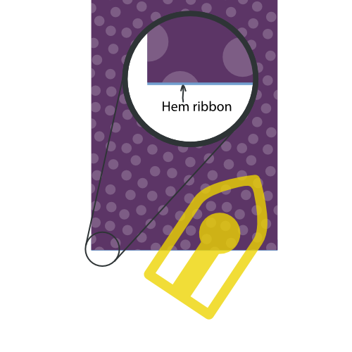

Fold back the trouser legs at the hemline, and press the hem.

<Tip>

Wenn du in einem Saum Bänder genäht hast, wird das Band ein paar mm unterhalb der Saum Linie verlängern und so den Stoff am Saum schützen.

</Tip>

### Schritt 55: Hem die Beine

With the hem neatly pressed, simply hand-sew the folded back part to the inside of your trousers.

<Tip>

Hemming wird von Hand gemacht, weil es wichtig ist, dass die Nähte nicht auf der Vorderseite zeigen. So when hand-sewing the hem, don't push your needle through the fabric, but just catch a few threads so your stitches don't show on the front

While there are machine alternatives, they aren't as neat (blind hem stitch) or probably not accessible to the home-sewer (industrial blind hem machine).

</Tip>

### Schritt 56: Trimmen, bereinigen und drücken

Trim any loose threads or basting that remains, and give your trousers a good final press.
