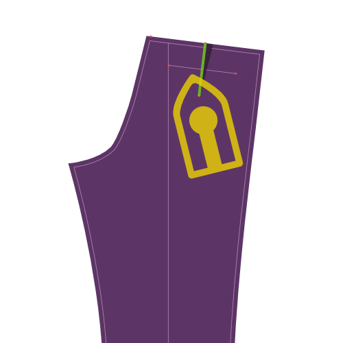
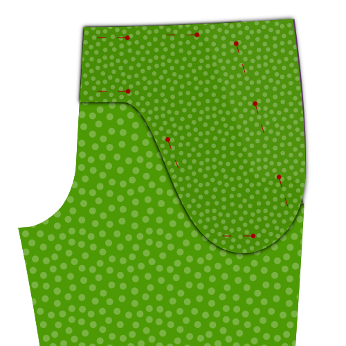
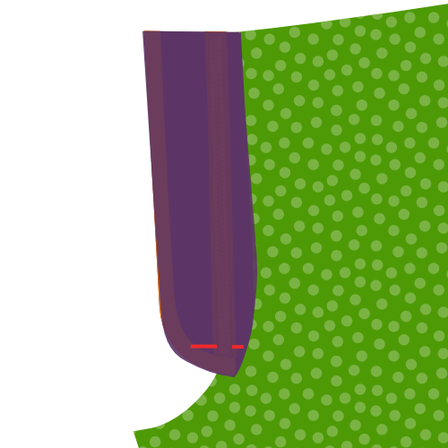
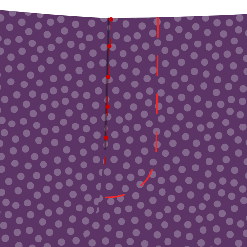
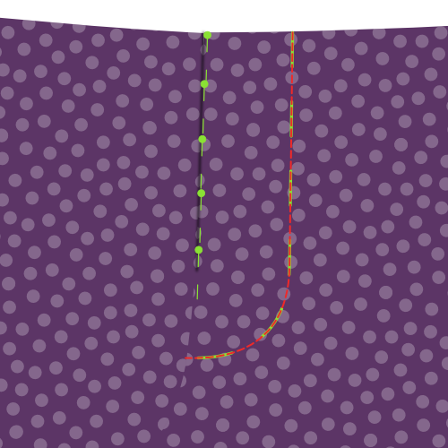
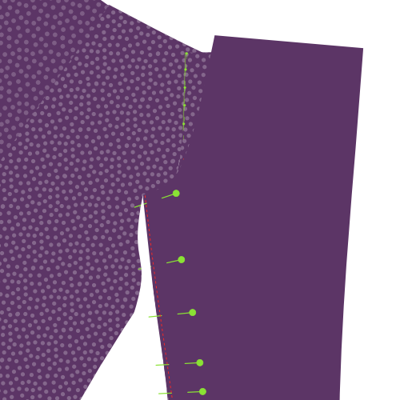
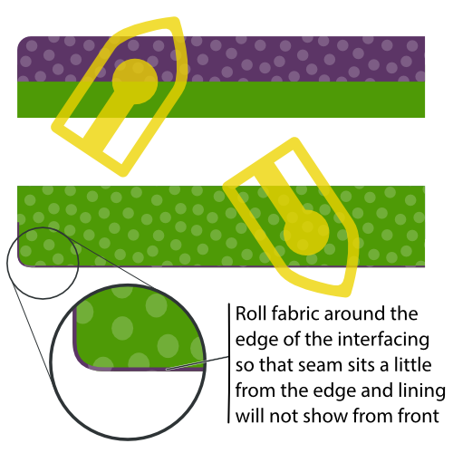
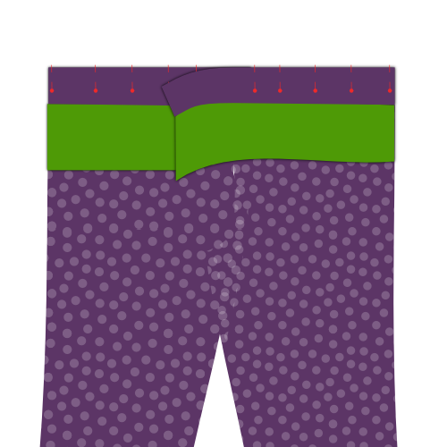
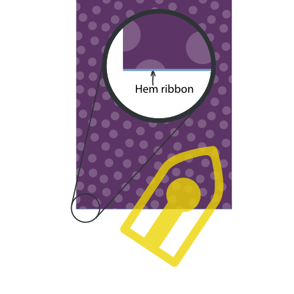

- - -
title: "Theo trousers: Sewing Instructions"
- - -

<Note>

¿Texto un poco seco para ti? Intento que los videos estén disponibles como parte de la documentación de patrones.

En este caso en particular, hay un montón de material de vídeo disponible, pero originalmente fue grabado para una versión anterior de este patrón. Aún así, buenas cosas.

</Note>

<YouTube id='PL1gv5yv3DoZOcmOJf6f0YWi522VXXv-mM' playlist />

<Note>

Muchos de los pasos siguientes deben repetirse para las patas de los pantalones.

Esto no siempre se menciona porque la vida es corta y escribir continuamente _No olvide hacer esto para ambas patas de pantalón_ se cansa muy pronto.

</Note>

### Paso 1: Baste las líneas de pliego

First thing to do is to  baste over the pleat line of your trouser legs. Do it on both front and back pieces for both legs.

### Paso 2: Cierra los dardos de atrás y presiona

### Cerrar los dardos traseros

Fold piece 1 (back) double so that the notches of the dart on the waistband are aligned, and a sharp crease runs to the notch at the dart end. Feel free to briefly iron the crease, this will make it easier to sew the dart accurately.

Close the dart by sewing from the waistband down to the end of the dart.

Use a small stitch length, and let your stitch run completely to the end (and of) the dart, then backtrack making sure to veer into the seam allowance.

#### Presiona los darts hacia el lado

Press your back darts flat, folding the seam allowance to the side of your trousers.

### Paso 3: Construir los bolsillos traseros

Construct the double welt pockets at the back of your trousers, including the pocket bag.

<Tip>

###### Bolsillos de doble soldadura

Construir un bolsillo de doble soldadura es una técnica que se utiliza es diferente de la ropa.
Por eso lo he sujetado en su propia página de documentación.

Hay documentación escrita y una serie de vídeo que muestra cómo hacerlo, así que incluso si nunca has hecho pockets de soldadura antes, estarás bien.

[A la documentación de pockets de soldadura](/docs/sewing/double-welt-pockets)

</Tip>

### Paso 4: Opcional: recorta tu revestimiento con fragmentos roscantes

If you are going to line your trousers (it's optional), you'll need to finish the edge of your lining. To do so, trim the edge of the lining with pinking shears.

Note that you only need to do this for those edges of your lining that are not caught in a seam. In other words, only the bottom edge of your lining.

<Tip>

Si no tienes escarchas pellizcas, puedes aplicar otro acabado como un zig-zag o usar un serger. Sin embargo, los fragmentos rosados son los mejores para este escenario porque no añaden ningún grueso, que es importante porque queremos evitar el borde del revestimiento haciendo un bache en sus pantalones.

</Tip>

### Paso 5: Recortar piezas para slant del bolsillo frontal

Align your front, lining and pocket bag on top of each other. Front and pocket back with their good side down, lining with the good side up.

Pin them together to make sure they don't move. Do so away from the pocket slant to not hinder yourself later.

Trim back the pocket bag (it should lie on top) exactly on the pocket slant line (marked on the pattern).

Now trim back the front piece (it should lie on the bottom) 3cm outwards from the slant line, parallel to it.

Finally, trim back your lining so that it stops 0.5 cm short of reaching the edge of your front.

<Tip>

El revestimiento es un poco más corto de modo que cuando se dobla, no se muestra. Pero realmente no es tan importante conseguir exactamente 0,5 cm más corto.

</Tip>

### Paso 6: Doble hacia atrás y coser slant del bolsillo frontal

Fold back your lining and front piece along the pocket slant line (and thus along the trimmed edge of the pocket bag. Pin this down and press.

You are going to sew along the pocket slant, but make sure to flip everything over first so you can sew from the good side.

Topstitch a 0.5 cm from the fold, making sure to keep it parallel and not stretch your fabric.

<Tip>

Esta parte superior estará siempre en el espectáculo, así que asegúrese de coincidir con el color del hilo y hacerlo bonito.

</Tip>

<Tip>

Para evitar que sus bolsillos salgan corriendo, puede colocar una pieza de cinta sin estirar entre el pliegue. Cuando se une, también se capturará esta cinta, evitando que el bolsillo salga.

</Tip>

### Paso 7: Finalizar borde dentro del bolsillo frontal

Fold away the main part of the front piece, so you can place the lining, pocket bag and folded edge of the front piece flat.

Zig-zag the edge of the folded-back front piece to finish it and secure it to the pocket back and lining.

### Paso 8: Bolsillo lateral

When you're done, place front piece, lining and pocket bag flat, and give it a good press.

<Tip>

Puede que sea un buen momento para recordarles que cada paso hasta este punto tenía que hacerse por ambas piernas.

Es sólo un recordatorio amistoso, los siguientes pasos deben hacerse también para ambas piernas.

</Tip>

### Paso 9: Adjuntar pieza lateral a bolsa de bolsa

Place the other half of the pocket bag with the good side down, and align the side piece on it with the good side up.

Sew a zig-zag stitch along the edge of the side piece to finish it and attach it to the pocket bag.

### Paso 10: Cierre la bolsa de bolsillo

Place the front piece, lining and pocket bag with the pocket bag up.

Align the second pocket bag with the attached side piece facing down.

Pin all pieces together making sure to stay about the bottom curve of the pocket bag.

When everything is pinned together, fold away the front piece and lining, and close the bottom curve of the pocket bag.

<Tip>

Sew to bottom curve of the pocket bag up until the point where it reached the side piece

You can finish the pocket bag in a number of ways, including:

- Serge the sides together
- Finish the edge with bias tape
- Sew the sides together and finish the edge with a zig-zag stitch

</Tip>

### Paso 11: Presione el bolsillo frontal

Put everything flat with the front piece at the bottom, and give it a good press.

### Paso 12: Anclar bolsillo frontal en su lugar

Pin the pocket down to the front piece along the slant and the edges of the pocket bag. This will prevent it from shifting around while we continue to work on our trousers.

### Paso 13: Termina los bordes laterales

Before we are going to sew the side seams, finish the side edges by serging or running a zig-zag stitch along the sides of your front and back pieces, making sure to stay within the foreseen seam allowance.

<Tip>

Asegúrese de incluir los bordes de la bolsa de forro y bolsa, ya que esto evitará que las cosas cambien cuando coser las costuras laterales.

</Tip>

### Paso 14: Aplasta las costuras del lado

Place the front and back of each leg on top of each other, with the good sides together.

Align the side seam, more precisely the side seam on the outside, where there is no crotch curve.

<Tip>

You can pin the pieces together to make sure things stay in place while sewing this lengthy seam.

</Tip>

Sew the seam, starting from the waistband along the entire side of your trousers.

### Paso 15: Pulse abrir costura

Press open the seam allowance along the side seams. Do so from the back, and repeat from the good side of the fabric.

Take your time, making sure to use enough heat, but not too much. Use steam or spray on water for best effect.

<Tip>

Una costura lateral plana agradable se ve grande, así que tómate tu tiempo para hacerlo bien.

</Tip>

### Paso 16: Escudo de mosca para volar

Place your fly piece on the fly shield with the good sides together, and align the edge with the biggest curve.

Sew along the curved edge, taking account the standard 1cm seam allowance, to join the two pieces together.

<Tip>

Si su revestimiento tiene algún estiramiento en él en absoluto, trate de estirarlo un poco mientras coser la curva. Esto hará más fácil conseguir que el revestimiento quede plano, sin enrollar más adelante.

</Tip>

### Paso 17: Presione el escudo de vuelo

<Tip>

Antes de apretar el tubo de la mosca, asegúrese de rodar un poco la costura para que su tela de revestimiento de pantalones se sienta un poco más, y el revestimiento sólo comienza alrededor de 2 mm del borde. Esto evitará que el revestimiento se repita en el borde.

</Tip>

After you have sewed fly piece and fly shield together, turn them inside out and press the seam you just made.

### Paso 18: Anclar zip a la parte frontal derecha

<Tip>

Pasos 18 a 21 todos conducen a una sola fila de stitching que coser tu zip al frente, al unir la pieza de mosca y el escudo de mosca de una vez.

Esta es la costura más difícil de hacer en todo el proceso de construcción. así que me tomo mi tiempo para explicar e ilustrar esto antes de empezar a coser.

</Tip>

Place your front piece for the right leg with the good side up. So that lining and front pocket bag sit underneath and lie flat.

Take your zip and open it (unzip it). Now turn it over so that it sits with the good side down. In other words, with the zipper puller down.

Align your zip with the crotch seam as shown in the illustration. Take the following into account:

- El final de tu zip debería sentarse en la parte superior de tus pantalones donde comenzará tu cintura. Sin embargo, asegúrese de recordar que allí hay permisos de costura así que no lo alinee con la parte superior del piete delantero, pero reste 1 cm de costura permitida.
- Alinear el zip con la costura del croll. No te importa el borde del zip, ya que vienen en diferentes anchuras. En cambio, asegúrese de que puede coser junto a los dientes del zip dentro de la costura de la pieza delantera.

Pin the zip in place with a few pins perpendicular to your zip (as shown). In other words, don't pin along the zip, but across the zip.

<Tip>

Si no está seguro de la colocación de su zip, póngalo lo más cerca posible del borde. Hacerlo sólo significará que su zip está un poco más lejos bajo la mosca, por lo que ciertamente no está en el espectáculo.

</Tip>

### Paso 19: Anclar escudo de mosca a zip

Take the fly shield/fly piece that you assembled in step 16 & 17, and place it with the fabric facing downward, and the lining upward.

Flip aside the top lining layer, and align the slightly curved edge of the fabric (where it is not sewn to the lining) with the edge of the fabric of your front piece.

<Tip>

Para mayor claridad, en la parte superior de la ilustración se muestra qué lado del escudo de moscas que debería estar enfrentado en una escala menor.

</Tip>

Pin this layer in place with a few pins perpendicular to your zip (as shown in red). Make sure you catch all layers underneath, including the zip. This way, you can remove your pins from the step before (shown in green) when done.

<Tip>

Si te sientes cómodo manteniendo todo esto en su lugar, puedes dejar que el revestimiento caiga y anclarlo todo, como se muestra en el siguiente paso. Eso es algo más rápido, pero más propenso a errores ya que las cosas pueden cambiar más fácilmente.

</Tip>

### Paso 20: Pin fly shield in place along zip

Let the lining fall back in place, and now pin all layers together along the zip.

When you are done, remove your earlier perpendicular pins.

### Paso 21: Plegar sobre escudo de mosca y anclar abajo

 

Flip everything over so that your fly shield lies at the bottom.

Fold the lining of the fly shield around the fly, front piece and fly piece, making sure to double-fold it so the raw edge is hidden inside.

Pin this down, and remove your previous pins.

### Paso 22: Vuelo Suelo en vuelo a lo largo de zip

Now you can sew along the double folded fly piece. This will fix the front, zip, fly shield and fly piece all in place.

<Tip>

Estarás cosiendo a lo largo de tu zip, así que asegúrate de instalar tu pie zipper para esto.

</Tip>

### Paso 23: Volar hacia atrás y presionar

When you're done, fold back the fly so that it extends from the front piece, and give it a thorough press from the back. And a gentle press from the front.

### Paso 24: Aplicar cintura de sesgo a segunda pieza de mosca y presionar

Apply bias tape to the edge with the large curve of your second fly piece.

Press the finished edge flat when you're done.

<Tip>

Bias tinta es una manera de terminar una costura. Si no está seguro de qué es o cómo aplicarlo, háganoslo saber.

</Tip>

### Paso 25: Pin y coser pieza de mosca a costura de cromo

Place the left leg with the good side up. Place the second fly piece on top with the good side down, aligning the unfinished seam with the crotch seam.

Pin the fly piece in place, then sew it in place along the crotch seam.

<Tip>

Cuando coja esto en su lugar, asegúrese de atrapar el revestimiento delantero.

</Tip>

Press the finished edge flat when you're done.

### Paso 26: Rolla la pieza de mosca hacia la espalda y presiona la costura

Fold the fly piece to the back. Before you press, make sure to roll the seam a bit backwards so that the front of the trousers sits a little further than the fly piece.

This way, the seam or fly piece will not show from the front.

Give it a good press from the back.

### Paso 27: Anclar y coser zip para volar

  

Place the right leg down with the good side up. Place the leg on top of it with the good side down.

With the crotch seams aligned, pin the zip along the edge of the fly piece with the good side of the zip down.

Make sure to pin the fly only to the fly piece. Not to any other layers underneath.

<Tip>

Encuentro más fácil fijar el zip a través de todas las capas, y luego, cuando esté seguro en su lugar añada pines extra que lo anclan a la pieza de mosca solamente. Cuando haya terminado, puede quitar los pines que atraviesan todas las capas.

</Tip>

Last but not least, sew along the zip with your zipper foot to attach it to the fly piece.

<Tip>

When aligning the zip, make sure to take the following into account:

- The zip should be placed with the good side down
- The zip should sit a bit back from the edge of your fly piece
- Make sure to align the top of the zip with the other zip half on the right leg

</Tip>

### Paso 28: Zig-zag el borde zip de la pieza de mosca

With the fly in place, run a zig-zag stitch along the edge of the zip to secure it to the fly piece.

### Paso 29: Bar-tack ambas piezas de mosca juntos

Place both fly pieces together, and move the front pieces out of the way.

Use a bar-tack to join them together at the bottom of the zip. Sew on both edges of the zip, and get as close to the zip as you can.

<Tip>

Si tu zip es demasiado largo, puedes recortarlo debajo de la barra-ataques.

</Tip>

### Paso 30: Únete a coberturas

 

Place both fronts with the good sides up. They are now joined by the fly.

Make sure the fly is neatly tucked under, and pin together both fronts at the bottom of the fly, where you bar-tacked earlier. Make sure the pin is aligned to the fold of your front.

Fold the fronts with the good sides together, and pin them together along the crotch.

You'll need to get the fly shields out of the way, so if you've pinned through all layers before, remove that pin now, making sure to replace it with a horizontal pin. This will tell you how far to sew.

Sew the crotch seam, starting at the cross-seam point, and going up to your horizontal pin.

<Tip>

Me resulta difícil explicar este paso, y difícil de ilustrar. Espero que tenga sentido cuando estés mirando a tu vuela. Si no es así, compruebe las instrucciones de vídeo.

</Tip>

### Paso 31: Encender la curva de mosca cerrada y bastar

Close the fly, and pin the fronts together making sure the fly is neatly tucked away.

We will be topstitching the fly curve next, and it's a good idea to baste it first.

You should start a bit above your earlier bar tack, and make sure you catch only the fly shield of the left leg.

Curve upwards toward the edge of the fly shield, and then proceed in parallel with the zip.

### Paso 32: Enlazar la curva de la mosca

Now topstitch your fly curve, using your basting as a guide.

When doing so, you will be locking your front, fly piece, pocket bag and lining all together.

### Paso 33: Anclar juntos la costura interior de la pierna

Close the legs with the good sides together, and pin together the inner leg seam. Start at the cross seam point and work your way to the bottom of the legs.

Make sure to do this for both legs.

### Paso 34: Apagar las costuras internas de la pierna

On both legs, sew the inner leg seams that you just pinned. Make sure to respect the seam allowance.

### Paso 35: Presione la costura abierta de la costura interior de la pierna

Place your leg inside-out on your ironing board, and press open the seam allowance of the inner leg seam.

### Paso 36: Cierra la costura cruzada

We are now going to close the cross-seam, from the bottom of your fly between your legs, up your bum to the center back of where you'll add the waistband later.

To do so, turn on of the legs inside out, so that that good side of the fabric is turned inside, and the bad side and lining sits on the outside.

The other leg should not be turned inside-out, but should just have its good side on the outside.

Now, put the leg that has the good side out (the normal leg) into the leg that has the bad side out (the inside-out leg).

This way, the good sides of both legs will sit against each other, and this is how you should sew the cross seam.

<Tip>

Tenga cuidado de que su pierna no se torne dentro de la otra pierna. Cuando esté en duda, vuelva a salir de la pierna de dentro, después de que haya fijado la costura cruzada para asegurarse de que todo está bien.

</Tip>

Pin the cross-seam in place, and then sew it close, starting at the side of the fly, and making sure to respect the seam allowance.

When done, press the seam allowance open.

### Paso 37: Presione el pliegue de la pierna en su lugar

Turn your trousers good side out, and carefully place one leg on your ironing board so that it lies flat and folds exactly on the crease line your basted earlier.

When it's looking good, press the crease lines in your leg, front a back. Repeat for the other leg.

Give it a firm press because you want the pleats to still be there after you wash your trousers (so you can see where to press them again).

<Tip>

En la industria, los productos químicos se aplican a lo largo de la línea de pliegues antes de que se presione juntos. Algunos tailors usan algún tipo de martillo y yunque de madera para golpear las fibras en un pliegue permanente.

</Tip>

Depending on your fabric, your crease might last longer, but ultimately, you can't expect to have a crease that can withstand a few washes without being reapplied.

<Tip>

Tal vez esto no hace falta decirlo, pero también hay otra opción: No presiones el pliegue. Esto le da a sus pantalones un aspecto más informal.

</Tip>

### Paso 38: Fusionar interfaz a la cintura

Fuse the waistband interfacing (Piece 3) to the waistband (Piece 4).

Align the interfacing in the middle of the waistband, and make sure to keep it nicely aligned as you fuse it in place with your iron.

### Paso 39: Cerrar la banda de cintura y forro de cintura

Join the waistband (Pieces 4a and 4b) by sewing both pieces good sides together.

Join the waistband lining (Pieces 5a and 5b) by sewing both pieces good sides together.

### Paso 40: Mostrando cintura a forrado de banda de cintura

Place your waistband on the waistband lining, good sides together, so that the waistband interfacing is facing upwards.

Align the edge, and pin them together.

<Tip>

Vamos a coser a lo largo del borde de la interfaz, pero vamos a coser alrededor de 3mm o 1/8 pulgadas del borde de la interfaz. Esto evitará que el revestimiento sea visible desde el frente más adelante.

</Tip>

On one side of the waistband, end with a curve and then go down vertically along the edge of the waistband interfacing. Check the illustration to make sure you do it on the correct side.

### Paso 41: Tela rolla alrededor del borde interactivo y pulsa la cintura

Before pressing the waistband, make sure to roll over the fabric around the edge of the interfacing.

Remember that in the previous step your sewed 3mm from the interfacing edge? Remember that in the previous step your sewed 3mm from the interfacing edge? You need to make the fold around the edge of the interfacing so that the actual seam sits 3mm more inwards. Remember that in the previous step your sewed 3mm from the interfacing edge? You need to make the fold around the edge of the interfacing so that the actual seam sits 3mm more inwards.

This will make sure that our lining fabric is never on display from the front of your trousers.

### Paso 42: Anclar cintura a pantalones

Pin the edge of your waistband (the side you did not sew the lining to) to the top of your trousers, good sides together.

Tuck the edge of your fly into the end of the waistband with the curved corner. On the other end of the waistband, it will be longer. In other words, your waistband will overlap here.

<Tip>

Tenga cuidado de emparejar la alineación vertical de la cintura en el zip. Con el zip cerrado, ambos lados de la cintura deben sentarse a una altura igual. Esto es fácil de perder si no lo compruebas.

</Tip>

### Paso 43: Pierde cintura a pantalones

Now that the waistband is pinned to top of your trousers, sew it in place.

On the side with the curved corner, get as close to the edge as possible. On the other side, stop when you reach the edge of your fly.

### Paso 44: Presione pulsera

Give your newly sewn seam a good press. Do not press the seam open, instead press it towards the top (put both trousers and waistband seam allowance in the waistband).

### Paso 45: Prepara los bucles de la cinta

The belt loops are a part of your trousers where you can let your creativity run free. There's load of different ways to make and shape belt loops, not to mention that where you place them is also up to you.

That being said, here's what to do to make a standard belt loop:

Find the belt loop pattern part, a small rectangular piece of fabric. There should be 8 of them, and these will become your belt loops. For each of them, take these steps:

- Zig-zag (o serge) a lo largo de los bordes más largos del rectángulo
- Doblar un lado hacia atrás a lo largo de la longitud, y presionar
- Doble el otro lado hacia atrás, a lo largo de la longitud, y presiona
- Coser a lo largo de la parte trasera del bucle de la cinta para que los lados doblados permanezcan en su lugar, pero las stitches no se muestran en la parte frontal
- Dale una buena prensa final cuando hayas terminado

<Tip>

Si bien la anchura de los bucles de la cinta no es tan importante, es importante asegurarse de que son todos del mismo ancho.

Para hacer más fácil tener una anchura consistente, puedes doblar los bucles de la cinta alrededor de una tira de cartón, papel grueso, o plástico de la anchura del bucle de la correa deseada.

Esta tira también puede ayudarle con la costura de la mano. Manténgalo en el bucle de la cinta y evitará que tu aguja perfore a través de todas las capas y tu hilo no se mostrará en la parte delantera.

</Tip>

### Paso 46: Adjuntar los bucles de la cinta: Tomás

Attach the bottom of the belt loops to your trousers. Place them about 1.5 cm below your waistband, depending on your waistband width.

Place the good side of the belt loop down on the good side of the trousers (good sides together) and secure with a bar tack or narrow zig-zag.

Then, zig zag the edge of the belt loop to the trousers.

<Tip>

Es importante sacar la cintura del camino mientras lo hace. Asegúrate de sujetar los bucles de la correa sólo a tus pantalones y no al revestimiento de la banda de cintura.

Tienes 8 bucles de cinturón, así que tienes que distribuirlos alrededor de tu cintura. Echa un vistazo a un par existente si no estás seguro de cómo hacer esto.

Asegúrese de colocar aros de cinta cerca del centro de la espalda y no demasiado cerca en la parte delantera (para los cubos de cinta).

</Tip>

### Paso 47: Waistband frente

The waistband facing needs to be cut out and attached to your waistband.

This will be a lot simpler to understand if you have a look at the relevant video:

@[youtube](https://www.youtube.com/embed/8dLOuOtb18U?list=PL1gv5yv3DoZOcmOJf6f0YWi522VXXv-mM)

### Paso 48: Recortar costura de cintura

Before we finalize the waistband, we're going to trim back some of its seam allowance.

<Tip>

**About seam allowance grading**
When trimming back different layers of seam allowance, always try to cut them at different lengths so that the bulk is reduced in incremental steps.

La capa que se encuentra más cercana al lado bueno de la prenda debe ser la más larga, así que recorta desde allí.

Hacerlo hará menos probable que el contorno de la franquicia de costura sea visible desde el lado bueno.

</Tip>

### Paso 49: Presione y funda el revestimiento de cintura

The waistband lining will be sewn from the front of the trousers on top of the seam that joins the waistband to the trousers (so called _stitch in the ditch_).

Doing so will catch the lining and secure it in place. However, since we'll be sewing this from the good side, the lining will lie beneath all other layers, and we won't see what we're doing.

That is why, to make sure it all lies clean and flat, we will first press and baste the lining.

The lining will extend downward from the top, and it needs to be folded back up under itself, so that it will get caught by the seam when we sew it in place later.

To make sure things look pretty, the distance between the top of our waistband and the (folded back) bottom edge of our lining should be constant. You can mark an even distance from the top of your trousers, and then pin back the lining at this line. Last but not least, press that fold in your lining.

When you're happy with how it looks, baste the lining in place just next to the seam joining the waistband and trousers.

<Tip>

Es mejor bastar al lado de la costura, y en realidad no en la costura. Esto hará que sea mucho más fácil remover tu cocimiento cuando hayamos cosido en el último paso.

</Tip>

### Paso 50: Aplasta el revestimiento de cintura en su lugar

After you basted the waistband lining, sew it in place from the good side, exactly in the seam between the waistband and trousers.

### Paso 51: Adjuntar bucles de cinta: Arriba

With your waistband and lining properly secured, it's time to attach the top of the belt loops.

Sew them in place just as you did at the bottom. That is, use a bar tack or close zig-zag to attach them, then zig-zag over the end to secure it.

<Tip>

No coser por la parte superior de los bucles de cinturón. Tendrás que trabajar el pie de tu máquina de coser bajo el ciclo de la cinta para que sólo cores la pieza que se pliegue.

Siéntete libre de recortar la longitud de tus bucles de cinturón después de tocar el bar y antes de zig-zag el final de ellos, como podrían ser demasiado largos.

</Tip>

### Paso 52: Termina el borde de las piernas

Before we hem the trousers, finish the raw edge of the legs with a zig-zag stitch or serger.

<Tip>

También sería un buen momento para probar con tus pantalones y marcar exactamente cuánto tiempo quieres que sean después de que se hemten.

</Tip>

### Paso 53: (opcional) Mezclado en una cinta de hem

<Tip>

La cinta de hem es una cinta que se sienta en el interior de su pantalón. En el lugar en el que tu húmeda se pliega hacia atrás, la tela tiene que sufrir un gran abuso, desde golpes a zapatos y otras cosas.

La colocación de una cinta dentro del tubo protege en cierta medida su tejido, y es un buen acabado.

</Tip>

Mark the hemline on your trousers (good side out).

Place the ribbon as shown in the illustration making sure that it extends a few mm above the hemline. Sew it in place all the way around the leg, making sure to sew close but not on the hemline.

### Paso 54: Presione el hem

Fold back the trouser legs at the hemline, and press the hem.

<Tip>

Si has cosido en un rifón de hem , la cinta se extenderá unos pocos mm por debajo de la línea de llave, protegiendo así la tela del tubo.

</Tip>

### Paso 55: Hem las piernas

With the hem neatly pressed, simply hand-sew the folded back part to the inside of your trousers.

<Tip>

Hemming se hace a mano porque es importante que las stitches no se muestren en el frente. So when hand-sewing the hem, don't push your needle through the fabric, but just catch a few threads so your stitches don't show on the front

While there are machine alternatives, they aren't as neat (blind hem stitch) or probably not accessible to the home-sewer (industrial blind hem machine).

</Tip>

### Paso 56: Recorte, limpia y presiona

Trim any loose threads or basting that remains, and give your trousers a good final press.
