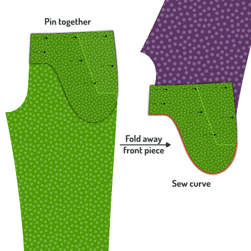
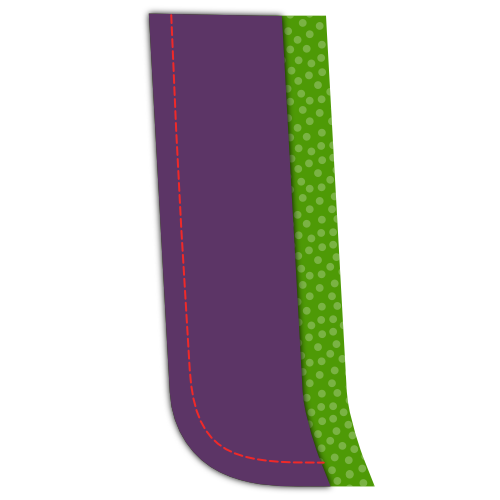
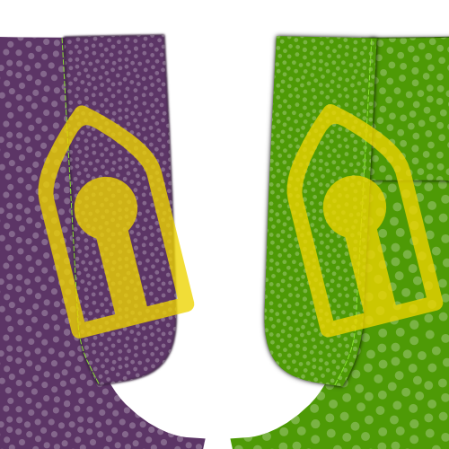
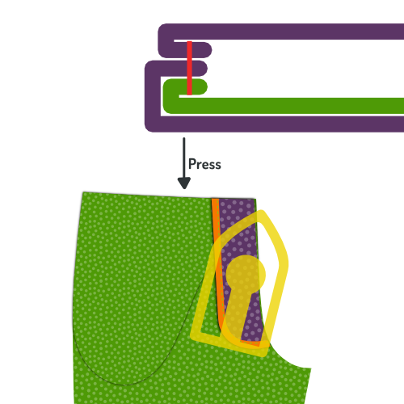
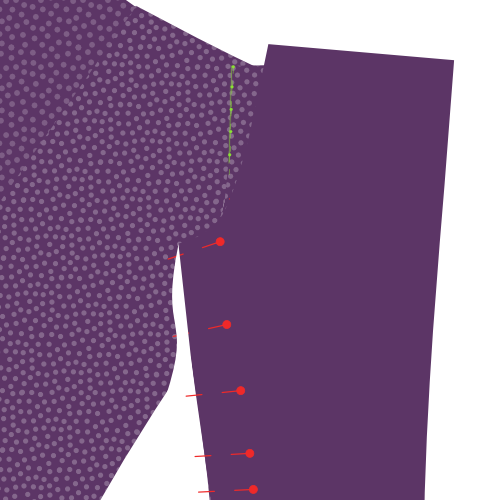
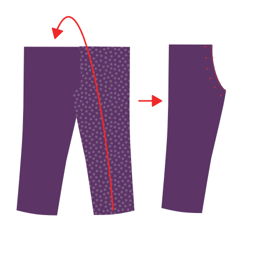
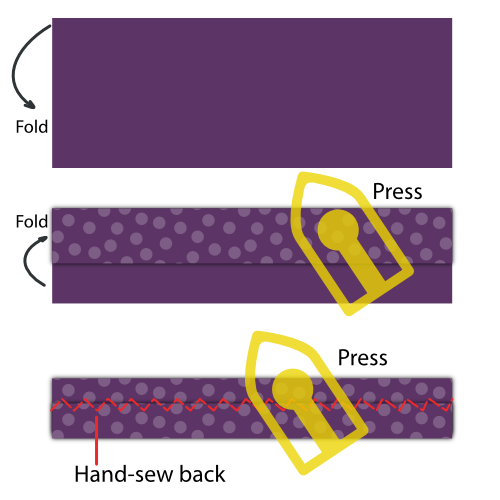
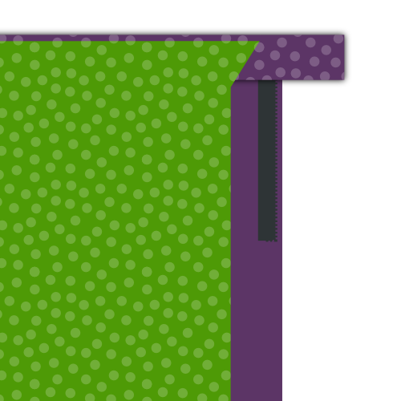

<Note>

Le texte est un peu concis pour vous ? J'essaie de rendre les vidéos disponibles comme partie intégrante de la documentation du patron.

Dans ce cas particulier, il y a beaucoup de matériel vidéo disponible, mais il a été enregistré à l'origine pour une version précédente de ce modèle. « Malgré tout, de bonnes choses. »

</Note>

<YouTube id='PL1gv5yv3DoZOcmOJf6f0YWi522VXXv-mM' playlist />

<Note>

La plupart des étapes ci-dessous doivent être répétées pour les deux pantalons.

Cela n'est pas toujours mentionné parce que la vie est courte et l'écriture continue *N'oubliez pas de le faire pour les deux pantalons* se fatigue très bientôt.

</Note>

### Étape 1 : Coller les lignes de pli

La première chose à faire est de se baser sur la ligne de pli de vos pantalons. Faites-le sur les deux pièces avant et arrière pour les deux jambes.

### Étape 2 : Fermez les fléchettes arrière et appuyez sur

### Fermer les fléchettes arrière

Plier la pièce 1 (dos) double de sorte que les encoches du dard sur la ceinture soient alignées, et un pli pointu se dirige vers l'encoche à l'extrémité du dart. N’hésitez pas à repasser brièvement le pli afin de faciliter la couture de la fléchette avec précision.

Fermez le dart en couturant de la ceinture jusqu'à la fin de la fléchette.

Utilisez une petite longueur de point et laissez votre point courir complètement jusqu'à la fin (et de) la flèche, puis le backtrack en s'assurant de bien pénétrer dans la marge de couture.

#### Appuyez sur les fléchettes arrières sur le côté

Pressez vos fléchettes arrière à plat en pliant la couture sur le côté de votre pantalon.

### Étape 3 : Construire les poches arrière

Construisez les deux poches à l'arrière de votre pantalon, y compris le sac de poche.

<Tip>

###### Poches double coulissantes

Construire une double poche soudée est une technique qui est utilisée pour différents vêtements.
C'est pourquoi je l'ai branché dans sa propre page de documentation.

Il y a à la fois une documentation écrite et une série vidéo qui vous montre comment le faire, donc même si vous n'avez jamais fait de poches de soudage avant, vous serez bien.

[À la documentation des poches de soudure](/docs/sewing/double-pockets)

</Tip>

### Étape 4 : Optionnel: Ajuster votre doublure avec des cisailles pinçantes

Si vous voulez aligner votre pantalon (facultatif), vous devrez terminer le bord de votre doublure. Pour ce faire, coupez le bord de la doublure avec des cisailles robustes.

Notez que vous devez seulement le faire pour les bords de votre doublure qui ne sont pas pris dans une couture. En d'autres termes, seulement le bord inférieur de votre doublure.

> Si vous n'avez pas de cisailles roseuses, vous pouvez appliquer une autre finition comme un point de zig-zag ou utiliser un serger. Cependant, les cisailles roses sont meilleures pour ce scénario car elles n'ajoutent pas de masse, qui est important parce que nous voulons éviter le bord de la doublure en faisant une bosse dans votre pantalon.

### Étape 5 : Ajuster les pièces pour la poche avant

Alignez votre sac avant, doublure et poche les uns sur les autres. Devant et dos de poche avec leur bon côté vers le bas, la doublure avec le bon côté vers le haut.

Épinglez les ensemble pour vous assurer qu'ils ne bougent pas. Éloignez-vous de la poche pour ne pas vous gêner plus tard.

Couper le sac de poche (il devrait se trouver sur le haut) exactement sur la ligne de la pochette (marquée sur le motif).

Coupez maintenant la pièce avant (elle devrait se trouver en bas) à 3cm de la ligne de tendant, parallèlement à celle-ci.

Enfin, coupez le dos de votre doublure pour qu'il arrête de 0,5 cm de court pour atteindre le bord de votre devant.

> La doublure est coupée un peu plus courte, de sorte que quand elle est pliée en arrière, elle ne s'affiche pas. Mais il n'est vraiment pas si important de le faire exactement 0,5 cm plus court.

### Étape 6 : Replier le dos et coudre la poche avant

Repliez le dos de votre doublure et la pièce avant le long de la rangée de poche (ainsi le long du bord coupé du sac de poche). Épinglez ceci et appuyez dessus.

Vous allez coudre le long de la poignée de poche, mais assurez-vous de tout retourner d'abord pour pouvoir coudre du bon côté.

Collez le dessus à 0,5 cm du pli, assurez-vous de le garder parallèle et de ne pas étirer votre tissu.

> Ce surpiqûre sera toujours montré, alors assurez-vous de correspondre à la couleur du fil et de le rendre joli.

> Pour empêcher vos poches de se déposer, vous pouvez placer un morceau de ruban non étirant entre le pli. Lors de la broderie, vous attraperez également ce ruban, empêchant la poche de se déposer.

### Étape 7 : Terminer le bord dans la poche avant

](step07.png)

Repliez la partie principale de la pièce avant pour pouvoir placer la doublure, le sac de poche et le bord plié de la pièce avant à plat.

Zig-zag le bord de la pièce avant pliée pour la finir et la fixer sur le dos de la poche et la doublure.

### Étape 8 : Appuyez sur la poche latérale

Lorsque vous avez terminé, placez la pièce avant, la doublure et le sac de poche à plat, et donnez-lui une bonne presse.

> Ce serait peut-être un bon moment pour vous rappeler que chaque étape devait être accomplie pour les deux jambes.
>
> C'est juste un rappel amical, les prochaines étapes doivent être faites pour les deux jambes aussi.

### Étape 9 : Attacher la pièce latérale au sac de poche

Placez l'autre moitié du sac de poche avec le bon côté vers le bas, et alignez la pièce latérale sur le bon côté vers le haut.

Coudre un point de zig-zag le long du bord de la pièce latérale pour le terminer et l'attacher au sac de poche.

### Étape 10: Fermer le sac de poche

Placez la pièce avant, la doublure et le sac de poche avec le sac de poche.

Alignez le deuxième sac de poche avec la pièce latérale attachée orientée vers le bas.

Épinglez toutes les pièces ensemble en vous assurant de rester sur la courbe inférieure du sac de poche.

Lorsque tout est épinglé ensemble, repliez la pièce avant et la doublure et fermez la courbe inférieure du sac de poche.

> Coudre à la courbe inférieure du sac de poche jusqu'au point où il a atteint la pièce latérale

> Vous pouvez finir le sac de poche de plusieurs façons, y compris :
>
> -   Serge les côtés ensemble
> -   Terminer le bord avec du ruban adhésif
> -   Coudre les côtés ensemble et finir le bord avec un point de zig-zag

### Étape 11: Appuyez sur la poche avant

Mettre tout à plat avec la pièce avant en bas, et lui donner une bonne presse.

### Étape 12: Épingler la poche avant en place

Épingler la poche sur la partie avant le long de la courge et les bords du sac de poche. Cela l’empêchera de se déplacer pendant que nous continuons à travailler sur notre pantalon.

### Étape 13: Terminer les bords latéraux

Avant de coudre les coutures latérales, finissez les bords latéraux en sergeant ou en faisant courir un point de zig-zag le long des côtés de vos pièces avant et arrière, en veillant à rester dans l'indemnité de couture prévue.

> Assurez-vous d'inclure les bords de la doublure et du sac de poche, car cela empêchera les choses de se déplacer lorsque nous couvrirons les coutures latérales.

### Étape 14: Coudre les coutures latérales

](step14.png)

Placez le devant et l'arrière de chaque jambe sur les uns sur les autres, avec les bons côtés ensemble.

Alignez la couture latérale, plus précisément la couture latérale à l'extérieur, où il n'y a pas de courbure de crochage.

> Vous pouvez épingler les pièces ensemble pour vous assurer que les choses restent en place pendant la couture de cette longue couture

Coudre la couture, à partir de la ceinture, le long de toute la face de votre pantalon.

### Étape 15 : Appuyez sur la marge de couture ouverte

Appuyez sur ouvrir la marge de couture le long des coutures. Faites-le à partir du dos et répétez à partir du bon côté du tissu.

Prenez votre temps, assurez-vous d'utiliser suffisamment de chaleur, mais pas trop. Utilisez de la vapeur ou de la pulvérisation sur l'eau pour obtenir le meilleur effet.

> Une belle couture de côté plat a l'air superbe, alors prenez votre temps pour la régler.

### Étape 16 : Coudre le bouclier de la mouche en pièce de mouche

Placez votre pièce de mouche sur le bouclier avec les bons côtés ensemble, et alignez le bord avec la plus grande courbe.

Coudre le long du bord courbé, en tenant compte de la marge de couture standard de 1 cm, pour joindre les deux pièces ensemble.

> Si votre doublure contient un étirement quelconque, essayez de l'étirer un peu pendant que vous coudez la courbe. Il sera ainsi plus facile de mettre la doublure à plat sans rides plus tard.

### Étape 17 : Appuyez sur le bouclier de la mouche

> Avant d’appuyer sur votre mouche, assurez-vous de rouler un peu la couture afin que votre doublure de pantalon s’assied un peu plus loin, et la doublure ne démarre qu'à environ 2mm du bord. Cela empêchera la doublure de se dessiner sur le bord.

Une fois que vous avez cousu la pièce de mouche et bouclier de mouche ensemble, retournez-les à l'intérieur et appuyez sur la couture que vous venez de fabriquer.

### Étape 18: Épingler le zip vers le devant droit

> Les étapes 18 à 21 mènent tous à une seule rangée de coutures qui va coudre votre zip à l'avant, tout en attachant la pièce de mouche et le bouclier de mouche en une seule fois.
>
> C'est la couture la plus difficile à faire dans tout le processus de construction, donc je prends mon temps pour expliquer et illustrer cela avant de commencer à coudre.

Placez votre pièce avant pour la jambe droite avec le bon côté vers le haut. Ainsi, ce sac de poche avant et doublure s'assied sous et repose à plat.

Prenez votre zip et ouvrez-le (décompresser). Maintenant, retournez-le pour qu'il s'assied avec le bon côté vers le bas. En d'autres termes, avec le tiroir à fermeture à glissière.

Alignez votre zip avec la couture de crotch comme indiqué dans l'illustration. Prendre en compte les éléments suivants :

-   La fin de votre glissière devrait se poser au sommet de votre pantalon où commencera votre ceinture. Cependant, n'oubliez pas qu'il y a une marge de couture là-bas, ne l'alignez donc pas avec le haut de la pièce avant, mais soustrayez une marge de couture de 1 cm.
-   Alignez le zip avec la couture crochée. Ne vous inquiétez pas le bord de la zip, comme ils viennent en différentes largeurs. Au lieu de cela, assurez-vous que vous pouvez coudre à côté des dents de la glissière dans la couture de la pièce avant.

Épingler le zip en place avec quelques broches perpendiculaires à votre zip (comme montré). En d'autres termes, ne pinglez pas le long du zip, mais de l'autre côté du zip.

> Si vous n'êtes pas sûr de l'emplacement de votre zip, mettez-la aussi près que possible du bord. Le fait de le faire signifie seulement que votre zip est un peu plus loin sous la volée, de sorte qu'il n'est certainement pas en spectacle.

### Étape 19: Épingler le bouclier de la mouche pour zipper

Prenez la pièce de bouclier/mouche que vous avez assemblée à l'étape 16 & 17, et placez-la avec le tissu orienté vers le bas, et la doublure vers le haut.

Inverser la couche de doublure supérieure, et alignez le bord légèrement courbé du tissu (où il n'est pas cousu à la doublure) avec le bord du tissu de votre pièce avant.

> Pour plus de clarté, quel côté du bouclier de la mouche qui doit être orienté vers le haut est affiché dans la partie supérieure de l'illustration, à une échelle plus petite.

Épingler ce calque en place avec quelques épingles perpendiculaires à votre zip (comme indiqué en rouge). Assurez-vous d'attraper toutes les couches en dessous, y compris le zip. De cette façon, vous pouvez retirer vos épingles de l'étape avant (affiché en vert) une fois terminé.

> Si vous êtes à l'aise de tenir tout cela en place, vous pouvez laisser la doublure tomber et épingler tout ensemble comme indiqué à l'étape suivante. C'est un peu plus rapide, mais plus sujet aux erreurs car les choses peuvent se déplacer plus facilement.

### Étape 20 : Épingler le bouclier de la mouche le long du zip

Laissez la doublure revenir en place, et maintenant épingler toutes les couches ensemble le long de la glissière.

Lorsque vous avez terminé, retirez vos épingles perpendiculaires antérieures.

### Étape 21 : Plier sur le bouclier de la mouche et épingler vers le bas

 {.fs-row2}  {.fs-row2}

Retournez tout pour que votre bouclier de mouche se trouve au fond.

Pliez la doublure du bouclier de la mouche autour de la mouche, de la pièce frontale et de la pièce de mouche, en faisant en sorte que le bord brut soit caché à l'intérieur.

Épinglez ceci vers le bas, et retirez vos épingles précédentes.

### Étape 22: Coudre la mouche en place le long du zip

Vous pouvez maintenant coudre le long de la mouche double pliée. Cela réparera le front, le zip, le bouclier de la mouche et la pièce de mouche en place.

> Vous allez coudre le long de votre zip, alors assurez-vous d'installer votre pied zippé.

### Étape 23 : Pliez la mouche arrière et appuyez sur

Lorsque vous avez terminé, repliez la mouche pour qu'elle s'étende de la pièce avant, et donnez-lui une pression profonde de l'arrière. Et une presse douce de l'avant.

### Étape 24 : Appliquez du ruban de biais sur la deuxième pièce de vol et appuyez sur

Appliquez un ruban de biais sur le bord avec la grande courbe de votre deuxième pièce de mouche.

Appuyez sur le bord fini à plat lorsque vous avez terminé.

> Bias ruban est une façon de finir une couture. Si vous n'êtes pas sûr de ce qu'il est ou de la manière de l'appliquer, faites-le moi savoir.

### Étape 25 : Épingler et coudre la mouche pour coudre la couture

Placez la jambe gauche avec le bon côté vers le haut. Placez la deuxième mouche sur le dessus avec le bon côté vers le bas, en alignant la couture non finie avec la couture crochée.

Épingler la mouche en place, puis la coudre en place le long de la couture.

> Lorsque vous courez cela en place, assurez-vous d'attraper la ligne avant.

Appuyez sur le bord fini à plat lorsque vous avez terminé.

### Étape 26 : Roulez la mouche au dos et appuyez sur la couture

Pliez la pièce de la mouche à l'arrière. Avant de presser, Assurez-vous de faire rouler la couture un peu en arrière pour que le pantalon se trouve un peu plus loin que la mouche.

De cette façon, la couture ou la pièce de mouche ne se montrera pas à l'avant.

Donnez-lui une bonne presse depuis le dos.

### Étape 27: Épingler et coudre le zip à la pièce de vol

 {.fs-row3}  {.fs-row3}  {.fs-row3}

Placez la jambe droite vers le bas avec le bon côté vers le haut. Placer la jambe sur le dessus avec le bon côté vers le bas.

Avec les coutures de crotch alignées, pincez le zip le long du bord de la mouche avec le bon côté du zip vers le bas.

Assurez-vous d'épingler la mouche uniquement à la mouche. Pas à d'autres couches en dessous.

> Je trouve plus facile d'épingler le zip à travers toutes les couches, puis lorsque la sécurité est en place, ajoutez des épingles supplémentaires qui l'épinglent à la pièce de mouche seulement. Quand c'est fait, vous pouvez enlever les broches qui passent par tous les calques.

Enfin et surtout, coudre le long du zip avec votre pied à glissière pour l'attacher à la mouche.

> Lors de l'alignement du zip, assurez-vous de prendre en compte les éléments suivants :
>
> -   Le zip doit être placé avec le bon côté vers le bas
> -   Le zip devrait s'asseoir un peu en arrière du bord de votre pièce de mouche
> -   Assurez-vous d'aligner le haut du zip avec l'autre moitié, sur la jambe droite

### Étape 28 : Zig-zag le bord zip à la pièce de la mouche

Avec la mouche en place, courez un point de zig-zag le long du bord du zip pour le fixer à la mouche.

### Étape 29 : Tape à barres les deux morceaux de mouche ensemble

Placez les deux morceaux de mouche ensemble, et déplacez les pièces avant hors du chemin.

Utilisez un bar-taquet pour les unir au bas de la zip. Coudre sur les deux bords du zip, et se rapprocher le plus possible du zip.

> Si votre zip est trop long, vous pouvez le couper en dessous de la barre.

### Étape 30: Joindre la couture de crotch

 {.fs-row2}  {.fs-row2}

Placez les deux faces avec les bons côtés vers le haut. Ils sont maintenant rejoints par la mouche.

Assurez-vous que la mouche est bien enfoncée sous la mouche et fixez les deux devants au fond de la mouche, où vous vous approchez plus tôt. Assurez-vous que la broche est alignée sur le pli de votre devant.

Repliez les fronts avec les bons côtés ensemble, et fixez-les ensemble le long de la récolte.

Vous aurez besoin de sortir les boucliers de la volée, donc si vous avez épinglé toutes les couches avant, retirez cette broche maintenant, assurez-vous de la remplacer par une broche horizontale. Cela vous dira jusqu'où il faut coudre.

Coudre la couture du crochet, en commençant par le point de couture croisé et en remontant à votre épingle horizontale.

> Je trouve cette étape difficile à expliquer, et difficile à illustrer. J'espère que cela aura un sens quand vous regardez votre mouche. Si ce n'est pas le cas, consultez les instructions de la vidéo.

### Étape 31: Feuille d'épingle fermée et courbe de baste

Fermez la mouche et fixez les devants ensemble en veillant à ce que la mouche soit bien enfoncée.

Nous allons refaire le point sur la courbe de mouche par la suite, et c'est une bonne idée de le baser d'abord.

Vous devriez commencer un peu au-dessus de votre équipement de barre précédente, et assurez-vous de ne prendre que le bouclier de la jambe gauche.

Faites une courbe vers le haut vers le bord du bouclier de la mouche, puis continuez en parallèle avec le zip.

### Étape 32: Couper la courbe de la mouche

Maintenant toppoint votre courbe de vol, en utilisant votre bâton comme guide.

Lorsque vous le ferez, vous verrouillerez votre devant, votre pièce de vol, votre sac de poche et votre doublure en même temps.

### Étape 33: Épinglez ensemble la couture intérieure de la jambe

Fermer les jambes avec les bons côtés ensemble, et épingler ensemble la couture intérieure de la jambe. Commencez au point de couture croisée et travaillez vers le bas des jambes.

Assurez-vous de le faire pour les deux jambes.

### Étape 34 : Coudre les coutures internes de la jambe

Sur les deux jambes, coudre les coutures intérieures de la jambe que vous venez d'épingler. Veillez à respecter l'allocation de couture.

### Étape 35 : Appuyez sur la couture ouverte de la couture intérieure des jambes

Placez votre jambe sur votre planche à repasser et appuyez sur ouvrir la marge de couture de la couture intérieure.

### Étape 36: Fermer la couture croisée

Nous allons maintenant fermer la couture croisée, du fond de votre mouche entre vos jambes, remonter le bum au centre à l'arrière de la ceinture, plus tard, vous y ajouterez la ceinture.

Pour cela, allumez les jambes à l'intérieur, de sorte que le bon côté du tissu soit retourné à l'intérieur, et le mauvais côté et la doublure se trouve à l'extérieur.

L'autre jambe ne doit pas être repliée sur elle-même, mais doit simplement avoir son bon côté à l'extérieur.

Maintenant, mettez la jambe qui a le bon côté dehors (la jambe normale) dans la jambe qui a le mauvais côté dehors (la jambe intérieure).

De cette façon, les bons côtés des deux jambes s'assoient les uns contre les autres, et c'est ainsi que vous devriez coudre la couture de croix.

> Faites attention à ce que votre jambe ne soit pas tordue à l'intérieur de l'autre jambe. En cas de doute, tournez à nouveau la jambe extérieure après avoir épinglé la couture de croix pour vous assurer que tout va bien.

Épingler la couture croisée en place, puis la coudre fermement, en commençant par le côté de la mouche, et en veillant à respecter la marge de couture.

Une fois terminé, appuyez sur la marge de couture ouverte.

### Étape 37: Appuyez sur le pli des jambes en place

Sortez vos pantalons du bon côté, et placez soigneusement une jambe sur votre planche à repasser pour qu'elle se trouve à plat et se plie exactement sur la ligne de pli que vous avez construite plus tôt.

Quand il est beau, appuyez sur les lignes de pli dans votre jambe, devant un dos. Répétez pour l'autre jambe.

Donnez-lui une presse ferme parce que vous voulez que les plis soient toujours là après avoir lavé votre pantalon (pour voir où les appuyer à nouveau).

> Dans l'industrie, les produits chimiques sont appliqués le long de la ligne de pli avant d'être pressés ensemble. Certains tailleurs utilisent une sorte de marteau et d'enclume en bois pour frapper les fibres dans un creux permanent.

Selon votre tissu, votre pli peut durer plus longtemps, mais en fin de compte, vous ne pouvez pas vous attendre à avoir un pli qui peut résister à quelques lavages sans être réappliqué.

> Peut-être que cela va de soi, mais il y a aussi une autre option : ne pas appuyer sur le creux. Cela donne à votre pantalon un aspect plus informel.

### Étape 38 : Fusionner l'interfaçage avec la ceinture

Fusionnez l'interfaçage de la ceinture (Piece 3) à la ceinture (Piece 4).

Aligner l'interfaçage au milieu de la ceinture, et assurez-vous de le garder bien aligné pendant que vous le fusionnez avec votre fer.

### Étape 39 : Fermer la ceinture et la ceinture

Rejoignez la ceinture (Pieces 4a et 4b) en couturant les deux pièces de bons côtés ensemble.

Rejoignez la doublure de ceinture (Pieces 5a et 5b) en cousant les deux pièces de bons côtés ensemble.

### Étape 40 : Coudre la ceinture à la ceinture

Placez votre ceinture sur la ceinture de la ceinture, les bons côtés ensemble, de sorte que l'interfaçage de la ceinture soit orienté vers le haut.

Alignez le bord et épinglez-le ensemble.

> Nous allons coudre le long du bord de l'interface, mais nous couvrirons environ 3mm ou 1/8 de pouce à partir du bord de l'interface. Cela empêchera que la doublure soit visible à l'avant plus tard.

Sur un côté de la ceinture, terminez par une courbe et descendez verticalement le long du bord de l’interface de la ceinture. Vérifiez l'illustration pour vous assurer que vous le faites sur le bon côté.

### Étape 41 : Roulez le tissu autour du bord d'interfaçage et appuyez sur la ceinture

Avant de presser la ceinture, assurez-vous de rouler sur le tissu autour du bord de l'interface.

Vous vous souvenez que dans l'étape précédente, vous avez cousu 3mm de la bordure interfacée ? Vous devez faire le pli autour du bord de l'interface, de sorte que la couture actuelle s'assoit de 3mm plus vers l'intérieur.

Cela permettra de s'assurer que notre tissu de doublure ne sera jamais exposé à l'avant de votre pantalon.

### Étape 42: Épingler la taille de la taille au pantalon

Épingler le bord de votre ceinture (le côté où vous n'avez pas coupé la doublure pour) au sommet de votre pantalon, les bons côtés ensemble.

Enclenchez le bord de votre mouche à l'extrémité de la ceinture avec le coin courbé. À l'autre extrémité de la ceinture, elle sera plus longue. En d'autres termes, votre ceinture se chevauchera ici.

> Veillez à faire correspondre l'alignement vertical de la ceinture à la fermeture zippée. Lorsque le zip est fermé, les deux côtés de la ceinture doivent s'asseoir à une hauteur égale. C'est facile à rater si vous ne le vérifiez pas.

### Étape 43 : Coudre la ceinture au pantalon

Maintenant que la ceinture est épinglée au dessus de votre pantalon, coupez-la en place.

Sur le côté avec le coin courbé, approchez le plus près possible du bord. De l'autre côté, arrêtez quand vous atteignez le bord de votre vol.

### Étape 44 : Appuyez sur la ceinture

Donnez à votre couture cousue une bonne presse. N'appuyez pas sur la couture ouverte, au lieu de la presser vers le haut (placez à la fois le pantalon et le bandeau de ceinture).

### Étape 45 : Préparez les boucles de ceinture

Les boucles de ceinture font partie de votre pantalon où vous pouvez laisser libre cours à votre créativité. Il y a de nombreuses façons de faire et de façonner des boucles de ceinture, sans oublier que l'endroit où vous les placez dépend aussi de vous.

Cela dit, voici ce qu'il faut faire pour faire une boucle de ceinture standard:

Trouvez la partie de motif de la boucle de la ceinture, un petit morceau de tissu rectangulaire. Il devrait y en avoir 8, et ceux-ci deviendront vos boucles de ceinture. Pour chacun d'eux, prenez ces mesures :

-   Zig-zag (ou serge) le long des bords les plus longs du rectangle
-   Replier un côté sur la longueur et appuyer sur
-   Plier le dos de l'autre côté le long de la longueur et appuyer sur
-   Coudre à la main le long de la boucle de la ceinture pour que les côtés pliés restent en place, mais les points ne s'affichent pas à l'avant
-   Donnez-lui une dernière bonne pression lorsque vous avez terminé

> Même si la largeur des boucles de votre ceinture n'est pas si importante, il importe de s'assurer qu'elles sont toutes de la même largeur.
>
> Pour faciliter l'obtention d'une largeur uniforme, vous pouvez plier vos boucles de ceinture autour d'une bande de carton, papier épais, ou plastique de la boucle de courroie désirée.
>
> Cette bande peut également vous aider à coudre à la main. Gardez-le dans la boucle de votre ceinture et il empêchera votre aiguille de percer à travers toutes les couches et votre fil ne se montrera pas à l'avant.

### Étape 46 : Attachez les boucles de ceinture : Bas

Attachez le bas des boucles de ceinture à votre pantalon. Placez-les à environ 1,5 cm en dessous de votre ceinture, selon la largeur de votre ceinture.

Placez le bon côté de la boucle de la ceinture sur le bon côté du pantalon (bons côtés ensemble) et sécurisez avec un appui-barre ou un zig-zag.

Puis zag le bord de la courroie vers le pantalon.

> Il est important de faire sortir la ceinture de la taille tout en faisant ceci. Assurez-vous d’attacher les boucles de ceinture uniquement à votre pantalon, et non à la bande de taille.

> Vous avez 8 boucles de ceinture, donc vous devez les répartir autour de votre ceinture. Jetez un coup d'œil à une paire existante si vous ne savez pas comment procéder.
>
> Assurez-vous de placer des cerceaux de ceinture à proximité du dos central, et pas trop près les uns des autres à l'avant (pour les boucles de ceinture).

### Étape 47 : Visage de la ceinture

La bande de taille doit être découpée et attachée à votre ceinture.

Ce sera beaucoup plus simple à comprendre si vous jetez un coup d'œil à la vidéo concernée :

@[youtube](https://www.youtube.com/embed/8dLOuOtb18U?list=PL1gv5yv3DoZOcmOJf6f0YWi522VXXv-mM)

### Étape 48 : Ajuster la marge de couture de la taille

Avant de finaliser la ceinture, nous allons couper une partie de sa marge de couture.

> **About seam allowance grading** When trimming back different layers of seam allowance, always try to cut them at different lengths so that the bulk is reduced in incremental steps.
>
> La couche la plus proche du bon côté du vêtement devrait être la plus longue, donc couper de là.
>
> Ce faisant, il sera moins probable que le contour de la marge de couture soit visible du bon côté.

### Étape 49: Appuyez et badigeonnez la doublure de ceinture

La doublure à bande de taille sera cousue à partir de l'avant du pantalon sur le dessus de la couture qui relie la ceinture au pantalon (appelé *point dans le fossé*).

Le fait de le faire rattrapera la doublure et la fixera en place. Cependant, comme nous allons coudre cela du bon côté, la doublure se trouvera sous toutes les autres couches, et nous ne verrons pas ce que nous faisons.

C'est pourquoi, pour que tout soit propre et plat, nous appuierons d'abord et bâtisserons la doublure.

La doublure va s'étendre vers le bas depuis le haut, et elle doit être repliée vers le haut sous elle-même, afin qu'il soit pris par la couture lorsque nous le couchons plus tard.

Pour s'assurer que les choses paraissent jolies, la distance entre le haut de notre ceinture et le bord inférieur de notre doublure doit être constante. Vous pouvez marquer une distance uniforme du haut de votre pantalon, puis épingler la doublure à cette ligne. Enfin et surtout, appuyez sur ce pli dans votre doublure.

Quand vous êtes satisfait de son apparence, badigeonnez la doublure en place juste à côté de la couture qui rejoint la ceinture et le pantalon.

> Il est préférable de badigeonner à côté de la couture, et pas vraiment dans la couture. Cela facilitera grandement la suppression de votre bâton quand nous aurons cousu dans la dernière étape.

### Étape 50: Coudre la doublure de ceinture en place

Après avoir bâti la toile de ceinture, coupez-la en place du bon côté, exactement dans la couture entre la ceinture et le pantalon.

### Étape 51 : Attacher la boucle de la ceinture : Haut

Avec votre ceinture et votre doublure bien fixées, il est temps de fixer le sommet des boucles de ceinture.

Les coudre en place comme vous l'avez fait en bas de page. C'est-à-dire, utilisez un taquet ou fermez le zig-zag pour les attacher, puis zig-zag sur l'extrémité pour le fixer.

> Ne pas coudre à travers le haut des boucles de ceinture. Tu devras travailler le pied de ta machine à coudre sous la boucle de la courroie de sorte que tu ne couses que la pièce qui est pliée en arrière.

> N’hésitez pas à couper la longueur des boucles de votre ceinture après avoir appuyé sur votre barre et avant de zig-zag la fin de celles-ci, car ils pourraient être trop longs.

### Étape 52: Terminer le bord des jambes

Avant d'ourdir le pantalon, finissez le bord brut des jambes avec un point de zig-zag ou de serger.

> Ce serait également un bon moment pour essayer votre pantalon et marquer exactement combien de temps vous voulez qu'il soit après qu'ils soient enserrés.

### Étape 53: (Optionnel) Coudre dans un ruban d'ourlet

> L'ourlet est un ruban qui se trouve à l'intérieur de votre pantalon. À l'endroit où votre ourlet se replie, le tissu doit prendre beaucoup d'abus de bosser dans des chaussures et d'autres choses.
>
> Placer un ruban à l'intérieur de l'ourlet protège votre tissu dans une certaine mesure, et c'est une finition soignée.

Marquez l'ourlet sur votre pantalon (bon côté).

Placez le ruban comme indiqué dans l'illustration en vous assurant qu'il s'étend à quelques mm au-dessus de l'ourlet. Coudre en place tout le long de la jambe, en s'assurant de coudre près mais pas sur l'ourlet.

### Étape 54 : Appuyez sur l'ourlet

Repliez les jambes du pantalon à l'ourlet et appuyez sur l'ourlet.

> Si vous avez cousu dans un ruban d'ourlet, le ruban s'étendra de quelques mm en dessous de la ligne d'ourlet, protégeant ainsi le tissu à l'ourlet.

### Étape 55: ourdir les jambes

Avec l'ourlet bien enfoncé, cousez simplement à la main la partie arrière pliée à l'intérieur de votre pantalon.

> L'emménagement se fait à la main parce qu'il est important que les points ne s'affichent pas sur le devant. Donc, lorsque vous cousez le ourlet à la main, ne poussez pas votre aiguille à travers le tissu, mais il suffit de attraper quelques fils pour que vos points ne s'affichent pas sur le devant
>
> Bien qu'il y ait des alternatives à la machine, elles ne sont pas aussi propres (point d'ourlets aveugles) ou probablement pas accessibles aux égouts de la maison (machine à ourlets industriels).

### Étape 56 : Couper, nettoyer et appuyer sur

Couper tous les fils lâches ou les bâtons qui restent, et donner à votre pantalon une bonne presse finale.
