- - -
title: "Theo trousers: Sewing Instructions"
- - -

<Note>

Tekst een beetje te droog voor je? Ik probeer video's beschikbaar te maken als deel van de documentatie.

In dit geval is er een hoop videomateriaal beschikbaar, maar dit is origineel opgenomen voor een eerdere versie van dit patroon. Nog steeds relevant wel.

</Note>

<YouTube id='PL1gv5yv3DoZOcmOJf6f0YWi522VXXv-mM' playlist />

<Note>

Veel van de stappen hieronder worden herhaald voor beide broekspijpen.

Dat wordt niet altijd vermeld omdat het leven kort is en het continu schrijven van _Do niet vergeet om dit voor beide broekspijpen_ te doen, snel genoeg wordt.

</Note>

### Stap 1: Drieg de plooilijnen

First thing to do is to  baste over the pleat line of your trouser legs. Do it on both front and back pieces for both legs.

### Stap 2: Sluit de nepen achteraan en strijk

### Sluit de achterste nepen

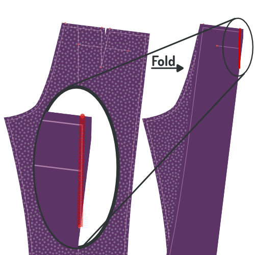

Fold piece 1 (back) double so that the notches of the dart on the waistband are aligned, and a sharp crease runs to the notch at the dart end. Feel free to briefly iron the crease, this will make it easier to sew the dart accurately.

Close the dart by sewing from the waistband down to the end of the dart.

Use a small stitch length, and let your stitch run completely to the end (and of) the dart, then backtrack making sure to veer into the seam allowance.

#### Strijk de nepen naar de zijkant

Press your back darts flat, folding the seam allowance to the side of your trousers.

### Stap 3: Maak de achterzakken

Construct the double welt pockets at the back of your trousers, including the pocket bag.

<Tip>

###### Dubbele paspelzakken

Het maken van een dubbele paspelzak is een techniek die wordt gebruikt zijn verschillende kledingstukken.
Daarom heb ik er een aparte pagina met documentatie voor gemaakt.

Er is zowel geschreven documentatie en een reeks video's die je tonen hoe dit werkt, dus zelfs als je nog nooit paspelzakken gemaakt hebt komt het wel in orde.

[Naar de documentatie over de paspelzakken](/docs/naaien/dubbel-zakjes)

</Tip>

### Stap 4: Optioneel: Knip je voering bij met een kartelschaar

If you are going to line your trousers (it's optional), you'll need to finish the edge of your lining. To do so, trim the edge of the lining with pinking shears.

Note that you only need to do this for those edges of your lining that are not caught in a seam. In other words, only the bottom edge of your lining.

<Tip>

Als je geen kartelschaar hebt kan je een andere methode gebruiken, zoals een zigzag- of overlocksteek. Kartelscharen zijn hier echter de beste optie omdat ze geen extra bulk toevoegen, wat belangrijk is als we willen vermijden dat de onderrand van de voering zichtbaar is door de stof van je broek.

</Tip>

### Stap 5: Knip delen voor voorste steekzakken bij

Align your front, lining and pocket bag on top of each other. Front and pocket back with their good side down, lining with the good side up.

Pin them together to make sure they don't move. Do so away from the pocket slant to not hinder yourself later.

Trim back the pocket bag (it should lie on top) exactly on the pocket slant line (marked on the pattern).

Now trim back the front piece (it should lie on the bottom) 3cm outwards from the slant line, parallel to it.

Finally, trim back your lining so that it stops 0.5 cm short of reaching the edge of your front.

<Tip>

De voering wordt een beetje korter geknipt zodat ze niet zichtbaar is als ze teruggeplooid wordt. Maar het is niet zo belangrijk om ze exact 0.5 cm korter te krijgen.

</Tip>

### Stap 6: Plooi de voorste zakopening en stik

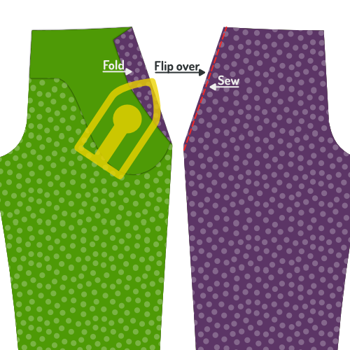

Fold back your lining and front piece along the pocket slant line (and thus along the trimmed edge of the pocket bag. Pin this down and press.

You are going to sew along the pocket slant, but make sure to flip everything over first so you can sew from the good side.

Topstitch a 0.5 cm from the fold, making sure to keep it parallel and not stretch your fabric.

<Tip>

Dit stiksel is altijd zichtbaar, dus zorg dat de draadkleur bij je stof past en maak het mooi.

</Tip>

<Tip>

Om te voorkomen dat je zakken uitrekken kan je een stuk niet-elastisch lint tussen de vouw stoppen. Wanneer je stikt wordt dit lint mee vastgemaakt, en zorgt het dat de zak niet uitrekt.

</Tip>

### Stap 7: werk de rand aan de binnenkant van de voorzak af

Fold away the main part of the front piece, so you can place the lining, pocket bag and folded edge of the front piece flat.

Zig-zag the edge of the folded-back front piece to finish it and secure it to the pocket back and lining.

### Stap 8: Strijk de steekzak

When you're done, place front piece, lining and pocket bag flat, and give it a good press.

<Tip>

Dit is misschien een goed moment om je nog eens te vertellen dat alle stappen tot nu toe gelden voor de twee broekspijpen.

Gewoon zodat je eraan denkt, de volgende stappen moeten trouwens ook twee keer gedaan worden.

</Tip>

### Stap 9: Bevestig belegdeel voorzak aan zakdeel

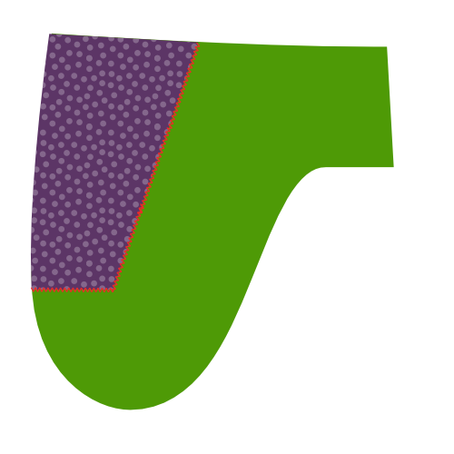

Place the other half of the pocket bag with the good side down, and align the side piece on it with the good side up.

Sew a zig-zag stitch along the edge of the side piece to finish it and attach it to the pocket bag.

### Stap 10: Sluit het zakdeel

Place the front piece, lining and pocket bag with the pocket bag up.

Align the second pocket bag with the attached side piece facing down.

Pin all pieces together making sure to stay about the bottom curve of the pocket bag.

When everything is pinned together, fold away the front piece and lining, and close the bottom curve of the pocket bag.

<Tip>

Sew to bottom curve of the pocket bag up until the point where it reached the side piece

You can finish the pocket bag in a number of ways, including:

- Serge the sides together
- Finish the edge with bias tape
- Sew the sides together and finish the edge with a zig-zag stitch

</Tip>

### Stap 11: Strijk de steekzak

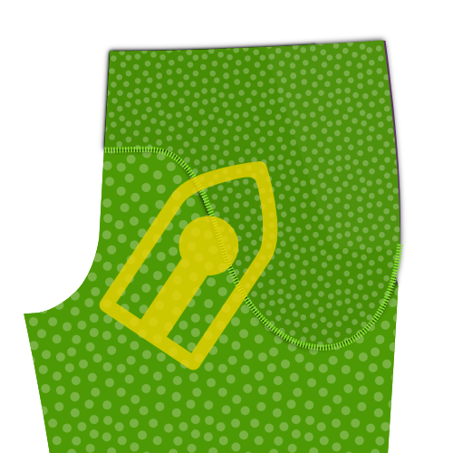

Put everything flat with the front piece at the bottom, and give it a good press.

### Stap 12: Speld de voorzak vast

Pin the pocket down to the front piece along the slant and the edges of the pocket bag. This will prevent it from shifting around while we continue to work on our trousers.

### Stap 13: Werk de zijranden af

Before we are going to sew the side seams, finish the side edges by serging or running a zig-zag stitch along the sides of your front and back pieces, making sure to stay within the foreseen seam allowance.

<Tip>

Zorg dat je de voering en randen van het zakdeel mee vastmaakt, dit zorgt ervoor dat niets verschuift terwijl we de zijnaden stikken.

</Tip>

### Stap 14: Stik de zijnaden

Place the front and back of each leg on top of each other, with the good sides together.

Align the side seam, more precisely the side seam on the outside, where there is no crotch curve.

<Tip>

You can pin the pieces together to make sure things stay in place while sewing this lengthy seam.

</Tip>

Sew the seam, starting from the waistband along the entire side of your trousers.

### Stap 15: Strijk de naadwaarde open

Press open the seam allowance along the side seams. Do so from the back, and repeat from the good side of the fabric.

Take your time, making sure to use enough heat, but not too much. Use steam or spray on water for best effect.

<Tip>

Een mooi platte zijnaad ziet er geweldig uit, dus neem je tijd om het goed te krijgen.

</Tip>

### Stap 16: stik het gulpbeleg aan het gulpdeel

Place your fly piece on the fly shield with the good sides together, and align the edge with the biggest curve.

Sew along the curved edge, taking account the standard 1cm seam allowance, to join the two pieces together.

<Tip>

Als je voering een beetje stretch heeft, rek de voering dan wat uit terwijl je de curve stikt. Dit maakt het makkelijker om de voering plat te laten liggen zonder plooien.

</Tip>

### Stap 17: Strijk het gulpbeleg

<Tip>

Voor je dit deel platstrijkt rol je de naad een beetje naar binnen zodat de voering naar de onderkant gekeerd wordt, en ongeveer 2 mm van de rand ligt. Dit voorkomt dat de voering aan de rand zichtbaar is.

</Tip>

After you have sewed fly piece and fly shield together, turn them inside out and press the seam you just made.

### Stap 18: Speld de rits aan het rechtervoorpand

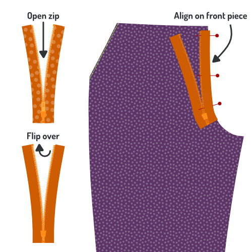

<Tip>

Stap 18 tot 21 leiden allemaal naar een enkel stiksel dat de rits aan het voorpand bevestigt, en tegelijk het gulpdeel en gulpbeleg vastmaakt.

Dit is de moeilijkste naad in het hele proces, dus ik ga mijn tijd nemen om alles uit te leggen en te illustreren voor je begint te naaien.

</Tip>

Place your front piece for the right leg with the good side up. So that lining and front pocket bag sit underneath and lie flat.

Take your zip and open it (unzip it). Now turn it over so that it sits with the good side down. In other words, with the zipper puller down.

Align your zip with the crotch seam as shown in the illustration. Take the following into account:

- Het einde van je rits zou aan de bovenrand van je broek moeten zitten, waar je tailleband begint. Denk er wel aan dat daar nog naadwaarde zit, dus leg het einde niet exact samen met de rand, maar 1 cm lager.
- Leg de rits gelijk met de kruisnaad. Let niet op de rand van de rits, aangezien deze in verschillende breedtes bestaan. Zorg in de plaats dat je naast de tandjes van de rits kan stikken en binnen de naadwaarde van het voorpand blijven.

Pin the zip in place with a few pins perpendicular to your zip (as shown). In other words, don't pin along the zip, but across the zip.

<Tip>

Als je niet zeker bent over de plaatsing van je rits, leg ze dan zo dicht mogelijk tegen de rand. Dit zorgt dat je rits iets verder in de gulp zit, zodat ze zeker niet zichtbaar is.

</Tip>

### Stap 19: Speld gulpbeleg aan rits

Take the fly shield/fly piece that you assembled in step 16 & 17, and place it with the fabric facing downward, and the lining upward.

Flip aside the top lining layer, and align the slightly curved edge of the fabric (where it is not sewn to the lining) with the edge of the fabric of your front piece.

<Tip>

Voor de duidelijkheid, de kant van het gulpbeleg die omhoog moet liggen is getoond in het bovenste deel van de illustratie, op een kleinere schaal.

</Tip>

Pin this layer in place with a few pins perpendicular to your zip (as shown in red). Make sure you catch all layers underneath, including the zip. This way, you can remove your pins from the step before (shown in green) when done.

<Tip>

Als je zeker genoeg bent dat je alles op z'n plaats kan houden kan je de voering terug laten vallen en alles samenspelden zoals in de volgende stap. Dit is een beetje sneller, maar je maakt sneller fouten omdat dingen snel kunnen verschuiven.

</Tip>

### Stap 20: Speld het gulpbeleg vast langs de rits

Let the lining fall back in place, and now pin all layers together along the zip.

When you are done, remove your earlier perpendicular pins.

### Stap 21: Plooi het gulpbeleg om en speld het neer

 

Flip everything over so that your fly shield lies at the bottom.

Fold the lining of the fly shield around the fly, front piece and fly piece, making sure to double-fold it so the raw edge is hidden inside.

Pin this down, and remove your previous pins.

### Stap 22: Stik de gulp vast langs de rits

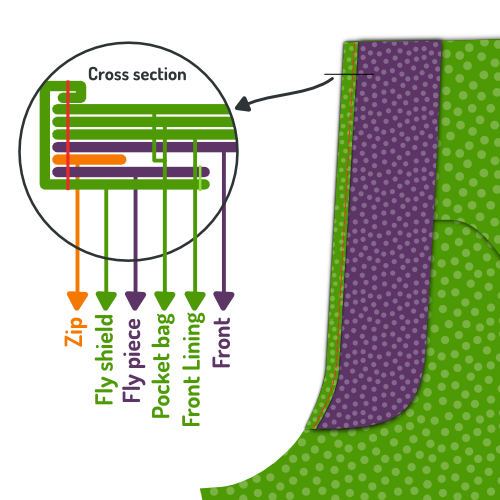

Now you can sew along the double folded fly piece. This will fix the front, zip, fly shield and fly piece all in place.

<Tip>

Je stikt langs je rits, dus gebruik je ritsvoet hiervoor.

</Tip>

### Stap 23: Plooi de gulp om en strijk

When you're done, fold back the fly so that it extends from the front piece, and give it a thorough press from the back. And a gentle press from the front.

### Stap 24: Stik biaislint aan het tweede gulpdeel en strijk

Apply bias tape to the edge with the large curve of your second fly piece.

Press the finished edge flat when you're done.

<Tip>

Biaislint is een manier om een rand af te werken. Als je niet zeker bent wat het is of hoe je het gebruikt, laat het me dan weten.

</Tip>

### Stap 25: Speld en stik het gulpdeel aan de kruisnaad

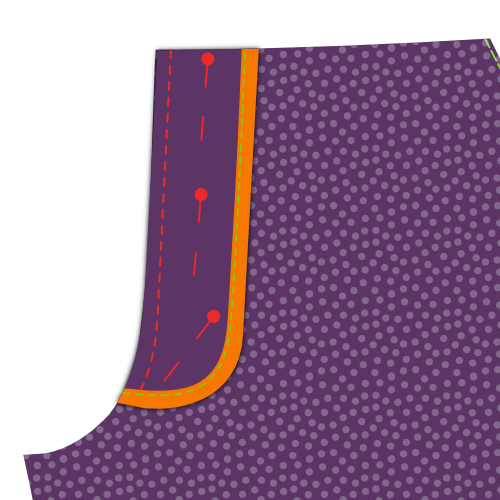

Place the left leg with the good side up. Place the second fly piece on top with the good side down, aligning the unfinished seam with the crotch seam.

Pin the fly piece in place, then sew it in place along the crotch seam.

<Tip>

Let op dat je de voering mee vaststikt bij het stikken van deze naad.

</Tip>

Press the finished edge flat when you're done.

### Stap 26: Keer het gulpdeel naar achter en strijk de naad

Fold the fly piece to the back. Before you press, make sure to roll the seam a bit backwards so that the front of the trousers sits a little further than the fly piece.

This way, the seam or fly piece will not show from the front.

Give it a good press from the back.

### Stap 27: Speld en stik de rits aan het gulpdeel

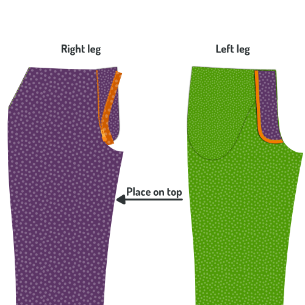 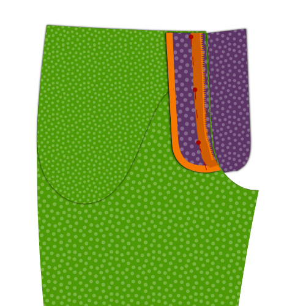 

Place the right leg down with the good side up. Place the leg on top of it with the good side down.

With the crotch seams aligned, pin the zip along the edge of the fly piece with the good side of the zip down.

Make sure to pin the fly only to the fly piece. Not to any other layers underneath.

<Tip>

Ik vind het makkelijker om de rits door alle lagen te spelden, en wanneer ze stevig vastzit extra spelden toe te voegen om ze enkel aan het gulpdeel te spelden. Als dat gebeurd is kan je de spelden die door alle lagen gaan verwijderen.

</Tip>

Last but not least, sew along the zip with your zipper foot to attach it to the fly piece.

<Tip>

When aligning the zip, make sure to take the following into account:

- The zip should be placed with the good side down
- The zip should sit a bit back from the edge of your fly piece
- Make sure to align the top of the zip with the other zip half on the right leg

</Tip>

### Stap 28: Zigzag de rand van de rits aan het gulpdeel

With the fly in place, run a zig-zag stitch along the edge of the zip to secure it to the fly piece.

### Stap 29: Bevestig de gulpdelen met een trens

Place both fly pieces together, and move the front pieces out of the way.

Use a bar-tack to join them together at the bottom of the zip. Sew on both edges of the zip, and get as close to the zip as you can.

<Tip>

Als je rits te lang is kan je ze onder de trensen bijknippen.

</Tip>

### Stap 30: Sluit de kruisnaad

 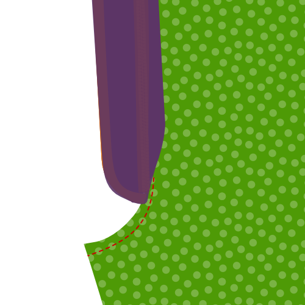

Place both fronts with the good sides up. They are now joined by the fly.

Make sure the fly is neatly tucked under, and pin together both fronts at the bottom of the fly, where you bar-tacked earlier. Make sure the pin is aligned to the fold of your front.

Fold the fronts with the good sides together, and pin them together along the crotch.

You'll need to get the fly shields out of the way, so if you've pinned through all layers before, remove that pin now, making sure to replace it with a horizontal pin. This will tell you how far to sew.

Sew the crotch seam, starting at the cross-seam point, and going up to your horizontal pin.

<Tip>

Deze stap is moeilijk uit te leggen, en lastig te illustreren. Ik hoop dat het duidelijk is als je naar je gulp kijkt. Indien niet, kijk naar de videoinstructies.

</Tip>

### Stap 31: Speld de gulp dicht en drieg de curve

Close the fly, and pin the fronts together making sure the fly is neatly tucked away.

We will be topstitching the fly curve next, and it's a good idea to baste it first.

You should start a bit above your earlier bar tack, and make sure you catch only the fly shield of the left leg.

Curve upwards toward the edge of the fly shield, and then proceed in parallel with the zip.

### Stap 32: Stik de curve van de gulp door

Now topstitch your fly curve, using your basting as a guide.

When doing so, you will be locking your front, fly piece, pocket bag and lining all together.

### Stap 33: Speld de binnenbeennaad samen

Close the legs with the good sides together, and pin together the inner leg seam. Start at the cross seam point and work your way to the bottom of the legs.

Make sure to do this for both legs.

### Stap 34: Stik de binnenbeennaden

On both legs, sew the inner leg seams that you just pinned. Make sure to respect the seam allowance.

### Stap 35: Strijk de naadwaarde van de binnenbeennaad open

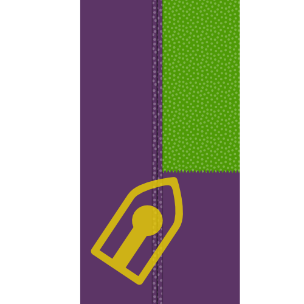

Place your leg inside-out on your ironing board, and press open the seam allowance of the inner leg seam.

### Stap 36: Stik de kruisnaad

We are now going to close the cross-seam, from the bottom of your fly between your legs, up your bum to the center back of where you'll add the waistband later.

To do so, turn on of the legs inside out, so that that good side of the fabric is turned inside, and the bad side and lining sits on the outside.

The other leg should not be turned inside-out, but should just have its good side on the outside.

Now, put the leg that has the good side out (the normal leg) into the leg that has the bad side out (the inside-out leg).

This way, the good sides of both legs will sit against each other, and this is how you should sew the cross seam.

<Tip>

Let op dat je ene broekspijp niet gedraaid zit in de andere. Als je twijfelt, keer het binnenstebuiten been dan terug naar de buitenkant nadat je de naad gespeld hebt om zeker te zijn dat alles ok is.

</Tip>

Pin the cross-seam in place, and then sew it close, starting at the side of the fly, and making sure to respect the seam allowance.

When done, press the seam allowance open.

### Stap 37: Strijk de plooi in de broekspijp

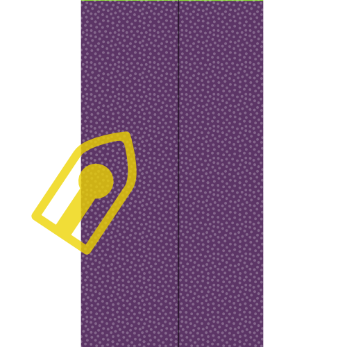

Turn your trousers good side out, and carefully place one leg on your ironing board so that it lies flat and folds exactly on the crease line your basted earlier.

When it's looking good, press the crease lines in your leg, front a back. Repeat for the other leg.

Give it a firm press because you want the pleats to still be there after you wash your trousers (so you can see where to press them again).

<Tip>

In de kledingindustrie gebruikt men chemische stoffen langs de vouwlijn voor ze gestreken wordt. Sommige kleermakers gebruiken een houten hamer en aambeeld om de vezels in een permanente plooi te timmeren.

</Tip>

Depending on your fabric, your crease might last longer, but ultimately, you can't expect to have a crease that can withstand a few washes without being reapplied.

<Tip>

Misschien is dit extreem logisch, maar er is nog een andere optie: laat de plooi gewoon weg. Dit geeft je broek een minder formele look.

</Tip>

### Stap 38: Strijk tussenvoering aan tailleband

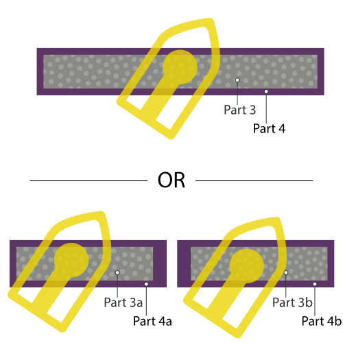

Fuse the waistband interfacing (Piece 3) to the waistband (Piece 4).

Align the interfacing in the middle of the waistband, and make sure to keep it nicely aligned as you fuse it in place with your iron.

### Stap 9: Sluit de tailleband en de voering van de tailleband

Join the waistband (Pieces 4a and 4b) by sewing both pieces good sides together.

Join the waistband lining (Pieces 5a and 5b) by sewing both pieces good sides together.

### Stap 40: Stik de tailleband aan de voering van de tailleband

Place your waistband on the waistband lining, good sides together, so that the waistband interfacing is facing upwards.

Align the edge, and pin them together.

<Tip>

We gaan langs de rand van de tussenvoering stikken, maar ongeveer 3 mm of 1/8 inch van de eigenlijke rand. Dit voorkomt dat de voering aan de voorkant zichtbaar is.

</Tip>

On one side of the waistband, end with a curve and then go down vertically along the edge of the waistband interfacing. Check the illustration to make sure you do it on the correct side.

### Stap 41: Rol de stof rond de rand van de tussenvoering en strijk de tailleband

Before pressing the waistband, make sure to roll over the fabric around the edge of the interfacing.

Remember that in the previous step your sewed 3mm from the interfacing edge? You need to make the fold around the edge of the interfacing so that the actual seam sits 3mm more inwards.

This will make sure that our lining fabric is never on display from the front of your trousers.

### Stap 42: Speld de tailleband aan de broek

Pin the edge of your waistband (the side you did not sew the lining to) to the top of your trousers, good sides together.

Tuck the edge of your fly into the end of the waistband with the curved corner. On the other end of the waistband, it will be longer. In other words, your waistband will overlap here.

<Tip>

Let op dat de rits en de tailleband verticaal doorlopen. Beide kanten van de tailleband zouden even hoog moeten komen met de rits gesloten. Dit is makkelijk over het hoofd gezien als je het niet nakijkt.

</Tip>

### Stap 43: Stik de tailleband aan de broek

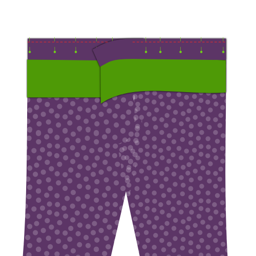

Now that the waistband is pinned to top of your trousers, sew it in place.

On the side with the curved corner, get as close to the edge as possible. On the other side, stop when you reach the edge of your fly.

### Stap 44: Strijk de tailleband

Give your newly sewn seam a good press. Do not press the seam open, instead press it towards the top (put both trousers and waistband seam allowance in the waistband).

### Stap 45: Bereid de riemlusjes voor

The belt loops are a part of your trousers where you can let your creativity run free. There's load of different ways to make and shape belt loops, not to mention that where you place them is also up to you.

That being said, here's what to do to make a standard belt loop:

Find the belt loop pattern part, a small rectangular piece of fabric. There should be 8 of them, and these will become your belt loops. For each of them, take these steps:

- Zigzag (of lock) langs de lange randen van de rechthoek
- Plooi één kant terug in de lengte, en strijk
- Plooi de andere kant terug, in de lengte, en strijk
- Naai met de hand langs de achterkant van het lusje zodat de geplooide randen op hun plek blijven, maar de steken vooraan niet zichtbaar zijn
- Strijk nog eens goed als je klaar bent

<Tip>

De exacte breedte van je lusjes is niet zo belangrijk, maar het is wel belangrijk dat ze allemaal even breed zijn.

Om het makkelijker te maken de breedte consequent te houden kan je het lusje rond een strook karton of dik papier van de gewenste breedte plooien.

Deze strook kan je ook helpen bij het naaien. Houd het strookje in je riemlus, dit helpt voorkomen dat je naald door de voorste stoflaag gaat en de steken zichtbaar worden.

</Tip>

### Stap 46: Bevestig de riemlussen: Onderkant

Attach the bottom of the belt loops to your trousers. Place them about 1.5 cm below your waistband, depending on your waistband width.

Place the good side of the belt loop down on the good side of the trousers (good sides together) and secure with a bar tack or narrow zig-zag.

Then, zig zag the edge of the belt loop to the trousers.

<Tip>

Het is belangrijk dat je de voering van de tailleband uit de weg houdt terwijl je dit doet. Zorg dat je de riemlusjes enkel aan je broek vastmaakt, en niet aan de voering van de tailleband.

Je hebt 8 riemlusjes, dus die moet je verdelen rond je tailleband. Kijk naar een bestaande broek als je niet zeker bent van waar ze moeten komen.

Zorg dat er zeker lusjes aan de middenrug zitten, en niet te dicht bij elkaar aan middenboor (zodat er ruimte is voor een gesp).

</Tip>

### Stap 47: Beleg tailleband

The waistband facing needs to be cut out and attached to your waistband.

This will be a lot simpler to understand if you have a look at the relevant video:

@[youtube](https://www.youtube.com/embed/8dLOuOtb18U?list=PL1gv5yv3DoZOcmOJf6f0YWi522VXXv-mM)

### Stap 48: Knip naadwaarde tailleband bij

Before we finalize the waistband, we're going to trim back some of its seam allowance.

<Tip>

**About seam allowance grading**
When trimming back different layers of seam allowance, always try to cut them at different lengths so that the bulk is reduced in incremental steps.

De laag die het dichtst bij de goede kant van het kledingstuk ligt moet het langst zijn, dus begin daar.

Dit maakt het minder waarschijnlijk dat de rand van de naadwaarde zichtbaar is langs de goede kant.

</Tip>

### Stap 49: Strijk en drieg de voering van de tailleband

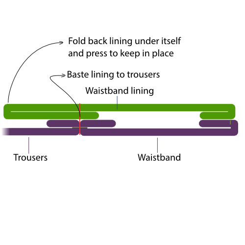

The waistband lining will be sewn from the front of the trousers on top of the seam that joins the waistband to the trousers (so called _stitch in the ditch_).

Doing so will catch the lining and secure it in place. However, since we'll be sewing this from the good side, the lining will lie beneath all other layers, and we won't see what we're doing.

That is why, to make sure it all lies clean and flat, we will first press and baste the lining.

The lining will extend downward from the top, and it needs to be folded back up under itself, so that it will get caught by the seam when we sew it in place later.

To make sure things look pretty, the distance between the top of our waistband and the (folded back) bottom edge of our lining should be constant. You can mark an even distance from the top of your trousers, and then pin back the lining at this line. Last but not least, press that fold in your lining.

When you're happy with how it looks, baste the lining in place just next to the seam joining the waistband and trousers.

<Tip>

Het is best om naast de naad te driegen, en niet echt in de naad. Dit maakt het makkelijker om je driegsteken te verwijderen nadat we de naad doorgestikt hebben.

</Tip>

### Stap 50: Stik de voering van de tailleband vast

After you basted the waistband lining, sew it in place from the good side, exactly in the seam between the waistband and trousers.

### Stap 51: Bevestig de riemlusjes: Bovenaan

With your waistband and lining properly secured, it's time to attach the top of the belt loops.

Sew them in place just as you did at the bottom. That is, use a bar tack or close zig-zag to attach them, then zig-zag over the end to secure it.

<Tip>

Stik niet door de bovenkant van de riemlusjes. Je zal de voet van je naaimachine onder het riemlusje moeten krijgen zodat je alleen door het teruggeplooide stuk stikt.

Knip de lengte van je riemlusjes gerust bij nadat je ze bevestigt, ze kunnen namelijk wat te lang zijn.

</Tip>

### Stap 52: Werk de onderrand van de broekspijpen af

Before we hem the trousers, finish the raw edge of the legs with a zig-zag stitch or serger.

<Tip>

Dit is ook een goed moment om je broek te passen en te markeren hoe lang je wil dat ze is na het omzomen.

</Tip>

### Stap 53: (Optioneel) Naai een broekstootband

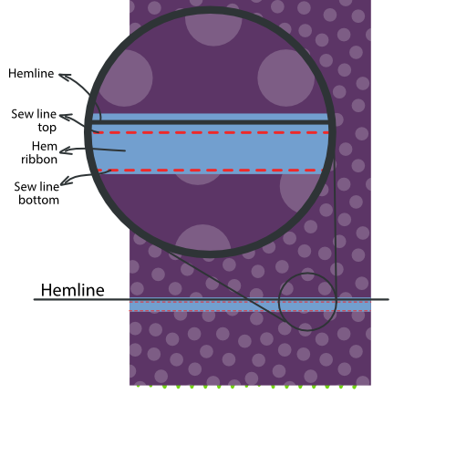

<Tip>

Een broekstootbandje is een lint dat aan de binnenkant van je broekzoom zit. Op de plek waar je zoom omgeplooid is krijgt de stof heel wat te verduren door tegen schoenen en andere dingen aan te schuren.

Een broekstootband beschermt je stof in zekere mate, en is een nette afwerking.

</Tip>

Mark the hemline on your trousers (good side out).

Place the ribbon as shown in the illustration making sure that it extends a few mm above the hemline. Sew it in place all the way around the leg, making sure to sew close but not on the hemline.

### Stap 54: Strijk de zoom

Fold back the trouser legs at the hemline, and press the hem.

<Tip>

Als je een broekstootband gebruikt hebt zal het lint een paar mm voorbij de zoomlijn liggen, en zo de stof aan de zoom beschermen.

</Tip>

### Stap 55: Zoom de broekspijpen

With the hem neatly pressed, simply hand-sew the folded back part to the inside of your trousers.

<Tip>

Omzomen wordt met de hand gedaan omdat het belangrijk is dat de steken niet zichtbaar zijn aan de goede kant. So when hand-sewing the hem, don't push your needle through the fabric, but just catch a few threads so your stitches don't show on the front

While there are machine alternatives, they aren't as neat (blind hem stitch) or probably not accessible to the home-sewer (industrial blind hem machine).

</Tip>

### Stap 56: Knip bij, ruim op en strijk

Trim any loose threads or basting that remains, and give your trousers a good final press.
