<Note>

Tekst een beetje te droog voor je? Ik probeer video's beschikbaar te maken als deel van de documentatie.

In dit geval is er een hoop videomateriaal beschikbaar, maar dit is origineel opgenomen voor een eerdere versie van dit patroon. Nog steeds relevant wel.

</Note>

<YouTube id='PL1gv5yv3DoZOcmOJf6f0YWi522VXXv-mM' playlist />

<Note>

Veel van de stappen hieronder worden herhaald voor beide broekspijpen.

Dat wordt niet altijd vermeld omdat het leven kort is en het continu schrijven van *Do niet vergeet om dit voor beide broekspijpen* te doen, snel genoeg wordt.

</Note>

### Stap 1: Drieg de plooilijnen

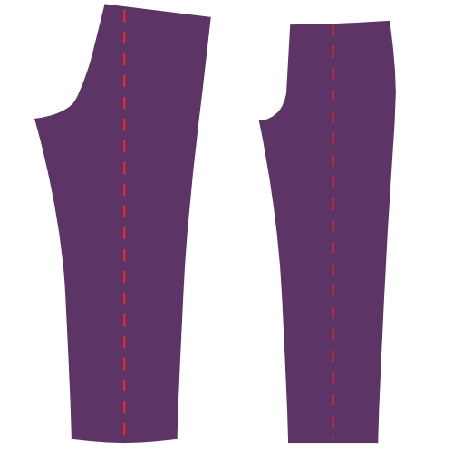

Het eerst dat je doet is over de plooilijn van je broekspijpen driegen. Doe dit op zowel voor- als achterpanden van beide broekspijpen.

### Stap 2: Sluit de nepen achteraan en strijk

### Sluit de achterste nepen

Plooi deel 1 (achterpand) dubbel zodat de merktekens van de neep aan de tailleband gelijk liggen, en een scherpe plooi naar het merkteken aan het einde van de neep loopt. Strijk deze plooi gerust lichtjes, dit maakt het makkelijker om de neep accuraat te stikken.

Sluit de neep door van de taillerand naar het einde van de neep te stikken.

Gebruik een kleine steeklengte, en laat je stiksel helemaal tot het einde van de neep (en eraf) lopen. Stik daarna een eindje terug, let op dat je enkel in de naadwaarde stikt.

#### Strijk de nepen naar de zijkant

Strijk de nepen plat, en leg de naadwaarde naar de zijkant van je broek.

### Stap 3: Maak de achterzakken

Maak de dubbele paspelzakken aan de achterkant van je broek, inclusief de broekzak.

<Tip>

###### Dubbele paspelzakken

Het maken van een dubbele paspelzak is een techniek die wordt gebruikt zijn verschillende kledingstukken.
Daarom heb ik er een aparte pagina met documentatie voor gemaakt.

Er is zowel geschreven documentatie en een reeks video's die je tonen hoe dit werkt, dus zelfs als je nog nooit paspelzakken gemaakt hebt komt het wel in orde.

[Naar de documentatie over de paspelzakken](/docs/naaien/dubbel-zakjes)

</Tip>

### Stap 4: Optioneel: Knip je voering bij met een kartelschaar

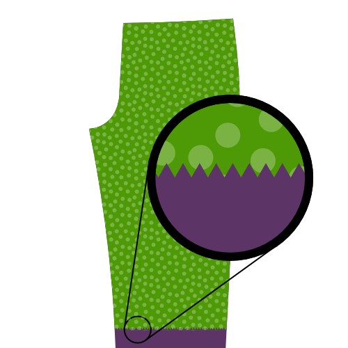

Als je je broek gaat voeren (dit is optioneel), moet je de rand van je voering afwerken. Om dit te doen knip je de rand van de voering bij met een kartelschaar.

Let op dat je dit alleen doet voor de delen van je voering die niet vastzitten in een naad. In andere woorden, enkel de onderrand van je voering.

> Als je geen kartelschaar hebt kan je een andere methode gebruiken, zoals een zigzag- of overlocksteek. Kartelscharen zijn hier echter de beste optie omdat ze geen extra bulk toevoegen, wat belangrijk is als we willen vermijden dat de onderrand van de voering zichtbaar is door de stof van je broek.

### Stap 5: Knip delen voor voorste steekzakken bij

Leg je voorpand, voering en zakdeel bovenop elkaar. Voorpand en zakdeel met de goede kanten naar beneden, voering met de goede kant omhoog.

Speld ze samen om te zorgen dat niets verschuift. Doe dit weg van de schuine rand van de zak zodat de spelden niet in de weg zitten.

Knip het zakdeel (dat bovenaan ligt) exact op de lijn van de steekzak (aangegeven op het patroon) bij.

Knip nu het voorpand (ligt onderaan) 3 cm voorbij en parallel met de schuine lijn bij.

Knip als laatste je voering bij zodat ze 0.5 cm korter is dan re rand van het voorpand.

> De voering wordt een beetje korter geknipt zodat ze niet zichtbaar is als ze teruggeplooid wordt. Maar het is niet zo belangrijk om ze exact 0.5 cm korter te krijgen.

### Stap 6: Plooi de voorste zakopening en stik

Plooi de voering en het voorpand om langs de lijn van de steekzak (en dus langs de bijgeknipte rand van het zakdeel). Speld dit vast en strijk.

Je gaat langs de zakopening stikken, maar keer alles eerst om zodat je van de goede kant kan stikken.

Stik door op 0.5 cm van de plooi. Hou het parallel en rek je stof niet uit.

> Dit stiksel is altijd zichtbaar, dus zorg dat de draadkleur bij je stof past en maak het mooi.

> Om te voorkomen dat je zakken uitrekken kan je een stuk niet-elastisch lint tussen de vouw stoppen. Wanneer je stikt wordt dit lint mee vastgemaakt, en zorgt het dat de zak niet uitrekt.

### Stap 7: werk de rand aan de binnenkant van de voorzak af

Plooi het grootste deel van het voorpand weg, zodat je de voering, zakdeel en geplooide rand van het voorpand plat kan leggen.

Zigzag de rand van het weggeplooide deel van het voorpand om het af te werken en vast te maken aan het zakdeel en de voering.

### Stap 8: Strijk de steekzak

Wanneer je klaar bent leg je het voorpand, de voering en het zakdeel plat, en strijk je het eens grondig.

> Dit is misschien een goed moment om je nog eens te vertellen dat alle stappen tot nu toe gelden voor de twee broekspijpen.
>
> Gewoon zodat je eraan denkt, de volgende stappen moeten trouwens ook twee keer gedaan worden.

### Stap 9: Bevestig belegdeel voorzak aan zakdeel

Leg de andere helft van het zakdeel met de goede kant naar beneden, en leg het belegdeel voorzak bovenop met de goede kant omhoog.

Zigzag langs de rand van het belegdeel voorzak om het af te werken en tegelijk aan het zakdeel te bevestigen.

### Stap 10: Sluit het zakdeel

Leg het voorpand, de voering en het zakdeel met het zakdeel naar boven.

Leg het tweede zakdeel met het bevestigde beleg bovenop, met het beleg naar beneden.

Speld alle delen samen, en let op dat de onderrand van het zakdeel gelijk ligt.

Plooi wanneer alles samengespeld is het voorpand en de voering opzij en sluit de onderrand van het zakdeel.

> Stik de onderrand van het zakdeel tot aan het punt waar het belegdeel begint

> Je kan het zakdeel op verschillende manieren afwerken, zoals:
>
> -   Lock de randen samen
> -   Werk de randen af met biaislint
> -   Stik samen en werk de rand af met een zigzagsteek

### Stap 11: Strijk de steekzak

Leg alles plat met het voorpand onderaan, en strijk het grondig.

### Stap 12: Speld de voorzak vast

Speld de zak aan het voorpand langs de zakopening en de randen van het zakdeel. Dit voorkomt dat dingen verschuiven terwijl we aan de rest van onze broek werken.

### Stap 13: Werk de zijranden af

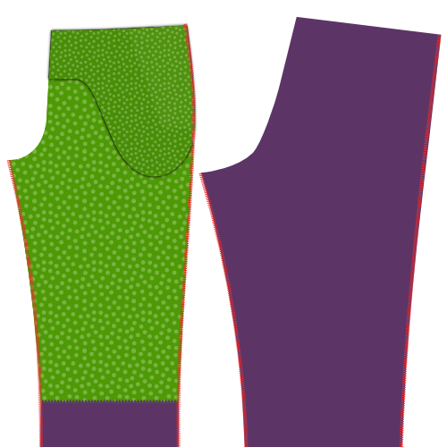

Voor we de zijnaden stikken, werken we de randen af met een zigzagsteek langs de rand van je voor- en zijpanden. Let op dat je binnen de naadwaarde blijft.

> Zorg dat je de voering en randen van het zakdeel mee vastmaakt, dit zorgt ervoor dat niets verschuift terwijl we de zijnaden stikken.

### Stap 14: Stik de zijnaden

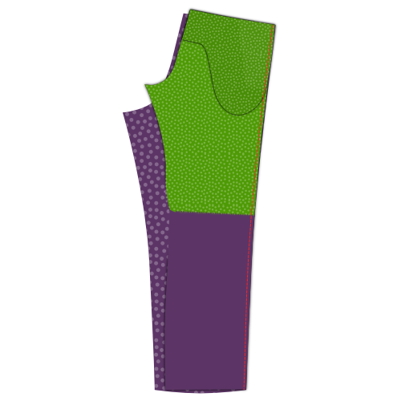

Leg het voor- en achterpand van elke broekspijp op elkaar, met de goede kanten op elkaar.

Leg de zijnaad gelijk, de zijnaad aan de buitenkant om precies te zijn, waar er geen kruiscurve is.

> Je kan de delen samenspelden om te zorgen dat alles op z'n plaats blijft bij het stikken van deze lange naad

Stik de naad, van de tailleband tot onderaan de broekspijp.

### Stap 15: Strijk de naadwaarde open

Strijk de naadwaarde langs de zijnaad open. Doe dit langs de verkeerde kant, en herhaal nog eens langs de goede kant van de stof.

Neem je tijd, en gebruik genoeg hitte, maar niet te veel. Gebruik stoom of sproei wat water voor het beste effect.

> Een mooi platte zijnaad ziet er geweldig uit, dus neem je tijd om het goed te krijgen.

### Stap 16: stik het gulpbeleg aan het gulpdeel

Leg het gulpdeel op het gulpbeleg met de goede kanten op elkaar, en leg de rand gelijk met de grootste curve.

Stik langs de gebogen rand op de standaard naadwaarde van 1 cm om de twee stukken aan elkaar te bevestigen.

> Als je voering een beetje stretch heeft, rek de voering dan wat uit terwijl je de curve stikt. Dit maakt het makkelijker om de voering plat te laten liggen zonder plooien.

### Stap 17: Strijk het gulpbeleg

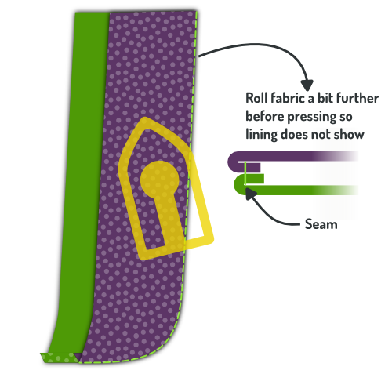

> Voor je dit deel platstrijkt rol je de naad een beetje naar binnen zodat de voering naar de onderkant gekeerd wordt, en ongeveer 2 mm van de rand ligt. Dit voorkomt dat de voering aan de rand zichtbaar is.

Als je het gulpdeel en gulpbeleg vastgestikt hebt keer je alles naar de goede kant en strijk je de naad plat.

### Stap 18: Speld de rits aan het rechtervoorpand

> Stap 18 tot 21 leiden allemaal naar een enkel stiksel dat de rits aan het voorpand bevestigt, en tegelijk het gulpdeel en gulpbeleg vastmaakt.
>
> Dit is de moeilijkste naad in het hele proces, dus ik ga mijn tijd nemen om alles uit te leggen en te illustreren voor je begint te naaien.

Leg het voorpand van de rechterbroekspijp met de goede kant omhoog. Zorg dat de voering en het zakdeel onderaan liggen, en mooi plat.

Neem je rits en open ze. Keer ze nu om zodat ze met de goede kant naar beneden ligt. In andere woorden, met de trekker naar beneden.

Leg je rits gelijk met de kruisnaad zoals in de illustratie. Hou het volgende in gedachten:

-   Het einde van je rits zou aan de bovenrand van je broek moeten zitten, waar je tailleband begint. Denk er wel aan dat daar nog naadwaarde zit, dus leg het einde niet exact samen met de rand, maar 1 cm lager.
-   Leg de rits gelijk met de kruisnaad. Let niet op de rand van de rits, aangezien deze in verschillende breedtes bestaan. Zorg in de plaats dat je naast de tandjes van de rits kan stikken en binnen de naadwaarde van het voorpand blijven.

Speld de rits vast met een paar spelden haaks op de rits (zoals getoond). In andere woorden, speld niet langs de rits, maar door de rits.

> Als je niet zeker bent over de plaatsing van je rits, leg ze dan zo dicht mogelijk tegen de rand. Dit zorgt dat je rits iets verder in de gulp zit, zodat ze zeker niet zichtbaar is.

### Stap 19: Speld gulpbeleg aan rits

Neem het gulpbeleg/gulpdeel dat je in stap 16 en 17 samengestikt hebt en leg het neer met de stof naar beneden en de voering naar boven.

Leg de bovenste laag voering opzij, en leg de rand van de stof met de lichte curve (waar het niet aan de voering bevestigd is) gelijk met de rand van de stof van het voorpand.

> Voor de duidelijkheid, de kant van het gulpbeleg die omhoog moet liggen is getoond in het bovenste deel van de illustratie, op een kleinere schaal.

Speld deze laag vast met een paar spelden haaks op de rits (zoals getoond in het rood). Zorg dat je alle lagen mee vastspeldt, ook de rits. Zo kan je de spelden van de vorige stap (getoond in het groen) verwijderen als je klaar bent.

> Als je zeker genoeg bent dat je alles op z'n plaats kan houden kan je de voering terug laten vallen en alles samenspelden zoals in de volgende stap. Dit is een beetje sneller, maar je maakt sneller fouten omdat dingen snel kunnen verschuiven.

### Stap 20: Speld het gulpbeleg vast langs de rits

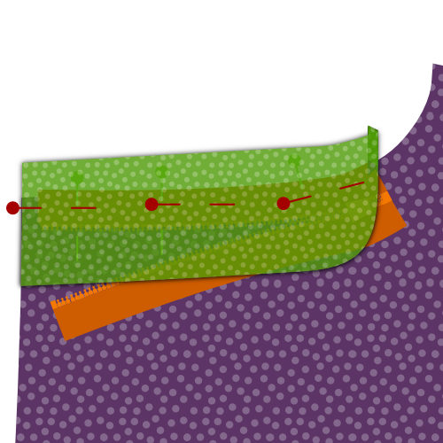

Leg de voering weer op z'n plek, en speld nu alle lagen samen langs de rits.

Wanneer je dit gedaan hebt kan je je eerdere spelden verwijderen.

### Stap 21: Plooi het gulpbeleg om en speld het neer

 {.fs-row2}  {.fs-row2}

Draai alles om zodat het gulpbeleg onderaan ligt.

Plooi de voering van het gulpbeleg rond de gulp, het voorpand en het gulpdeel, zodat de onafgewerkte rand aan de binnenkant zit.

Speld dit vast, en verwijder je eerdere spelden.

### Stap 22: Stik de gulp vast langs de rits

Nu kan je langs het geplooide gulpdeel stikken. Dit zet het voorpand, de rits, het gulpbeleg en het gulpdeel in één keer vast.

> Je stikt langs je rits, dus gebruik je ritsvoet hiervoor.

### Stap 23: Plooi de gulp om en strijk

Wanneer je klaar bent, plooi de gulp dan om zodat ze van het voorpand wegligt, en strijk grondig van de verkeerde kant. En strijk nog eens zachtjes van de voorkant.

### Stap 24: Stik biaislint aan het tweede gulpdeel en strijk

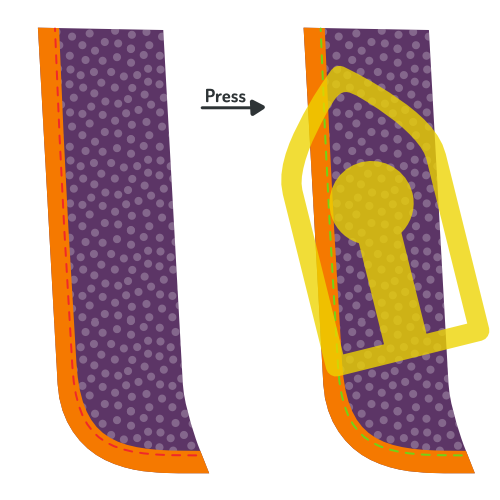

Stik bieslint aan de rand met de grootste curve van je tweede gulpdeel.

Strijk de afgewerkte rand plat wanneer je klaar bent.

> Biaislint is een manier om een rand af te werken. Als je niet zeker bent wat het is of hoe je het gebruikt, laat het me dan weten.

### Stap 25: Speld en stik het gulpdeel aan de kruisnaad

Leg de linkerbroekpijp met de goede kant omhoog. Leg het tweede gulpdeel bovenop met de goede kant naar beneden, en leg de onafgewerkte rand samen met de kruisnaad.

Speld het gulpdeel vast, en stik het dan vast langs de kruisnaad.

> Let op dat je de voering mee vaststikt bij het stikken van deze naad.

Strijk de afgewerkte rand plat wanneer je klaar bent.

### Stap 26: Keer het gulpdeel naar achter en strijk de naad

Plooi het gulpdeel naar de verkeerde kant. Rol de naad een beetje verder naar achter voor je dit strijkt zodat deze niet meer zichtbaar is langs de goede kant.

Op deze manier zal de naad of het gulpbeleg onzichtbaar zijn aan de voorkant.

Strijk eens goed langs de achterkant.

### Stap 27: Speld en stik de rits aan het gulpdeel

 {.fs-row3}  {.fs-row3}  {.fs-row3}

Leg de rechterbroekspijp neer met de goede kant omhoog. Leg de linkerbroekspijp bovenop met de goede kant naar beneden.

Leg de kruisnaden gelijk en speld de rits langs de rand van het gulpdeel met de goede kant van de rits naar beneden.

Zorg dat je de rits enkel aan het gulpdeel speldt. Vermijd alle andere lagen.

> Ik vind het makkelijker om de rits door alle lagen te spelden, en wanneer ze stevig vastzit extra spelden toe te voegen om ze enkel aan het gulpdeel te spelden. Als dat gebeurd is kan je de spelden die door alle lagen gaan verwijderen.

Stik uiteindelijk langs de rits met je ritsvoet om ze vast te maken aan het gulpdeel.

> Let op het volgende terwijl je de rits goedlegt:
>
> -   De rits ligt met de goede kant naar beneden
> -   De rits ligt een beetje verder dan de rand van je gulpdeel
> -   Leg de bovenkant van de rits gelijk met de andere helft van de rits aan de rechterbroekspijp

### Stap 28: Zigzag de rand van de rits aan het gulpdeel

Zigzag langs de rand van de rits om ze vast te maken aan het gulpdeel.

### Stap 29: Bevestig de gulpdelen met een trens

Leg de twee gulpdelen samen, en leg de voorpanden uit de weg.

Gebruik een trens om ze aan elkaar te bevestigen, aan de onderkant van de rits. Stik aan beide kanten van de rits, en zo dicht bij de rits als je kan.

> Als je rits te lang is kan je ze onder de trensen bijknippen.

### Stap 30: Sluit de kruisnaad

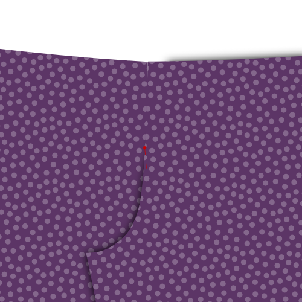 {.fs-row2}  {.fs-row2}

Leg beide voorpanden met goede kanten naar boven. Ze zijn nu verbonden met de gulp.

Zorg dat de gulp netjes weggeplooid is, en speld beide voorpanden samen onder de rits, waar je eerder trensen maakte. Zorg dat de speld samenligt met de plooi van je voorpand.

Plooi de voorpanden met goede kanten samen, en speld de kruisnaad dicht.

Je zal de gulpdelen uit de weg moeten leggen, dus als je eerder door alle lagen heen hebt gespeld, verwijder deze speld dan en vervang ze door een horizontale speld. Dit zal aangeven hoe ver je moet naaien.

Stik de kruisnaad, beginnend aan het punt waar de zijnaden kruisen, en tot aan je horizontale speld.

> Deze stap is moeilijk uit te leggen, en lastig te illustreren. Ik hoop dat het duidelijk is als je naar je gulp kijkt. Indien niet, kijk naar de videoinstructies.

### Stap 31: Speld de gulp dicht en drieg de curve

Sluit de gulp, en speld de voorpanden zo neer dat de gulp netjes opzij ligt.

We gaan nu de curve van de gulp doorstikken, en het is een goed idee om dit eerst te driegen.

Je start een stukje boven je eerdere trens, en zorgt dat je enkel het gulpbeleg aan het linkervoorpand vaststikt.

Ga in een curve naar boven tot aan de rand van het gulpbeleg, en ga dan parallel met de rits verder.

### Stap 32: Stik de curve van de gulp door

Stik nu de gulp door, en gebruik je driegsteek als een gids.

Wanneer je dit doet stik je het voorpand, het gulpdeel, het zakdeel en de voering allemaal samen vast.

### Stap 33: Speld de binnenbeennaad samen

Sluit de broekspijpen met de goede kanten samen, en speld de binnenbeennaad samen. Start aan de kruisnaad en ga van daar naar beneden langs elke pijp.

Doe dit voor beide broekspijpen.

### Stap 34: Stik de binnenbeennaden

Stik de binnenbeennaden die je net gespeld hebt aan beide broekspijpen. Zorg dat je de naadwaarde respecteert.

### Stap 35: Strijk de naadwaarde van de binnenbeennaad open

Leg je broekspijp binnenstebuiten op je strijkplank, en strijk de naadwaarde van de binnenbeennaad open.

### Stap 36: Stik de kruisnaad

We gaan nu de kruisnaad sluiten, van de onderkant van de gulp tussen je benen, langs je kont tot aan de middenrug waar later de tailleband komt.

Om dit te doen keer je één van de benen binnenstebuiten, zodat de goede kant van de stof naar binnen zit, en de slechte kant en voering aan de buitenkant.

Het andere been mag niet binnenstebuiten zitten, maar gewoon met de goede kant naar buiten.

Stop nu de gewone broekspijp (met de goede kant naar buiten) in de andere broekspijp (die binnenstebuiten zit).

Op deze manier zitten de goede kanten van de broekspijpen tegen elkaar, en op deze manier zou je de kruisnaad moeten stikken.

> Let op dat je ene broekspijp niet gedraaid zit in de andere. Als je twijfelt, keer het binnenstebuiten been dan terug naar de buitenkant nadat je de naad gespeld hebt om zeker te zijn dat alles ok is.

Speld de kruisnaad vast en stik hem dan dicht, beginnend aan de kant van de gulp, en met de standaard naadwaarde.

Als dit gedaan is strijk je de naadwaarde open.

### Stap 37: Strijk de plooi in de broekspijp

Keer je broek naar de goede kant, en leg voorzichtig één broekspijp op de strijkplank zodat ze plat ligt en gevouwen op de plooilijn die je eerder gedriegd hebt.

Als dit er goed uit ziet, strijk je de plooien in je broekspijp, aan de voor- en achterkant. Herhaal voor de andere broekspijp.

Strijk het grondig, je wil namelijk dat deze plooien zichtbaar blijven na het wassen (zodat je ze er weer in kan strijken).

> In de kledingindustrie gebruikt men chemische stoffen langs de vouwlijn voor ze gestreken wordt. Sommige kleermakers gebruiken een houten hamer en aambeeld om de vezels in een permanente plooi te timmeren.

Afhankelijk van je stof kan je plooi langer blijven, maar uiteindelijk kan je niet verwachten dat een plooi langer dan een paar wasbeurten meegaat.

> Misschien is dit extreem logisch, maar er is nog een andere optie: laat de plooi gewoon weg. Dit geeft je broek een minder formele look.

### Stap 38: Strijk tussenvoering aan tailleband

Strijk de tussenvoering voor de tailleband (deel 3) aan de tailleband (deel 4).

Leg de tussenvoering in het midden van de tailleband, en let op dat ze netjes recht blijft liggen terwijl je ze vaststrijkt.

### Stap 9: Sluit de tailleband en de voering van de tailleband

Maak de tailleband (delen 4a en 4b) door beide delen met de goede kanten op elkaar te stikken.

Maak de voering van de tailleband (delen 5a en 5b) door beide delen met de goede kanten op elkaar te stikken.

### Stap 40: Stik de tailleband aan de voering van de tailleband

Leg je tailleband op de voering van de tailleband, met de goede kanten op elkaar, zodat de tussenvoering van de tailleband naar boven ligt.

Leg de rand gelijk, en speld ze samen.

> We gaan langs de rand van de tussenvoering stikken, maar ongeveer 3 mm of 1/8 inch van de eigenlijke rand. Dit voorkomt dat de voering aan de voorkant zichtbaar is.

Aan één kant van de tailleband eindig je met een curve en ga je dan verticaal naar beneden langs de rand van de tussenvoering. Kijk naar de illustratie om zeker te zijn dat je dit aan de juiste kant doet.

### Stap 41: Rol de stof rond de rand van de tussenvoering en strijk de tailleband

Zorg voor je de tailleband strijkt dat de stof over de rand van de tussenvoering rolt.

Weet je nog dat je in de vorige stap 3 mm van de rand van de tussenvoering stikte? Je moet de stof rond de rand van de tussenvoering plooien zodat de eigenlijke naad 3 mm verder naar binnen zit.

Dit zorgt dat onze voeringstof nooit zichtbaar is aan de voorkant van je broek.

### Stap 42: Speld de tailleband aan de broek

Speld de rand van je tailleband (de kant waar je de voering niet aan stikte) aan de bovenrand van je broek, met de goede kanten samen.

Stop de rand van de gulp in de kant van de tailleband met de afgeronde hoek. Aan de andere kant van de tailleband zal dit langer zijn. In andere woorden, hier zal je tailleband overlappen.

> Let op dat de rits en de tailleband verticaal doorlopen. Beide kanten van de tailleband zouden even hoog moeten komen met de rits gesloten. Dit is makkelijk over het hoofd gezien als je het niet nakijkt.

### Stap 43: Stik de tailleband aan de broek

Nu de tailleband aan de bovenrand van de broek gespeld is, kan je deze vaststikken.

Stik zo dicht mogelijk bij de rand aan de kant met de afgeronde hoek. Aan de andere kant stop je bij de rand van je gulp.

### Stap 44: Strijk de tailleband

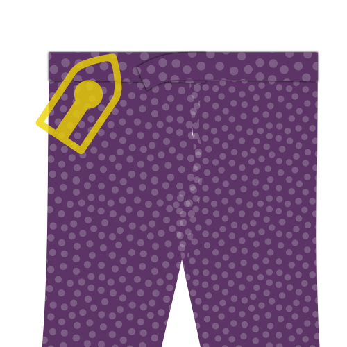

Strijk deze nieuwe naad eens goed. Strijk de naad niet open, maar naar boven, zodat de hele naadwaarde in de tailleband zit.

### Stap 45: Bereid de riemlusjes voor

De riemlusjes zijn een deel van je broek waar je creatief mee kan omspringen. Er zijn een hoop manieren op riemlusjes te maken, om nog maar te zwijgen van waar je ze plaatst.

Los daarvan is dit de standaard manier om een riemlusje te maken:

Vind het patroondeel voor de riemlus, een klein rechthoekig stuk stof. Hiervan zou je er 8 moeten hebben, en dit worden je riemlusjes. Voor elke lus volg je deze stappen:

-   Zigzag (of lock) langs de lange randen van de rechthoek
-   Plooi één kant terug in de lengte, en strijk
-   Plooi de andere kant terug, in de lengte, en strijk
-   Naai met de hand langs de achterkant van het lusje zodat de geplooide randen op hun plek blijven, maar de steken vooraan niet zichtbaar zijn
-   Strijk nog eens goed als je klaar bent

> De exacte breedte van je lusjes is niet zo belangrijk, maar het is wel belangrijk dat ze allemaal even breed zijn.
>
> Om het makkelijker te maken de breedte consequent te houden kan je het lusje rond een strook karton of dik papier van de gewenste breedte plooien.
>
> Deze strook kan je ook helpen bij het naaien. Houd het strookje in je riemlus, dit helpt voorkomen dat je naald door de voorste stoflaag gaat en de steken zichtbaar worden.

### Stap 46: Bevestig de riemlussen: Onderkant

Bevestig de onderkant van de riemlussen aan je broek. Leg ze ongeveer 1.5 cm onder je tailleband, afhankelijk van hoe breed de tailleband is.

Leg de goede kant van de riemlus op de goede kant van de broek (goede kanten samen) en stik vast met een trens of smalle zigzag.

Zigzag dan de rand van de riemlus aan de broek.

> Het is belangrijk dat je de voering van de tailleband uit de weg houdt terwijl je dit doet. Zorg dat je de riemlusjes enkel aan je broek vastmaakt, en niet aan de voering van de tailleband.

> Je hebt 8 riemlusjes, dus die moet je verdelen rond je tailleband. Kijk naar een bestaande broek als je niet zeker bent van waar ze moeten komen.
>
> Zorg dat er zeker lusjes aan de middenrug zitten, en niet te dicht bij elkaar aan middenboor (zodat er ruimte is voor een gesp).

### Stap 47: Beleg tailleband

Het beleg van de tailleband moet uitgeknipt worden en aan je tailleband vastgemaakt.

Dit is een stuk makkelijker te begrijpen als je naar de video hierover kijkt:

@[youtube](https://www.youtube.com/embed/8dLOuOtb18U?list=PL1gv5yv3DoZOcmOJf6f0YWi522VXXv-mM)

### Stap 48: Knip naadwaarde tailleband bij

Voor we de tailleband afwerken gaan we de naadwaarde wat bijknippen.

> **Over het bijknippen van naden** Als je verschillende lagen naadwaarde bijknipt, probeer de lagen dan op verschillende lengtes te knippen zodat de bulk geleidelijk aan vermindert.
>
> De laag die het dichtst bij de goede kant van het kledingstuk ligt moet het langst zijn, dus begin daar.
>
> Dit maakt het minder waarschijnlijk dat de rand van de naadwaarde zichtbaar is langs de goede kant.

### Stap 49: Strijk en drieg de voering van de tailleband

De voering van de tailleband wordt langs de voorkant van de broek vastgestikt, bovenop de naad tussen de tailleband en de broek (zogenaamd *door de naad stikken*).

Dit stikt de voering vast. Maar, omdat we dit langs de goede kant stikken ligt de voering onder alle andere lagen en zien we niet wat we doen.

Daarom moeten we de voering eerst strijken en driegen zodat alles netjes plat ligt.

De voering komt naar beneden van bovenaan, en moet terug onder zichzelf geplooid worden zodat het vastzit in de naad als we die later stikken.

Om te zorgen dat alles er mooi uitziet moet de afstand tussen de bovenrand van de tailleband en de (omgeplooide) onderrand van de voering evenwijdig zijn. Je kan een gelijke afstand van de bovenrand markeren, en dan de voering op deze lijn terugspelden. Strijk dan deze plooi in je voering.

Als je blij bent met hoe het eruitziet, drieg de voering dan vast naast de naar die de tailleband en broek verbindt.

> Het is best om naast de naad te driegen, en niet echt in de naad. Dit maakt het makkelijker om je driegsteken te verwijderen nadat we de naad doorgestikt hebben.

### Stap 50: Stik de voering van de tailleband vast

Nadat je de voering van de tailleband gedriegd hebt, stik ze dan vast langs de goede kant, exact in de naad tussen de tailleband en de broek.

### Stap 51: Bevestig de riemlusjes: Bovenaan

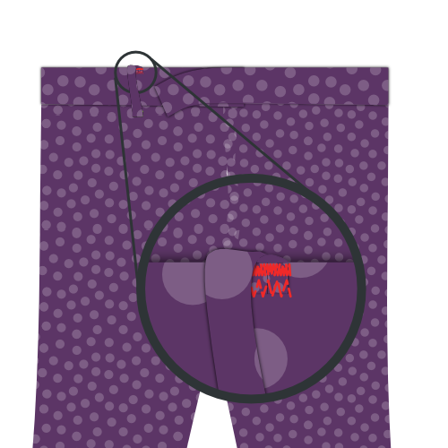

Nu je tailleband en voering echt vastzitten is het tijd om de bovenkant van de riemlusjes vast te maken.

Stik ze vast zoals je aan de onderkant deed. Dat wil zeggen, zet ze vast met een trens of smalle zigzag, en zigzag dan over het uiteinde om ze af te werken.

> Stik niet door de bovenkant van de riemlusjes. Je zal de voet van je naaimachine onder het riemlusje moeten krijgen zodat je alleen door het teruggeplooide stuk stikt.

> Knip de lengte van je riemlusjes gerust bij nadat je ze bevestigt, ze kunnen namelijk wat te lang zijn.

### Stap 52: Werk de onderrand van de broekspijpen af

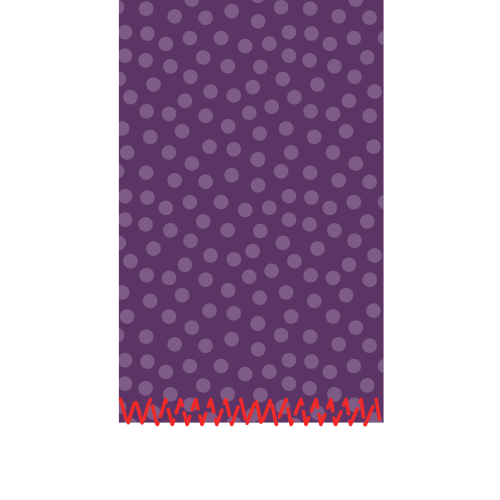

Werk de onafgewerkte rand van de broekspijpen af met een zigzagsteek of overlock voor we de broek omzomen.

> Dit is ook een goed moment om je broek te passen en te markeren hoe lang je wil dat ze is na het omzomen.

### Stap 53: (Optioneel) Naai een broekstootband

> Een broekstootbandje is een lint dat aan de binnenkant van je broekzoom zit. Op de plek waar je zoom omgeplooid is krijgt de stof heel wat te verduren door tegen schoenen en andere dingen aan te schuren.
>
> Een broekstootband beschermt je stof in zekere mate, en is een nette afwerking.

Markeer de zoomlijn op je broek (met de goede kant naar buiten).

Leg de broekstootband zoals getoond in de illustratie, en let op dat ze een paar mm boven de zoomrand ligt. Stik vast rondom de broekspijp, en let op dat je dichtbij maar niet op de zoomlijn stikt.

### Stap 54: Strijk de zoom

Plooi de broekspijpen om aan de zoomlijn, en strijk de zoom.

> Als je een broekstootband gebruikt hebt zal het lint een paar mm voorbij de zoomlijn liggen, en zo de stof aan de zoom beschermen.

### Stap 55: Zoom de broekspijpen

Als de zoom netjes gestreken is, naai het teruggeplooide deel dan vast aan de binnenkant van je broek.

> Omzomen wordt met de hand gedaan omdat het belangrijk is dat de steken niet zichtbaar zijn aan de goede kant. Dus duw je naald niet door de stof wanneer je de zoom naait, maar pik een paar draadjes van de stof op zodat je steken niet zichtbaar zijn aan de goede kant
>
> Er bestaan manieren om dit met de naaimachine te dien, maar deze zijn niet zo netjes (blindzoomsteek), of niet toegankelijk voor gewone stervelingen (industriele blindzoommachine).

### Stap 56: Knip bij, ruim op en strijk

Knip alle losse draadjes of driegdraadjes die overblijven bij, en strijk je broek nog eens grondig.
