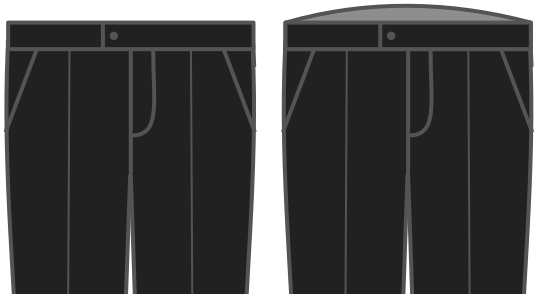

Esto levanta la cintura de tus pantalones en la espalda.

<Note>

Este patrón de pantalones se basa en el método de redacción de Winifred Aldrich.
Una de las quejas que recibo a menudo es que la parte posterior de los pantalones es demasiado baja.
También es una queja válida, es baja.

Esta opción le permite mitigar eso, sin cambios dramáticos en el patrón.
Te permite simplemente levantar la espalda de los pantalones.

</Note>

## Efecto de esta opción en el patrón

