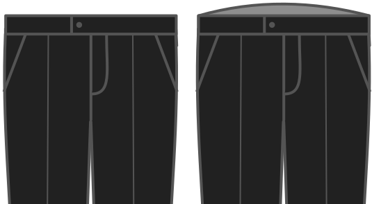

- - -
title: "Back rise"
- - -

Dit verhoogt de taille van je broek achteraan.

<Note>

Dit broekpatroon is gebaseerd op de tekenmethode van Winifred Aldrich.
Een klacht die ik vaak krijg is dat de broek achteraan te laag is.
De klacht is gegrond, ze is laag.

Deze optie staat je toe dat aan te passen, zonder het patroon dramatisch te veranderen.
Je kan gewoon de achterkant van de broek wat hoger maken.

</Note>

## Effect van deze optie op het patroon

