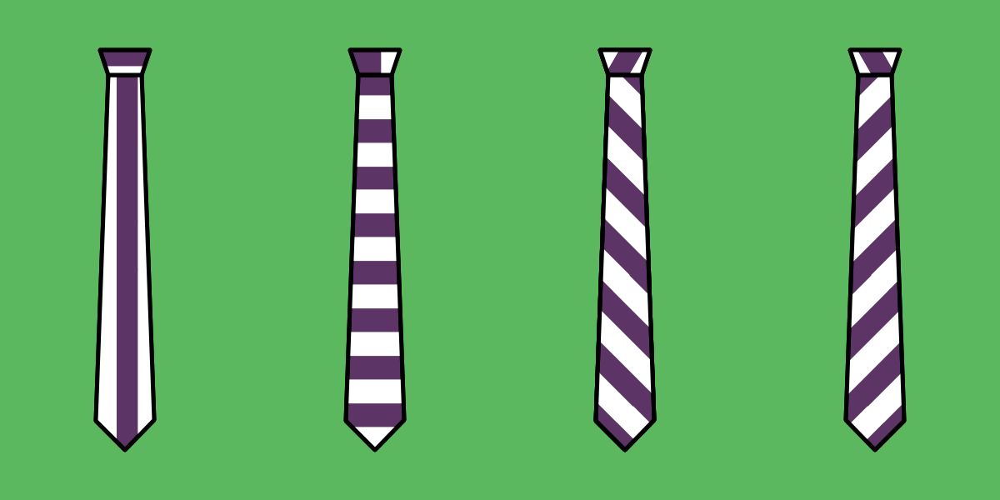

- - -
title: "Trayvon tie: Cutting Instructions"
- - -

- **Main fabric**
  - Cut **1 tip**
  - Cut **1 tail**
- **Lining fabric**
  - Cut **1 lining tip**
  - Cut **1 lining tail**
  - Cut **1 loop**
- **Interfacing**
  - Cut **1 interfacing tip**
  - Cut **1 interfacing tail**

<Warning>

###### Caveat

- There is no seam allowance on the **interfacing** parts and the **loop**
- The **lining** **tip** and **tail** have only seam allowance at the tip
- The **fabric** **tip** and **tail** have only seam allowance at the tip and center

</Warning>

<Tip>

###### Choosing your tie grain

This pattern does not include a grain line. The grain line is typically printed on the pattern to show you how to place your pattern on your fabric, relative to the fabric's grain.

For a tie, how you do this is not so much a rule as it is a personal choice. As such, there is no grain line printed on the pattern. You can do what you want.

That being said, a lot of ties are cut on bias, as this results in the best drape. If you are unsure what to do, consider cutting your tie on bias.

If this all sounds very confusing, might I suggest reading the help page on [Fabric grain](/docs/sewing/fabric-grain).

</Tip>
