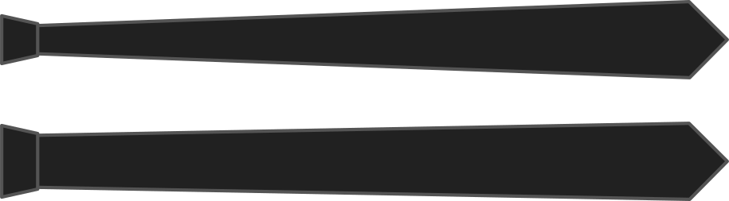

La anchura del nudo es la anchura en medio de la corbata, donde se hace el nudo.

Cuán ancho es su corbata en el medio influirá en la corbata no. Ir ancho para nudos grandes y gruesos, ir estrecho para nudos pequeños.

<Note>

No hacer que el ancho del nudo sea mayor que el ancho de la punta

</Note>

## Efecto de esta opción en el patrón

