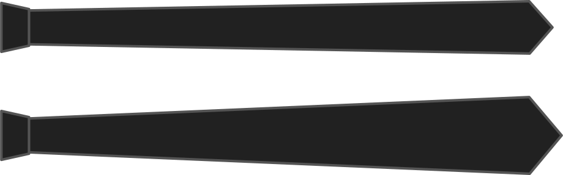

- - -
title: "Tip width"
- - -

The tip width is the width at the tip of the tie.

How wide your tie is at the tip is a style choice.

<Note>

Do not make the tip width smaller than the knot width

</Note>

## Effect of this option on the pattern

