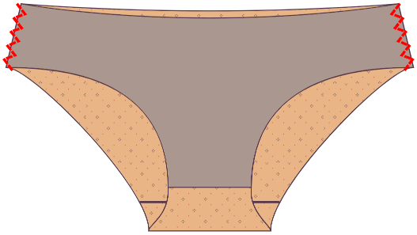

### Stap 1: Stik het voorpand aan het eerste zweefstuk

Leg een van de zweefstukken op het voorpand, _goede kanten op elkaar_, zodat de kruisnaden op één lijn staan. Speld of drieg aan de naadwaarde.

### Stap 2: Open plat

Vlak openen. Je kunt drukken als je wilt, maar wie strijkt er onderweers?

### Stap 3: Stik het rugpand aan het eerste zweefstuk

Leg het rugpand op de glans, met de goede kanten op elkaar. Speld of drieg aan de naadwaarde.

### Stap 4: Open plat

Vlak openen.

## Stap 5: Bevestig het tweede gussetstuk

Haal de voor- en achterpanden uit de weg door ze naar het midden te rollen.

Leg de tweede zweefstuk met goede kanten op elkaar op de boven, zodat het lijnt met het eerste zweefstuk. De voor- en achterpanden van de roll-up stukken moeten tussen de stukken gesorteerd worden.

Stik de voor- en achterste naden aan de naadwaarde met behulp van een overlock of een zigzagsteek.

## Stap 6: Draai de rechterkant uit

Keer de troeven naar buiten. Alle gussetnaden moeten omzeild worden.

### Stap 7: Stik de zijnaden

Speld de zijnaad de goede kanten op elkaar. Stik de zijnaden aan de naadwaarde met een overlock of een zigzagsteek.

<Note>

Goed gedaan! Technisch gezien kan je de randen onbewerkte verlaten omdat jersey stoffen niet fragiel zijn, maar om je undieten op te laten blijven, moet je waarschijnlijk een elastiek toevoegen aan de broekspijpen en de taille. Blijf gaan.

</Note>

### Stap 8: Bereid elastiek voor

Vervang de randen van elk stuk elastiek met de naadwaarde en stik samen. Je zou drie elastische stukken moeten hebben: één voor de tailleband en twee voor de benen.

Deel het elastiek in vier kwartalen en markeer de punten met spelden of hoeken om het elastiek gelijk te maken. Doe hetzelfde voor de opening van de taille en de broekspijp, en markeer de kwart punten.

### Stap 9: Stik elastiek aan de buitenkant van het kledingstuk

Speld de elastiek aan de opening van de taille en de broekspijp aan de goede kant van de stof, zorg ervoor dat je de kwartaalmarkeringen oprijdt. Als je elastiek een decoratieve rand heeft, zorg ervoor dat je de rand van de naad (niet de decoratieve rand) van de elastiek naar de rand van de stof voert. De decoratieve rand moet naar het kledingstuk wijzen, niet weg.

Stik het elastiek aan het kledingstuk door een zigzagsteek. Je zal het elastische beetje moeten rekken als je stik om hem plat tegen de stof te laten leggen. Vermijd de stof zelf uit te rekken.

Knip alle overtollige stof weg die bulk of plakt uit het elastisch voorkomt.

### Stap 10: Plooi het elastiek en stik het weer vast

Plooi de elastiek en de stof naar de binnenkant en sluit de onafgewerkte rand van de stof onder de elastiek. Je zou naar de buitenzijde moeten kijken, een geplooide rand met een beetje elastische korte uitstraling. Stik met een zigzagsteek.

Herhaal deze stappen voor elk van de taille- en beenopeningen.

Het is je gelukt!
