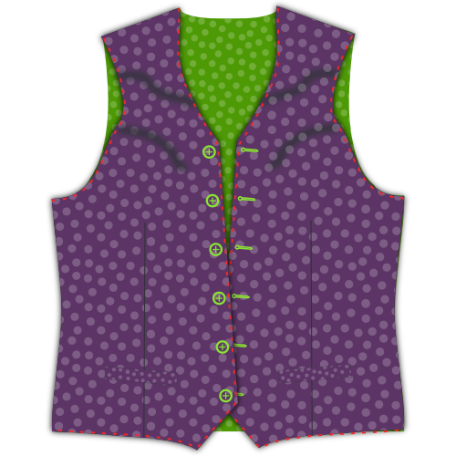

### Étape 1 : Thermocoller l'entoilage

#### Repasser l'entoilage sur les passepoils/rabats de poche

Placez votre passepoil/rabat poche avec le côté endroit vers le bas, et votre entoilage de poche sur le dessus.

L'entoilage est un peu plus petit que le passepoil, alors assurez-vous d'aligner le côté qui a la ligne d'aide marquée dessus.

Pour chaque poche, repassez l'entoilage sur l'envers du passepoil de poche.

#### Repasser l'entoilage sur les devants

Placez votre devant avec le côté endroit vers le bas et votre entoilage par-dessus.

Repassez l'entoilage en place.

> **Prenez votre temps**
> 
> Ne passez pas le fer simplement pour le repasser, vous voulez vraiment repasser sur votre tissu pour qu'il se thermocolle bien.
> 
> Placez votre fer à repasser et pressez pendant 10 secondes environ avant de passer au point suivant pour répéter le processus.

### Étape 2 : Assembler la parementure et la doublure de devant

#### Coudre la parementure à la doublure

Placez votre parementure avant et votre doublure endroit contre endroit. Épinglez les bords de la parementure/doublure en place.

Les coudre ensemble.

#### Repasser sur la marge de couture ouverte
Repassez pour ouvrir les marges de couture entre la parementure et la doublure.

### Étape 3 : Fermer toutes les pinces

#### Fermer les pinces dos

Repliez le dos endroit contre endroit et cousez la pince dos.

> N'oubliez pas de faire la même chose pour la doublure

#### Fermer les pinces devant
Repliez votre devant (avec son entoilage thermocollé) endroit contre endroit, et cousez la pince avant.

### Étape 4 : Repasser toutes les pinces

#### Repasser les pinces de devant
Une fois coupées ouvertes, Repassez sur les pinces avant ouvertes.

#### Repasser les pinces dos
Si vous coupez les pinces dos, repassez pour les ouvrir. Si ce n'est pas le cas, repassez vers le côté.

> N'oubliez pas de faire la même chose pour la doublure

### Étape 5 : Construire les poches

#### Attacher le fond de poche au passepoil de poche

Placez votre fond de poche avec l'endroit vers le haut, et votre passepoil de poche dessus avec l'endroit vers le bas.

Alignez le côté droit du fond avec le côté du passepoil qui n'a pas d'entoilage, et les coudre ensemble avec la marge de couture standard.

#### Repasser pour ouvrir la couture
Lorsque vous avez terminé, repassez sur cette couture avec les marges ouvertes.

#### Marquer l'emplacement de votre poche

Votre pièce de patron avant possède une ligne d'aide pour montrer où le passepoil de poche doit aller. Il s'agit de deux demi-rectangles réunis lors de la couture de la pince pour créer la forme de votre passepoil de poche.

Si vous n'avez pas encore marqué les quatre coins de ce rectange, vous devriez le faire maintenant.

> La poche est assise sous un léger angle sur votre patron. En avançant, dans les illustrations, je vais dessiner la poche droite car cela facilite les choses.

#### Fixer la pochette et la poche face

 

Placez votre pièce avant vers le bas avec le bon côté vers le haut. Nous allons attacher la soudure à la ligne inférieure de votre contour de poche et à la ligne de face vers le haut.

> Si vous n'avez jamais fait de poche de soudure auparavant, il peut être un peu contre-intuitif d'attacher la poche à l'extérieur du vêtement. La poche devrait être à l'intérieur, non ?
> 
> Détendez-vous, la poche se retrouvera à l'intérieur

Tant votre poche que votre poche orientée ont une ligne d'aide sur elles. Cette ligne doit être alignée sur les bords longs de votre poche.

Placez la poche vers le bas et la poche vers le haut, les deux avec leur bon côté vers le bas.

Alignez soigneusement leur ligne d'aide sur le contour de la poche. Ils devraient maintenant s’asseoir côte à côte et s’enfoncer les uns dans les autres au milieu de votre poche.

Maintenant coudre le long de la ligne d’assistance qui marque le bord long de votre poche.

> Il est important que les lignes que vous coudez forment maintenant les bords longs d'un rectangle parfait. Cela déterminera la forme de votre poche, donc si vous faites une ligne plus longue que l'autre, ou s'ils ne sont pas parallèles ou mal alignés, votre poche sera mauvaise.

#### Couper la poche

Il est temps de couper soigneusement la poche. Commencez au milieu de la poche et coupez le long des bords les plus longs vers le côté.

Aux bords de votre poche, vous devez arrêter d'ouvrir le centre et au lieu de couper vers la fin de votre ligne de points de moins de 45 degrés.

> Ce petit triangle que vous coupez à la fin est important. Assurez-vous de bien cibler car vous devriez couper jusqu'à l'extrémité de vos points sans les couper.

#### Appuyez sur ouvrir la marge de couture

Appuyez sur ouvrir la marge de couture le long des bords longs de votre poche.

#### Apportez la poche face à l'arrière et appuyez sur

Retournez la poche face à l'arrière et appuyez dessus.

#### Appuyez sur les triangles sur les côtés courts

Déplacez votre poche vers le haut pour révéler ces petits traingles sur le côté de votre poche.

Repliez-les en vous assurant de garder votre poche en ouvrant un rectangle propre, puis enfoncez-les.

#### Amenez la poche à l'arrière, le pli et appuyez sur

 

Retournez la poche avec le dos de la poche attachée sur le côté arrière.

Pliez votre welt au point où il atteint le sommet de la poche. La soude doit couvrir la totalité de l'ouverture de poche.

> L'illustration le montre depuis le dos car il est plus facile de voir ce qui se passe de cette façon. Cependant, vous devriez vérifier à l'avant pour vous assurer que votre poche de soudure est bonne.

#### Coudre les triangles de poche

Placez votre devant avec le bon côté vers le haut et assurez-vous que la poche orientée et soudée repose à plat.

Pliez le devant verticalement au bord de votre poche pour révéler ce petit triangle sur le côté court de votre ouverture.

Coudre ce triangle en cousant à droite du pli, et le bord de la poche.

#### Fermer le sac de poche

Coudre votre poche face au sac de poche pour finir votre poche.

> Cela devrait aller de soi, mais attention à ne pas coudre votre sac de poche à l'avant de la ceinture.

#### Appuyez sur votre poche terminée

Lorsque vous avez terminé, donnez à votre poche une bonne pression finale.

### Etape 6: Centrer la couture du dos

Placez vos deux pièces de dos avec leur bon côté et cousez la couture centrale de l'arrière.

Lorsque vous avez terminé, appuyez sur ouvrir cette couture.

> N'oubliez pas de faire la même chose pour la doublure

### Étape 7 : Rejoignez les devants

Montez le dos avec le bon côté vers le haut et mettez vos devants sur le bon côté vers le bas. Alignez les coutures latérales, la broche et la couture.

Lorsque vous avez terminé, appuyez sur ouvrir ces coutures.

### Étape 8: Rejoignez les épaules

Alignez les coutures des épaules, coupez-les et appuyez sur ouvrir la marge de couture.

> N'oubliez pas de faire la même chose pour la doublure

### Étape 9 : Insérez la ligne

#### Faire glisser la doublure dans le wasitcoat

Placez votre doublure dans votre manteau de taille, de bons côtés ensemble. En d'autres termes, le manteau de taille devrait avoir le bon côté et le mauvais côté à l'extérieur. La doublure devrait avoir le mauvais côté et le bon côté.

#### Épingler la doublure sur le tissu

Alignez la doublure avec le bord du tissu, puis fixez-la en place.

Commencez au centre de l'arrière et suivez le coude vers le bas de la fermeture avant. Faites le tour de l'ourlet, mais laissez un écart de 15 cm au centre de l'arrière.

#### Coudre la doublure en tissu

Avec votre doublure épinglée bien en place, coudre la doublure et le tissu ensemble.

N'oubliez pas de laisser cet écart de 15 cm au centre de l'arrière.

#### Tournez la ceinture et appuyez sur les bords

Atteignez l’écart que vous avez laissé ouvert à l’ourlet et tournez votre manteau de taille.

Appuyez sur les bords que vous venez de coudre, assurez-vous de rouler un peu le tissu afin que la doublure soit toujours cachée.

### Étape 10 : Terminer les armures

#### Épingler la marge de couture en tissu

Tout au long de l'embouteillage, enfoncez la couture du tissu de votre ceinture. Tout en agissant de la sorte, gardez votre maquillage hors d'atteinte.

#### Épingler la ligne vers le bas

Maintenant, pliez votre doublure un peu avant le bord de l'armure et enfoncez-la.

#### Coudre la doublure à la main sur le tissu

Utilisez un point de couture pour coudre à la main la doublure sur le tissu le long de l'armure.

### Étape 11 : Terminer l'ourlet
Rappelez-vous que nous n'avons pas comblé cette lacune à l'étape 9? Il est temps de le fermer.

Utilisez un point de couture pour coudre à la main la doublure sur le tissu et refermez l'ourlet.

### Étape 12: Faire les trous de boutons

Si vous ne l'avez pas encore fait, transférez le bouton de votre patron sur votre tissu.

Fais ces boutontrous.

### Étape 13: Attacher les boutons

Épinglez votre manteau de taille fermé et transférez l'emplacement de vos trous de boutons sur le côté du bouton.

Coudre sur ces boutons.

> Vous pouvez également transférer l'emplacement des boutons à partir du modèle. Cependant, le transfert des trous de boutons que vous venez de faire vous assure que les boutons et les trous de boutons s'alignent, même si votre ou vos boutonnier(s) sont un peu éteints.

### Étape 14: Optionnel: Coller les bords

Si vous le souhaitez, vous pouvez piocher autour des bords de votre manteau de taille.

Le piquage doit être fait à la main. Vous courez un simple point à quelques mm des bords de votre manteau de taille, mais ne laissez vos points de surface que pour quelques fils. Vous l'avez certainement vu comme une finale sur des vestes en costume.

> Vous pouvez piocher avec un fil de la même couleur ou utiliser une couleur contrastante si vous vous sentez audacieux.

> Bien que le piquage ajoute un aspect distinctif, il enroule également votre tissu dans votre garniture/face ce qui empêche les choses de se déplacer.

Après cela, vous voudrez probablement repasser votre manteau de taille.
