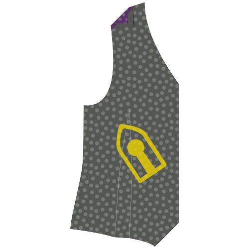
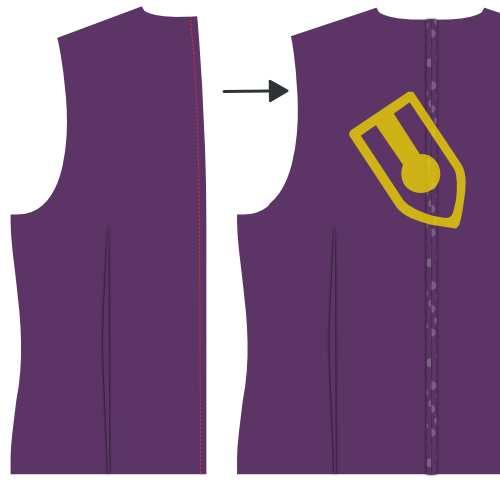
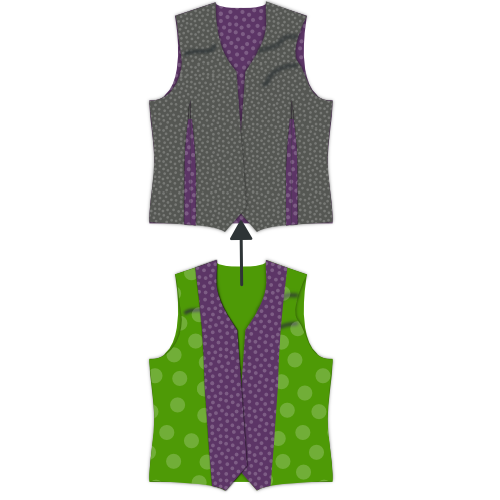
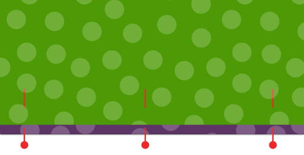

### Stap 1: Bevestig tussenvoering

#### Strijk de tussenvoering aan de paspels

Place your pocket welt with the good side down, and your pocket interfacing on top.

The interfacing is a bit shorter than the welt, so make sure to align the side that has the help line marked on it.

For each pocket, press the interfacing piece to the bad side of the pocket welt.

#### Strijk de tussenvoering aan de voorpanden

Place your front with the good side down, and your interfacing on top.

Press the interfacing in place.

> **Neem je tijd**
> 
> Strijk dit niet gewoon even om ermee klaar te zijn, je moet de tussenvoering echt op de stof persen zodat ze goed vastkleeft.
> 
> Zet je strijkijzer neer en zet er 10 seconden lang druk op voor je opschuift naar het volgende stukje.

### Stap 2: Bevestig het beleg aan de voering

#### Stik beleg aan voering

Place your front facing and lining with good sides together. Pin the edges of the facing/lining boundary in place.

Sew them together.

#### Strijk de naadwaarde open

Press open the seam allowance between facing and lining.

### Stap 3: Sluit alle nepen

#### Sluit nepen achter

Fold your back with good sides together, and sew the back dart.

> Vergeet niet hetzelfde te doen voor de voering

#### Sluit de voorste nepen

Fold your front (and the interfacing fused to it) with good sides together, and sew the front dart.

### Stap 4: Strijk alle nepen

#### Strijk de voorste nepen

Once cut open, press the front darts open.

#### Strijk de achterste nepen

If you cut open the back darts, press them open. If not, press them to the side.

> Vergeet niet hetzelfde te doen voor de voering

### Stap 5: Maak de zakken

#### Bevestig het zakdeel aan de paspel

Place your pocket bag down with the good side up, and your pocket welt on top of it with the good side down.

Align the straight side of the bag with the side of the welt that has no interfacing, and sew them together at the standard seam allowance.

#### Strijk de naad open

When you are done, press open this seam.

#### Markeer waar je zak moet komen

Your front pattern piece has a helpline on it to show where the welt pocket should go. It's two half rectangles that got joined together when you closed the dart to form the shape of your welt pocket.

If you haven't marked the four corners of that rectangle yet, you should do so now.

> De zak zit een beetje schuin op je patroon. Vanaf nu teken ik de zak recht op de illustraties, omdat dat iets makkelijker is.

#### Bevestig paspel en beleg zak

 

Place your front piece down with the good side up. We're going to attach the welt to the bottom line of your pocket outline, and the facing to the top line.

> Als je nog nooit een paspelzak gemaakt hebt kan het een beetje vreemd lijken om de zak aan de buitenkant van het kledingstuk te bevestigen. Zakken zitten toch aan de binnenkant?
> 
> Rustig blijven, de zak komt uiteindelijk aan de binnenkant terecht

Both your pocket welt and your pocket facing have a help line on them. That line needs to line up with the long edges of your pocket.

Place the pocket welt at the bottom, and the pocket facing on the top, both with their good side down.

Carefully align their helpline on the pocket outline. They should now sit side by side, and just bump into each other at the middle of your pocket.

Now sew along the helpline which marks the long edge of your pocket.

> Het is belangrijk dat de lijnen die je nu stikt een perfecte rechthoek vormen. Dit bepaalt de vorm van je zak, dus als de ene lijn langer is dan de andere, of ze zijn niet parallel of zitten op de verkeerde plek zal je zak er niet mooi uitzien.

#### Knip de zak open

Time to carefully cut open the pocket. Start in the middle of the pocket, and cut towards along the longest edges towards the side.

At the edges of your pocket you need to stop cutting open the center and instead cut towards the end of your line of stitches under 45 degrees.

> Dit kleine driehoekje dat je zo aan het einde krijgt is belangrijk. Wees voorzichtig en knip tot vlak voor je steken, zonder in het stiksel te knoppen.

#### Strijk de naadwaarde open

Press open the seam allowance along the long edges of your pocket.

#### Keer het zakbeleg naar de achterkant en strijk

Flip the pocket facing to the back side and press it down.

#### Strijk de driehoekjes aan de korte kanten plat

Move your pocket facing out of the way to reveal those little traingles at the side of your pocket.

Fold them back making sure you to keep your pocket opening a clean rectangle, and press them down.

#### Keer de paspel naar de achterkant, plooi en strijk

 

Flip the pocket welt with the attached pocket back tot he back side.

Fold your welt down at the point where it reaches the top of the pocket. The welt should cover the entire pocket opening.

> De illustratie toont dit langs de achterkant aangezien het zo duidelijker is wat er allemaal gebeurt. Kijk sowieso ook even naar de voorkant om te zien of je paspelzak er mooi uitziet.

#### Stik de driehoekjes vast

Put your front down with the good side up and make sure the pocket facing and welt lie flat.

Fold your front over vertically at the edge of your pocket to reveal that little triangle at the short side of your pocket opening.

Sew this triangle down by sewing right next to the fold, and pocket edge.

#### Sluit het zakdeel

Sew your pocket facing to the pocket bag to finish your pocket.

> Dit zou duidelijk moeten zijn, maar let op dat je je zakdeel niet aan je voorpand vastmaakt.

#### Strijk je afgewerkte zak

When you're done, give your pocket a good final press.

### Stap 6: Middenrugnaad

Put your two back pieces with their good side together and sew the center back seam.

When you're done, press open this seam.

> Vergeet niet hetzelfde te doen voor de voering

### Stap 7: Bevestig rugpand aan voorpanden

Put your back down with the good side up and put your fronts on it with the good side down. Align the side seams, pin and sew.

When you're done, press open these seams.

### Stap 8: Bevestig de schouders aan elkaar

Align the shoulder seams, sew them, and press open the seam allowance.

> Vergeet niet hetzelfde te doen voor de voering

### Stap 9: Bevestig de voering

#### Schuif de voering in het gilet

Place your lining in your waistcoat, good sides together. In other words, the waistcoat should have the good side in and bad side out. The lining should have the bad side in and good side out.

#### Speld de voering aan de stof

Align the lining with the fabric edge, and pin it in place.

Start at center back, and follow the neckline down the front closure. Work your way around the hem, but leave about a 15cm gap at the center back.

#### Stik voering aan de stof

With your lining pinned neatly in place, sew lining and fabric together.

Do not forget to leave that 15cm gap at the center back.

#### Keer het gilet en strijk de randen

Reach through the gap you left open at the hem, and turn your waistcoat.

Press the edges you've just sewn, making sure to roll the fabric a bit so that the lining is always hidden.

### Stap 10: Werk de armsgaten af

#### Speld de naadwaarde van de stof om

All along the armhole, pin back the seam allowance of your waistcoat fabric. While doing so, keep your lining out of the way.

#### Speld de voering om

Now fold back your lining a bit before the edge of the armhole and pin it down.

#### Naai de voering aan de stof

Use a slipstitch to hand-sew the lining to the fabric all along the armhole.

### Stap 11: Werk de zoom af

Remember that gap we didn't close in step 9? Time to close it.

Use a slipstitch to hand-sew the lining to the fabric and close the hem.

### Stap 12: Maak de knoopsgaten

If you haven't done so yet, transfer the buttonhole placement from your pattern onto your fabric.

Make those buttonholes.

### Stap 13: Naai knopen aan

Pin your waistcoat closed and transfer the location of your buttonholes to the button side.

Sew on those buttons.

> Je kan de plaats van de knopen ook overnemen van het patroon. Door je te baseren op de knoopsgaten die je net maakte verzeker je dat de knopen en knoopsgaten overeenkomen, zelfs als je knoopsgaten een beetje afwijken.

### Stap 14: Optioneel: Pit de randen door

If you'd like, you can pick-stitch around the edges of your waistcoat.

Pick-stitching needs to be done by hand. You run a simple stitch a few mm from the edges of your waistcoat, but only let your stitches surface for a few threads. You've certainly seen it as a finish on suit jackets.

> Je kunt een doorpitsteek maken met thread van dezelfde kleur, of een contrasterende kleur gebruiken als je je moedig voelt.

> Een doorpitsteek geeft een bepaald uitzicht, maar bevestigt ook de stof aan de voering en beleg zodat dingen minder gaan rondschuiven.

After this, you probably want to iron your waistcoat.
