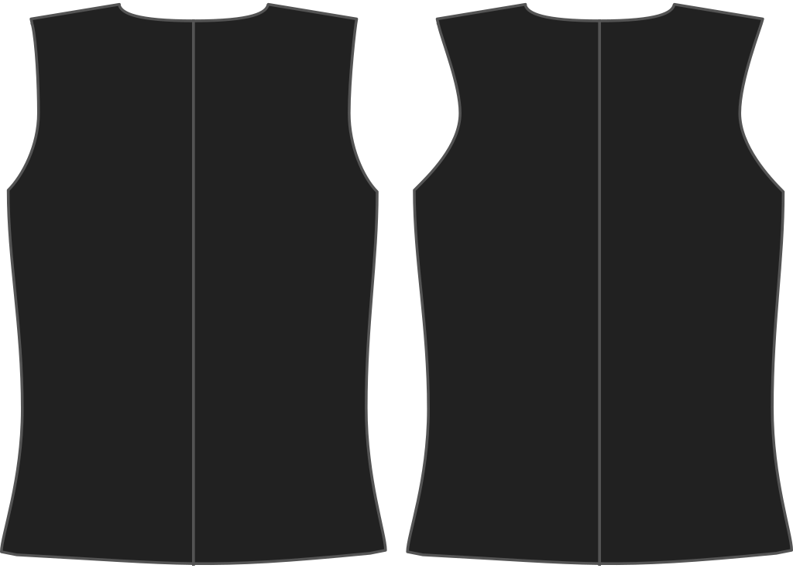

- - -
title:"Échancrure dos"
- - -

Jusqu'où voulez-vous que l'emmanchure de votre gilet se courbe côté dos ?

<Note>

###### Pour quoi faire ?

L'emmanchure de votre gilet peut se courber plus vers l'intérieur, étant donné qu'il n'y a pas de manche fixée.
Cela influence le style du gilet.

</Note>

## Effet de cette option sur le patron

