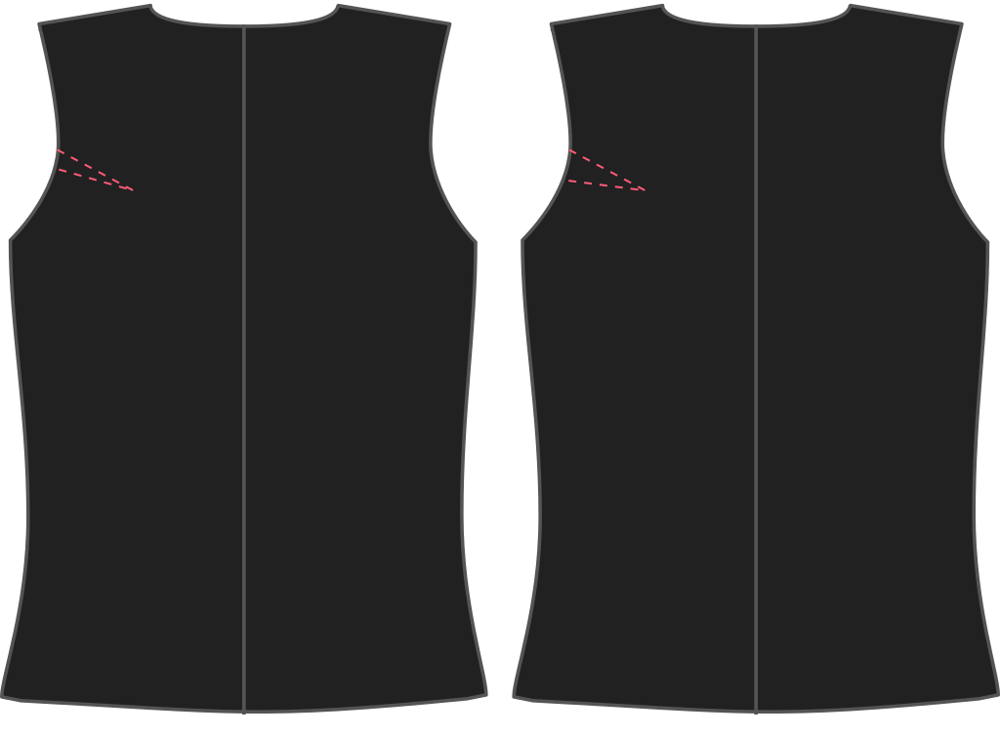

Dieses Muster kommt mit einem standardmäßigen 0,5 cm Scye Dart (denken Sie an Armlochdart) auf der Rückseite. Du kannst den Dart erhöhen oder verringern, um die Rüstung zu beeinflussen.

<Note>

###### Was ist der Punkt?

Der Sinn dieses Darts ist es, sicherzustellen, dass das Armloch flach gegen deinen Körper liegt und nicht gegen deinen Gang.
Angesichts der Tatsache, dass es keine Ärmel gibt, ist ein klaffendes Rüstungsloch besonders unschön.

Während dieser Dart benutzt wird, um das Muster zu formen, müssen Sie den Dart nicht nähen, da er in die Schulternahtlinie integriert ist.

</Note>

## Effekt dieser Option auf das Schnittmuster

