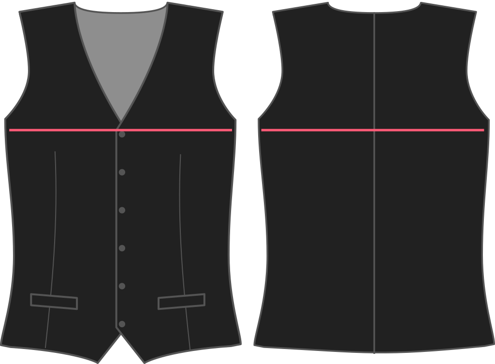

- - -
title: "Chest ease"
- - -

Wie viel Platz möchtest du an der Brust haben?

<Note>

Da eine Weste keine Arme hat, geht eine kleine Brustpflege sehr weit. Fügen Sie zu viel hinzu, und Sie werden am Ende klaffende Rüstungen haben.

</Note>

## Effekt dieser Option auf das Schnittmuster

