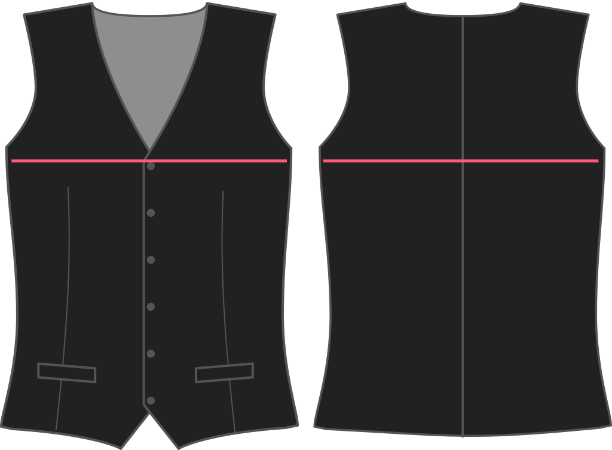

- - -
title: "Chest ease"
- - -

How much room do you want at the chest?

<Note>

Given that a waistcoat has no arms, a little chest ease goes a long way. Add too much, and you'll end up with gaping armholes.

</Note>

## Effect of this option on the pattern

