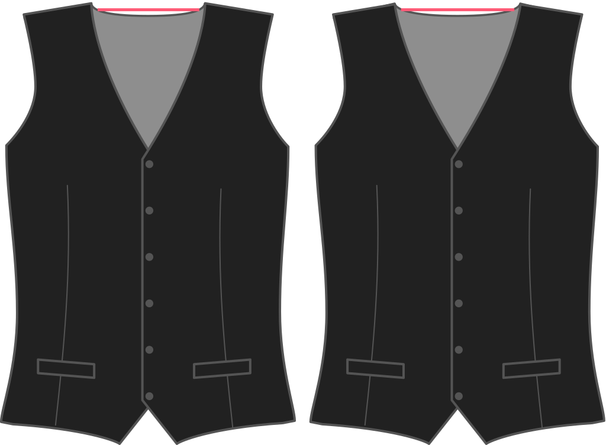

¿Hasta dónde quieres que tu cinturón se sienta lejos de tu cuello en la costura del hombro? El valor por defecto es 2cm.

<Note>

###### ¿Cuál es el punto?

###### What's the point?

The shoulder seam of a waistcoat is typically more narrow than your shirt. Esta opción controla lo estrecho que es (en el lado del collar).

</Note>

## Efecto de esta opción en el patrón

