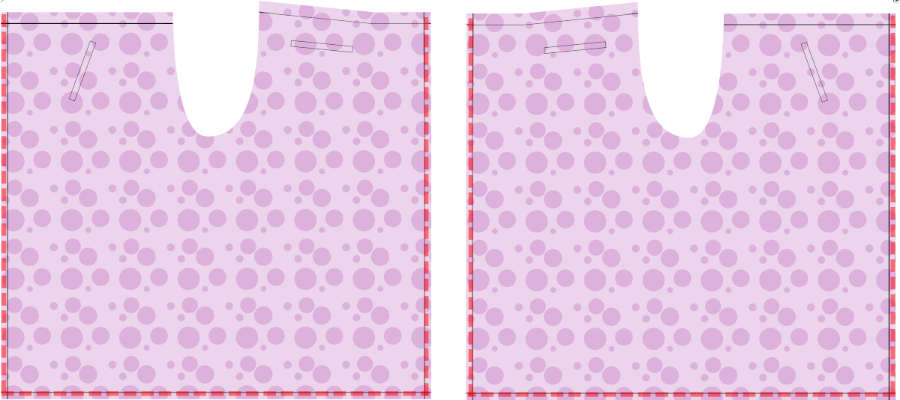

<Tip>

##### La clé de Waralee est la bande de taille

d'une certaine manière, Waralee est juste une bande de taille avec un long morceau de tissu attaché. La bande de taille doit continuer à partir du tissu en deux cordes de tissu qui sont utilisées pour attacher le pantalon à l'avant et deux dans le dos. Ces chaînes ne sont pas incluses dans le masque. Traditionnellement, elles sont de la même longueur. Vous pouvez en faire des plus longues pour le panneau avant (le côté qui est un peu plus court que l'autre, sur la gauche dans les illustrations ci-dessous), pour vous permettre d'attacher les deux sets à l'avant. Je préfère cela car il est plus facile de lire, et vous n'avez pas la majeure partie du nœud dans le dos.

</Tip>

## Étape 1 : Coudre les poches

<Note>

##### Les poches sont optionnelles

Traditionnellement, ce type de pantalon n'a pas de poches. Mais je veux mettre mon téléphone, mes clés et mon portefeuille quelque part. J'ai donc inclus des poches dans le motif. Vous pouvez décider par vous-même si vous le souhaitez sur votre pantalon.

Les illustrations des étapes suivantes montrent les pantalons Waralee sans poches. Seuls les emplacements de poche du modèle sont affichés, pour vous aider à vous orienter.

##### Si vous voulez des poches, faites-les d'abord

si vous voulez faire les poches, les faire avant de mettre un morceau de tissu sur l'autre. Il est plus facile de travailler avec les pièces encore séparées.

</Note>

Si vous le désirez, coudre les poches.

J'ai inclus des placements pour les poches avant qui seront cachées par les volets à l'avant. Mais ils seront toujours facilement accessibles pour y insérer votre téléphone ou vos clés. Ce sont des poches simples de welt. Les deux à l'avant sont à l'angle et ceux à l'arrière sont orientés horizontalement. Les gabarits de poche devraient permettre d'avoir suffisamment de tissu pour attacher la poche à la ceinture. Si vous voulez des poches particulièrement profondes, veuillez ajuster en conséquence.

## Étape 2 : tailler les côtés et le bas

Entourer les côtés et le bas.

Vous pouvez utiliser la méthode qui vous convient le mieux. Dans la version que j'ai d'abord fait je viens de serrer les côtés, les plié dos et le dessus les cousu, puis fait la même chose pour le fond. Je l'ai fait pour garder la majeure partie du tissu au minimum et pour permettre un meilleur drapeau. Ce que vous faites devrait dépendre du type de tissu que vous utilisez.

## Étape 3 : Coudre les deux parties ensemble au crochet

Maintenant vous devez coudre les deux parties ensemble. Disposez-les avec *bons côtés ensemble* et cousez la couture le long du cutout. Terminez cette couture et appuyez dessus.

## Étape 4 : Préparez les quatre chaînes

Les cordes ne sont que de longs tubes de tissu.

Prenez un quart de la mesure de votre tour de taille. Ajoutez ce numéro à 40cm (17”). Ajoutez votre marge de couture. C'est la longueur de chaque chaîne. Découpez quatre bandes de tissu de longueur et de largeur de 5cm (2").

Par exemple, si ma tour de taille est de 84,6 cm : 84,6 cm divisée par 4 est de 21,2 cm. 21,2cm plus 40cm est 61,2cm. 61,2cm plus ma couture de 1cm est 62,2cm. Je couperai quatre bandes de tissu qui sont 62,2cm par 5cm.

<Note>

##### Vous pouvez allonger les attaches avant

Optionnellement, pour allonger les attaches avant, les étendre par la mesure de votre quart de taille.

Lors de la génération de votre patron, une des options de style est appelée « Bande de taille ». Les chaînes, lorsqu'elles sont pliées, doivent avoir la même largeur que celle que vous avez spécifiée pour cette option, soit 2,5cm (1") par défaut.

La longueur supplémentaire de 40cm (17") est de faire le nœud.

Si votre matériau est délicat ou mince, vous pouvez ajouter un peu d'interfaçage pour lui donner de la force.

</Note>

Repliez-les en deux le long du côté long, *bons côtés ensemble*. Faire piquer le côté long et l'un des côtés courts et tourner la cravate à droite.

<Tip>

##### Tourner les tubes du côté droit du tissu peut être difficile

Cela peut être facilité en prenant un morceau de twine plus long que les bandes. Dites que entre les côtés de droite, le long du pli. Assurez-vous de bien l'attraper en couturant le côté court. Vous pouvez l'utiliser pour tirer la fin à travers le tube que vous avez créé. Lorsque vous avez terminé, vous pouvez le couper. Avoir un long bâton skinny ou un tourneur de boucle peut également aider à cela.

</Tip>

## Étape 5 : Coudre la bande de taille

Il est maintenant temps de coudre le bandeau de taille. Pensez à ajouter de l'interfaçage si votre tissu est délicat.

Repliez la marge de couture et pliez le long de la bande de la taille. (rouge)

Insérez une des chaînes que vous avez faites à l'étape précédente de chaque côté. Coudre le long de la bande de taille et ajouter quelques coutures supplémentaires pour s'assurer que ces cordes sont bien attachées. (bleu)

<Tip>

##### Sécurisez bien les chaînes de caractères

Les cordes maintiennent votre pantalon, donc avoir cette panne de broderie entraînera des instants difficiles.

</Tip>

## Étape 6: Portez votre pantalon

Appuyez sur votre pantalon, et essayez-les!

Tenez le côté avant contre votre ventre et enveloppez les deux cordes autour de vous et attachez dans le dos (ou, si vous avez de longues cordes, enveloppez-les tout le chemin autour de vous et attachez à l'avant). Puis mettez le dos à travers vos jambes et attachez les autres cordes à l'avant.

Voici un article qui montre comment attacher des pantalons d'écharpe : [Comment attacher des pantalons](https://www.wikihow.com/Tie-Wrap-Pants)

Si vous êtes coincé ou avez des questions supplémentaires, vous pouvez toujours atteindre [autres FreeSewers](https://discord.freesewing.org/).
