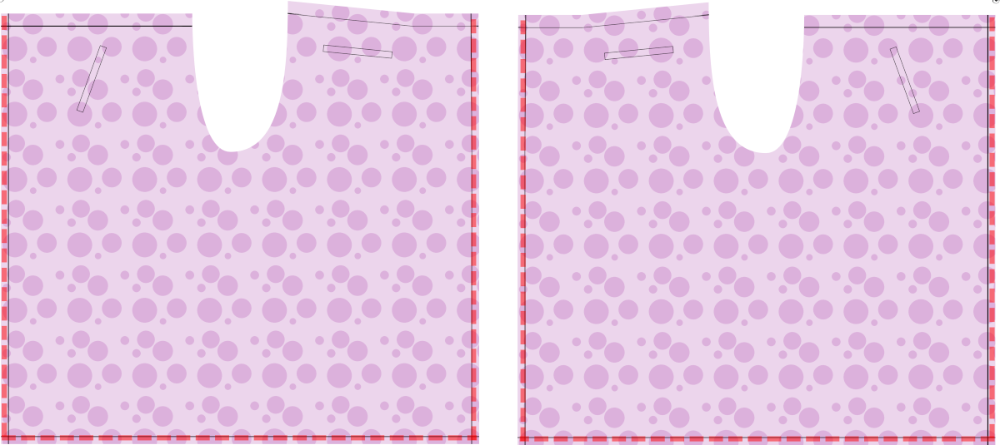
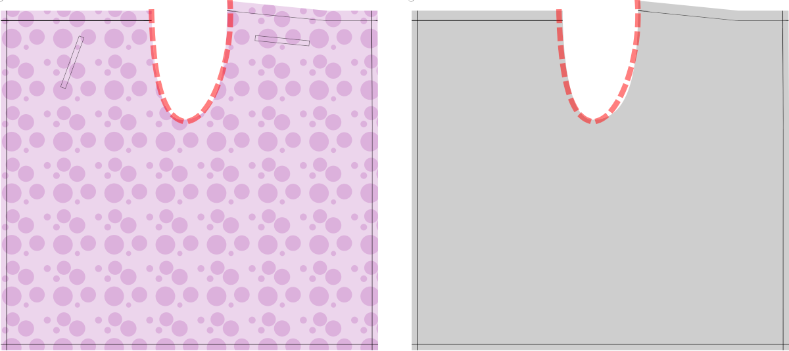
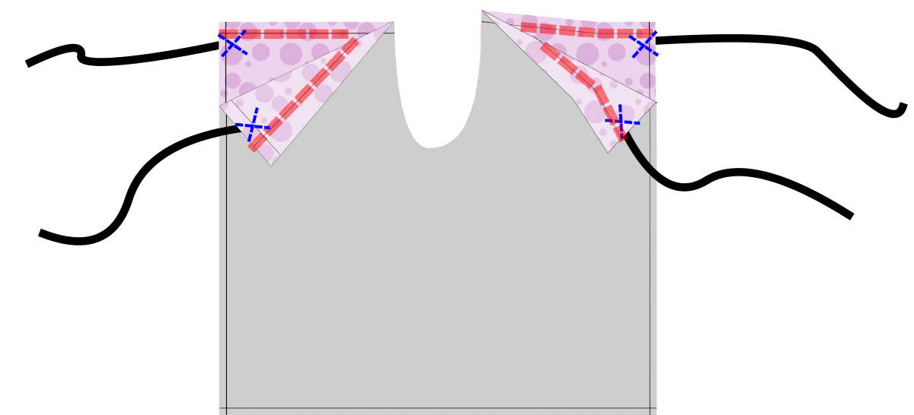

<Warning>

##### The key to Waralee is the waist band

In a way, Waralee is just a waist band with a long piece of fabric attached. The waist band needs to continue from the fabric into two strings of fabric that are used to tie the pants in the front and two in the back. These strings are not included in the pattern. Traditionally, they are of similar length. You can make longer ones for the front panel (the side that is a little shorter than the other, on the left in the illustrations below), to allow you to tie both sets in the front. I prefer this as it is easier to tie, and you don't have the bulk of the knot in the back.

</Warning>

### Step 1: Sew the pockets

<Note>

##### Pockets zijn optioneel

Traditioneel hebben deze broektypes geen zakken. Maar ik wil ergens mijn telefoon, sleutels en portemonnee zetten. Dus ik heb zakken in het patroon opgenomen. Je kunt voor jezelf beslissen of je ze op je broek wilt hebben.

De illustraties in de volgende stappen laten de oorlogsbroek zien zonder zakken. Alleen de zakplaatsingen van het patroon worden getoond, om je te helpen jezelf te oriënteren.

##### Als je zakken wilt kun je ze eerst

Als je de zakken gaat maken, laat ze eerst één stuk stof op de andere plaatsen. Het is makkelijker om met de delen te werken die nog gescheiden.

</Note>

-   If desired, sew the pockets.

<Note>

I included placements for the front pockets that will be hidden by the flaps in the front. But they will still be easily accessible to put your phone or keys in. These are single welt pockets. The ones in the front are at an angle and the ones in the back are horizontally oriented. The pocket templates should allow for enough fabric to attach the pocket to the waistband. If you want particularly deep pockets, please adjust accordingly.

</Note>

<Fixme>

Explain how to sew the pockets more.

</Fixme>

### Step 2: Hem the sides and bottom

-   Hem the sides
-   Hem the bottom.

<Note>

You can use whatever method works best for you. In the version I first made I just serged the sides, folded them back and top stitched them, then did the same for the bottom. I did this to keep the bulk of the fabric to a minimum and allow for a better drape. What you do should depend on the type of fabric you're using.

</Note>

### Step 3: Sew the two pants parts together at the crotch

Now you get to sew the two pants parts together.

-   Lay the two pants parts on top of one another with *good sides together* and sew the seam along the cutout.
-   *Finish* this seam and press it.

### Step 4: Prepare the four strings

The strings are just long tubes of fabric.

-   Take a quarter of your waist measurement. Add that number to 40cm (17”). Add your seam allowance. This is the length of each string.
-   Cut out four strips of fabric that are that long and 5cm (2”) wide.

<Tip>

For example, if my waist circumference is 84.6cm: 84.6cm divided by 4 is 21.2cm. 21.2cm plus 40cm is 61.2cm. 61.2cm plus my seam allowance of 1cm is 62.2cm. I will cut four strips of fabric that are 62.2cm by 5cm.

</Tip>

<Note>

##### You can lengthen the front ties

Optionally, to make the front ties longer, extend them by your quarter waist measurement.

When generating your pattern, one of the style options is called “Waist Band”. The strings, when folded, should have the same width as you specified for that option, 2.5cm (1") by default.

The extra 40cm (17") of length is to make the knot.

If your material is delicate or flimsy, you can add some interfacing to this to give it strength.

</Note>

-   Fold them in half along the long side, *good sides together*.
-   Stitch the long side and one of the short sides,
-   Turn the tie right side out.

<Tip>

##### Het draaien van buizen aan de rechterkant van de stof kan moeilijk zijn

Dit kan makkelijker worden door een stuk twee stukken langer te nemen dan de strips. Leg die tussen de rechterzijden, langs de stof. Zorg ervoor dat je dit vastpakt terwijl je de korte kant naait. Je kunt dit gebruiken om het einde door de buis die je hebt gemaakt te trekken. Wanneer je klaar bent, kun je het uitknippen. Het hebben van een lange schoonheidsstok of loopdraad kan hier ook mee helpen.

</Tip>

### Step 5: Sew the waist band

Now it is time to sew the waist band.

-   If your fabric is delicate, add interfacing to the wrong side of the pants above the waist band line. (red)
-   Fold the seam allowance in, and then fold along the waist band line. (red)
-   Insert one of the strings you made in the previous step on each side.
-   Sew along the waist band line, and add some additional stitching to make sure those strings are attached well. (blue)

<Warning>

##### Secure the strings well

The strings keep your pants up, so having that stitching fail will result in awkward moments.

</Warning>

### Step 6: Wear your pants

Press your pants, and try them on!

Hold the front side against your belly and wrap both strings around you and tie in the back (or, if you have long strings, wrap them all the way around you and tie in the front). Then hand the back side through your legs to yourself and tie the other strings in the front.

Here is an article demonstrating how to tie wrap pants: [How to Tie Wrap Pants](https://www.wikihow.com/Tie-Wrap-Pants)

If you get stuck, or have additional questions, you can always reach out to [other FreeSewers](https://discord.freesewing.org/).
