Bepaalt de locatie van de schoudernaad aan de kant van de kraag.

- Verhoog deze optie om de schoudernaad naar voren aan de kraag te verschuiven
- Verminder deze optie om de schoudernaad achterwaarts op de kraagzijde te bewegen

## Effect of this option on the pattern

