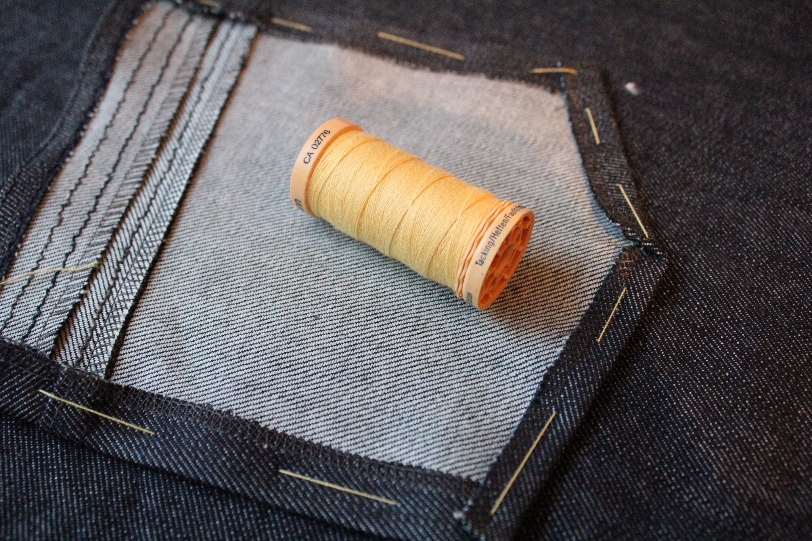

Зметування — це тимчасове з'єднання деталей викрійки.

Зазвичай це робиться вручну, але Ви також можете зробити це на машинці.

Приклади, де зазвичай використовується зметування:

- Намітка зметувальним швом перед стьобанням
- Наметання прикраси, кишені або іншої деталі перед тим, як закріпити її
- Наметування виточок чи інших змін у викрійці під час примірки на людині

Зметувальний шов ніколи не буває постійним — лише тимчасовим способом з'єднання деталей.

> Зметування та закріплення булавками — різні методи для схожих ситуацій
