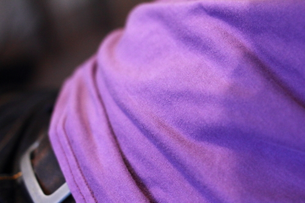
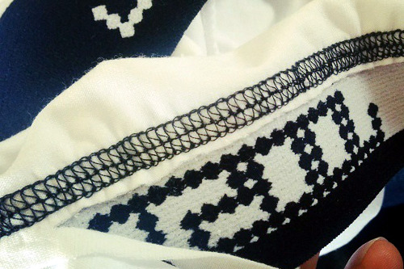
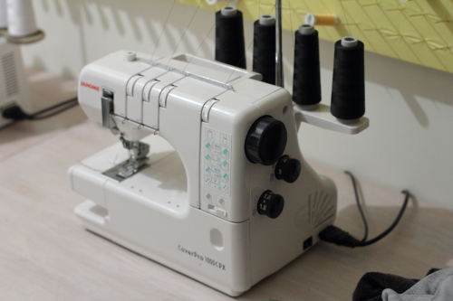

Eine Coverlock ist eine Art von Nähmaschine, die speziell dafür da ist, einen Coverlock-Stich oder eine Coverlock-Naht zu nähen.

Eine Coverlock-Naht wird für das Säumen von Strickbekleidung verwendet. Sie versäubert den zurückgefalteten Stoff so, dass er nicht ausfransen kann, und die resultierende Naht kann sich mit dem Stoff mitdehnen.

Coverlocks können dedizierte Maschinen sein oder in einer Overlock/Serger integriert.
