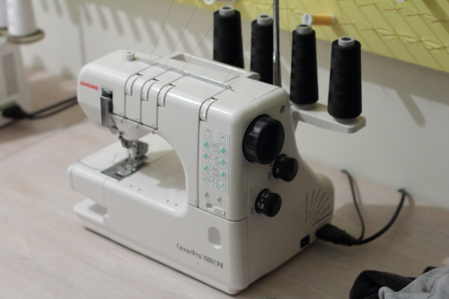

Een coverlock is een soort naaimachine specifiek bedoeld voor het naaien van een coverlock steek, of coverlock naad.

Een coverlock steek kan gebruikt worden voor het omzomen van jersey kleding. De steek werkt de omgeplooide rand van de stof af zodat deze niet kan rafelen en rekt mee met de stof.

Coverlocks bestaan als aparte machines, of zijn geïntegreerd met een overlock.
