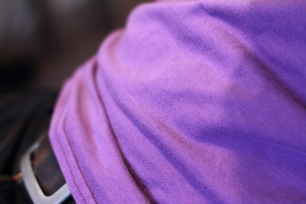

Коверлок - це тип швейної машини, яка призначена для виконання човникової строчки, або шва "коверлок".

Потайний шов використовується для підшивання трикотажних виробів. Він обробляє складену назад тканину так, щоб вона не могла задиратися, а отримана строчка розтягувалася разом з тканиною.

Коверлоки можуть бути окремими машинами або інтегрованими в оверлок/розпошивальну машину.
