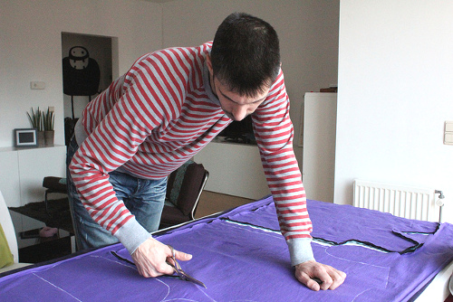

El corte es el acto de cortar las diferentes piezas de patrón de su tejido.

El corte se realiza típicamente con tijeras o con una cortadora rotativa.

> El **cortado de una prenda**, como parece, se refiere a cómo fue cortada. Por ejemplo, vaqueros de corte alto y una parte superior de corte bajo.
