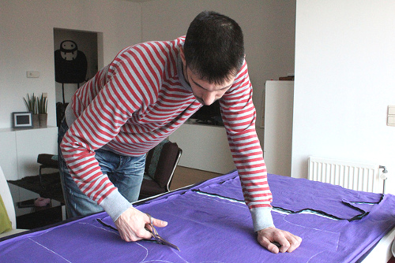

Крій — це процес вирізання з тканини різних деталей викрійки.

Крій зазвичай виконується ножицями або роторним різаком.

> **Крій одягу**, себто його вигляд, описує як він був вирізаний. Наприклад, джинси вузького крою та топ з глибоким вирізом.
