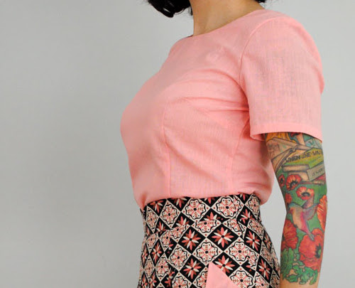

Abnäher sind für die Schnittmustergestaltung von entscheidender Bedeutung, da sie ein flaches, zweidimensionales Gewebe in eine dreidimensionale Form verwandeln.

Ein Abnäher wird von zwei Linien geformt, die einen Keil bilden, und sich in der Abnäherspitze treffen. Wenn die Linien zusammengenäht werden, erzeugen sie eine permanente Falte, wodurch der Stoff mehr nicht flach aufliegen kann, was eine dreidimensionale Form erzeugt.

Abnäher werden dort eingesetzt, wo der Stoff Kurven in mehr als eine Richtung abdecken muss. Du brauchst an deinen Beinen keine Abnäher, weil dort der Stoff der Krümmung deiner Beine folgen kann um sich um sie herum zu wickeln. Dein Hintern krümmt sich aber nicht nur horizontal, sondern auch vertikal. Somit sind Gesäße und Brüste die typischen Orte, wo du Abnäher findest.

> Wikipedia hat zu diesem Thema noch etwas mehr zu sagen: [Abnäher (engl. *dart*) auf Wikipedia](http://en.wikipedia.org/wiki/Dart_\(sewing\))
> 
> Ganze Kapitel in Büchern zum Nähen und Schnittmusterdesign sind den Abnähern gewidmet. Es ist nicht so einfach, zu wissen, wie und wo sie verwendet werden sollen. Aber für diese Website ist es erst einmal ausreichend, wenn du weißt, was sie sind.

> Bild von [Tasha](http://bygumbygolly.com/2013/01/finished-1940s-simplicity-diamonds/)
