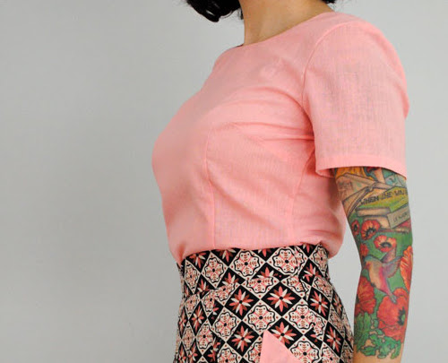

Darts are crucial in pattern design as they turn a flat, two-dimensional piece of fabric, into a three-dimensional shape.

A dart is created by two lines that form a wedge, and meet each other in the dart point. When the lines are sewn together they create a permanent fold, preventing the fabric from laying flat, thereby creating a three-dimensional shape.

Darts are used where fabric needs to cover curves in more than one direction. 
You don't need a dart for your legs because your fabric can follow the curvature of your legs and wrap around it. 
Your bum does not only curve horizontally, but also vertically. 
So bums and boobs are typically places where you'll find darts.

> Wikipedia has a bit more to say on this subject: [Dart (sewing) on Wikipedia](http://en.wikipedia.org/wiki/Dart_(sewing))
> 
> Entire chapters in books on sewing and pattern design are dedicated to darts. Knowing how and where to use them is not so simple. But for this website, knowing what they are is sufficient.

> Picture by [Tasha](http://bygumbygolly.com/2013/01/finished-1940s-simplicity-diamonds/) 
