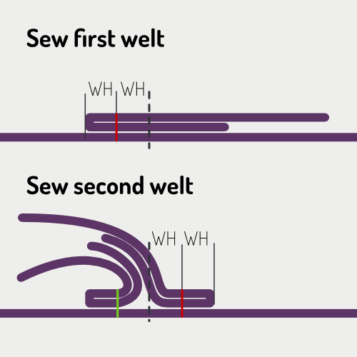
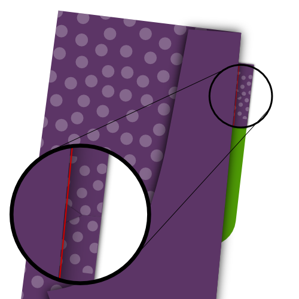

## Video
<YouTube id='PL1gv5yv3DoZOFSXz7yydeV1H8m6pfwstn' playlist />

## Lerne Paspeln mit David Page Coffin

Die November 2015 Edition des [Seamwork Magazine](https://www.seamwork.com/) hat einen Abschnitt, der sich [Erobere die Paspel (engl. *Conquering the Welt*)](https://www.seamwork.com/issues/2015/11/conquering-the-welt) nennt, wo David Page Coffin schrittweise die Konstruktion von Paspeltaschen erläutert.

David hat verschiedenste Bücher über Hosen- und Hemdenkonstruktion geschrieben, gibt online Nähkurse und veranstaltet Workshops in ganz Amerika und außerhalb.

David ist ein Freund der Website, und so viel besser darin, dies zu erklären, als ich es jemals könnte.

## Bevor du anfängst

### Was du brauchst

Um Doppelpaspeltaschen herzustellen, benötigst du:

 - Grundlegendes Nähzubehör
 - Der Stoff oder das Schnittmusterstück, in dem du die Tasche machen möchtest
 - Zwei Stoffstreifen für die Paspeln
 - Ein Streifen Einlage
 - Futterstoff oder anderen geeigneten Stoff für die Tasche (Siehe Stoff- und Farboptionen)
 - Besatz für den Taschenbeutel je nach Stoff- und Farboptionen

### Parameter

Zwei Werte bestimmen die Größe deiner Doppelpaspeltasche. Das sind:

 - Die Taschenbreite: Dies ist die Breite der Öffnung der fertigen Doppelpaspeltasche
 - Die Paspelhöhe: Dies ist die Höhe einer einzigen Paspel, und diese Hälfte der Höhe unserer Doppelpaspeltasche

> Im Beispiel unten verwende ich eine Taschenbreite von 13 cm und eine Welthöhe von 0,5 cm

## Zuschnitt

### Taschenwelten

Die Schweissnähte sind zwei rechteckige Stoffstreifen mit den folgenden Maßen:

 - Länge: Taschenbreite + 4cm
 - Breite: Welthöhe x2 + 5cm

Zum Beispiel:

 - Length: 13+4 = 17cm
 - Breite: (0.5x2)+5 = 6cm

Sie bilden die beiden schmalen Stoffstreifen, die Ihre doppelte Welttasche bilden.

> Achten Sie darauf, die Kornlinie zu respektieren, wenn Sie die beiden Schweissen schneiden

### Tascheneinlage

Die Taschenschnittstelle ist ein einziger rechteckiger Streifen verstellbarer Schnittstellen mit den folgenden Maßen:

 - Länge: Taschenwidht + 4cm
 - Breite: Welthöhe x2 + 5cm

Zum Beispiel:

 - Length: 13+4 = 17cm
 - Breite: (0.5x2)+5 = 6cm

> Möglicherweise haben Sie bemerkt, dass die Schnittstelle die gleiche Größe wie eine Welt hat

Die Schnittstelle wird verwendet, um die Tasche zu stabilisieren und wird mit dem Stoff mit Ihrem Eisen verschmolzen.

### Optional: Taschenbezug

Die (optionale) Tasche ist ein einziger rechteckiger Stoffstreifen mit folgenden Maßen:

 - Länge: Taschenbreite + 4cm
 - Breite: Welthöhe x2 + 5cm

Zum Beispiel:

 - Length: 13+4 = 17cm
 - Breite: (0.5x2)+5 = 6cm

> Du hast vielleicht bemerkt, dass das Gesicht die gleiche Größe wie eine Welt hat

Das Gesicht ist, was Sie sehen, wenn Sie durch die Öffnung Ihrer Tasche.

Das Gesicht ist optional, wenn Sie es nicht verwenden, wird es durch die Tasche aufgedeckt, aus welchem Material die Tasche hergestellt wird.

### Taschenbeutel

Die Form der Tasche hängt vom Muster ab. Für die Einfachheit werde ich eine rechteckige Tasche mit abgerundeten Ecken am unteren Rand verwenden, wie man sie auf den hinteren Hosentaschen finden kann.

> Es gibt in der Regel eine längere und kürzere Version der Tasche. Das liegt daran, dass die eine Seite an der Oberschicht befestigt ist, die andere an der Unterschweißung befestigt ist.

## Konstruktion

### Schritt 1: Sicherungsschnittstelle vor Ort

Verschmelzen Sie die Taschenschnittstelle mit der schlechten Seite Ihres Kleidungsstücks, so dass es den Ort überdeckt, an dem Sie die Welttasche herstellen.

> Muster haben normalerweise Noten, die Ihnen helfen, die Platzierung einer Welttasche zu bestimmen

### Schritt 2: Markiere die Tasche auf der guten Seite des Stoffes

Markiere die Tasche wie folgt:

 - Markieren Sie die Taschenbreite mit den vertikalen Linien. Lassen Sie diese Linien ausdehnen, damit Sie die Schweißnähte später ausrichten können
 - Die mittlere Öffnung der Tasche mit einer horizontalen Linie ausrichten. Lasse es sich erweitern um dir zu helfen, die Schweissen später auszurichten
 - Markiere zwei horizontale Linien parallel zur Mittelzeile, bei einem Versatz in Höhe der Welthöhe (0,5cm in unserem Beispiel)

Der Teil der horizontalen Linien parallel zur Mittellinie, die zwischen den Vertikellinien fallen, ist, wo wir unsere Schweissen nähen. Dies wird durch die roten Linien veranschaulicht.

### Schritt 3: Falten und drücken Sie die Schwellungen

Falten Sie die Schweißnähte parallel mit der langen Seite, mit der guten Seite.

Falten Sie sie nicht in die Hälfte. Stattdessen machen Sie die eine Seite 1cm länger als die andere.

Drücken Sie die Falte so dass es zu einer scharfen Falte wird.

> Durch das Aussetzen der Kanten wird der Weltenrand ausgeschaltet, was die Schüttelmasse und die Sichtbarkeit auf der Außenseite des Kleidungsstücks verringert.

### Schritt 4: Nähwelten vor Ort

> In den obigen Bildern ist die gestrichelte schwarze Linie das Zentrum der Erde. Die rote Linie zeigt, wo man nähen soll, und die grüne Linie ist eine Naht, die bereits genäht wurde.

Legen Sie die Welt auf die gute Seite Ihres Kleidungsstücks mit der kürzeren gefalteten Seite nach unten und zentrieren Sie sie horizontal.

Die gefaltete Seite mit der Mitte der Welttasche ausrichten und nun zweimal die Welthöhe nach außen verschieben.

In unserem Beispiel mit einer Welthöhe von 0,5cm liegt die Falte Ihrer Welt 1cm vom Welttaschenmittel.

Nähen Sie Ihre Welt in Platz 0,5 cm (WH) aus der Falte, oder mit anderen Worten, genau auf der Linie, die Sie auf Ihrem Kleidungsstück markiert.

Stellen Sie sicher, dass Sie genau auf den vertikalen Linien starten und stoppen, die die Taschenbreite angeben.

Wenn du fertig bist, nähe die zweite Welt vor Ort. Beachte, dass dies ein bisschen komplizierter sein wird, da du die erste Welle zurückklappen musst, und legen Sie einen Teil Ihrer zweiten Welt darüber.

### Schritt 5: Schneiden Sie Ihre Tasche

> Im Bild markiert die rote Linie wie und wo man die Tasche öffnet, und die grüne Linie zeigt die Nähte.

Schneiden Sie Ihre Welttasche durch Schneide entlang der Mitte horizontale Linie. Stoppen Sie die vertikalen Linien, die die Seiten der Tasche markieren, und schneiden Sie unter 45 Grad an den Rand Ihrer Heftlinie, die die Schweißnähte hält.

> Achten Sie darauf, dass Sie nicht in Ihre Nähte schneiden oder zu weit schneiden. Richten Sie es genau.

### Schritt 6: Die Schweissen auf die andere Seite drehen und drücken

Sie haben Ihre Schweißnähte auf die gute Seite des Stoffes. Jetzt werden wir sie auf die Rückseite drehen, durch die Öffnung, die wir gerade im Gewebe geschnitten.

Drehen Sie die Schweissen auf den Rücken und drücken Sie sie flach. Nehmen Sie sich Zeit, den Stoff in ein sauberes Rechteck zu bearbeiten, bevor Sie ihn nach unten drücken.

> Achte darauf, die dreieckigen Stoffstücke (am kurzen Rand deiner Öffnung) auf die Seite zu drücken

> Du drückst mehrere Stoffschichten. Überlegen Sie, ob Sie die Ebenen einzeln drücken (oder öffnen) bevor Sie sie zusammen drücken. Dies wird eine schärfere Kreise und eine bessere Welttasche hervorrufen.

### Schritt 7: Nähen Sie die Tasche öffnende Seiten zu den Schweissen

 

Lege deine Kleidung mit der guten Seite nach oben und falten Sie sie auf der Seite Ihrer Welttasche und sorgen Sie dafür, dass Ihre Schwellungen flach liegen.

Nähen Sie das dreieckige Stück Gewebe aus der Tasche Öffnung zu den Schweißen.

> Vergewissern Sie sich, dass Sie nicht in die Taschenöffnung nähen, da dies die Nähte auf der Vorderseite zeigt

### Schritt 8: Nähe die untere Tasche in die untere Welt

Falten Sie Ihr Kleidungsstück aus dem Weg, damit Sie die Tasche in die untere Schweiß nähen können.

Auch mit einer Zick-Zack-Nähte den Weltrand fertig zu stellen, so dass die Welt im Inneren der Tasche bleibt.

> Die Taschentasche zeigt sich hier (grün) viel Klarheit. Sie können Ihre Taschen auch aus anderen Stoffen herstellen.

### Schritt 9: Optional: Nähen nach oben Tasche

> Dieser Schritt ist optional. Befestigen Sie die Vorderseite der Tasche an der oberen Tasche wenn Sie wollen, dass Sie durch die Öffnung der Tasche zeigen.

### Schritt 10: Nähe die oberste Tasche in die oberste Welt

Falte dein Kleidungsstück so dass du die Tasche nach oben nähen kannst.

> Wenn Sie die Vorderseite auf Ihre Tasche aufgetragen haben, stellen Sie sie mit der Vorderseite in Richtung der Schwefel.

### Schritt 11: Befestigen Sie die Schweissen an die Tasche

  

Legen Sie Ihr Kleidungsstück mit der guten Seite nach oben und falten Sie es an die Seite der Welttasche zurück.

Nähen Sie das dreieckige Stoffstück aus der Tasche und öffnen Sie die Taschen zu den Taschen so wie Sie es früher genäht haben.

Falte dein Kleidungsstück an der Spitze der Welttasche zurück.

Nähen Sie jetzt die Oberseite der Tasche öffnen, um die Tasche zu öffnen.

### Schritt 12: Beende die Tasche

Beenden Sie nun die Tasche zurück, indem Sie alle Kanten schließen (die obere Kante ist optional).

Um dies zu tun, können Sie ein bias Band, einen Serger oder nähen Sie einen anderen Finishstitch.

Danach bist du fertig!
