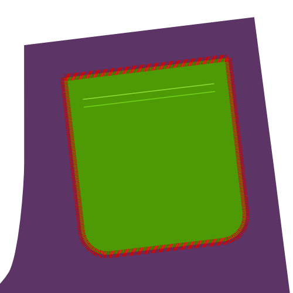

## Video

<YouTube id='PL1gv5yv3DoZOFSXz7yydeV1H8m6pfwstn' playlist />

## Lerne Paspeln mit David Page Coffin

In der Ausgabe des [Seamwork Magazine](https://www.seamwork.com/) von November 2015 gibt es einen Abschnitt betitelt [Conquering the Welt](https://www.seamwork.com/issues/2015/11/conquering-the-welt), in welchem Coffin dich durch die Konstruktion einer Paspeltasche führt.

David hat verschiedene Bücher über Hosen- und Hemdenentwürfe geschrieben, gibt online Nähkurse und bietet Workshops in den Vereinigten Staaten und anderen Ländern an.

David ist ein Freund der Website, und so viel besser darin, dies zu erklären, als ich es jemals könnte.

## Bevor du anfängst

### Was du brauchst

Um Doppelpaspeltaschen herzustellen, benötigst du:

- Grundlegendes Nähzubehör
- Der Stoff oder das Schnittmusterstück, in dem du die Tasche machen möchtest
- Zwei Stoffstreifen für die Paspeln
- Ein Streifen Einlage
- Futterstoff oder anderen geeigneten Stoff für die Tasche (Siehe Stoff- und Farboptionen)
- Besatz für den Taschenbeutel je nach Stoff- und Farboptionen

### Parameter

Zwei Werte bestimmen die Größe deiner Doppelpaspeltasche. Das sind:

- Die Taschenbreite: Dies ist die Breite der Öffnung der fertigen Doppelpaspeltasche
- Die Paspelhöhe: Dies ist die Höhe einer einzigen Paspel, und diese Hälfte der Höhe unserer Doppelpaspeltasche

> Im Beispiel unten verwende ich eine Taschenbreite von 13 cm und eine Paspelhöhe von 0,5 cm

## Zuschnitt

### Taschenpaspeln

Die Paspeln sind zwei rechteckige Stoffstreifen mit den folgenden Maßen:

- Länge: Taschenbreite + 4cm
- Breite: Paspelhöhe x2 + 5cm

Für unser Beispiel:

- Länge: 13cm + 4cm = 17cm
- Breite: (0,5cm x 2) + 5cm = 6cm

Dies wird zu den beiden schmalen Stoffstreifen werden, die deine Doppelpaspeltasche bilden.

> Achte darauf, beim Ausschneiden der beiden Paspeln den Fadenlauf zu berücksichtigen

### Tascheneinlage

Die Tascheneinlage ist ein einziger rechteckiger Streifen an Bügeleinlage mit den folgenden Maßen:

- Länge: Taschenbreite + 4cm
- Breite: Paspelhöhe x2 + 5cm

Für unser Beispiel:

- Länge: 13cm + 4cm = 17cm
- Breite: (0,5cm x 2) + 5cm = 6cm

> Du hast vielleicht bemerkt, dass die Einlage genauso groß wie eine Paspel ist

Die Einlage wird verwendet, um die Tasche zu stabilisieren, und wird mit dem Bügeleisen mit deinem Stoff fest verbunden.

### Optional: Taschenbesatz

Der (optionale) Taschebesatz ist ein einziger rechteckiger Stoffstreifen mit folgenden Maßen:

- Länge: Taschenbreite + 4cm
- Breite: Paspelhöhe x2 + 5cm

Für unser Beispiel:

- Länge: 13cm + 4cm = 17cm
- Breite: (0,5cm x 2) + 5cm = 6cm

> Du hast vielleicht bemerkt, dass der Besatz genauso groß wie eine Paspel ist

Der Besatz ist das, was du sehen, wenn du durch die Öffnung deiner Tasche spähst.

Der Besatz ist optional, wenn du keinen verwendest, wird beim Spähen durch die Taschenöffnung das Material sichtbar sein, das du für den Innenbeutel verwendet hast.

### Taschenbeutel

Die Form des Taschenbeutels hängt vom Schnittmuster ab. Der Einfachheit halber werde ich einen rechteckigen Taschenbeutel mit abgerundeten Ecken am unteren Rand verwenden, wie man sie hinten auf Hosen finden kann.

> Es gibt in der Regel eine längere und kürzere Version des Taschenbeutels. Das liegt daran, dass eine Seite an der oberen Paspel, die andere an der unteren Paspel befestigt wird.

## Konstruktion

### Schritt 1: Einlage festbügeln

Bügele die Einlage an der schlechten Seite deines Kleidungsstückes fest, sodass sie die Stelle bedeckt, an der du deine Paspeltasche konstruieren wirst.

> Schnittmuster haben normalerweise Knipse, die dir dabei helfen, eine Paspeltasche zu platzieren

### Schritt 2: Markiere die Paspeltache auf der guten Seite des Stoffes

Markiere die Paspeltasche wie folgt:

- Markiere die Taschenbreite mit vertikalen Linien. Mache diese Linien etwas länger, damit sie dir später beim Ausrichten der Paspeln helfen
- Richte die Mitte der Taschenöffnung an einer horizontalen Linie aus. Mache diese Linien etwas länger, damit sie dir später beim Ausrichten der Paspeln helfen
- Markiere zwei horizontale Linien parallel zur Mittellinie, um die Paspelhöhe versetzt (0,5cm in unserem Beispiel)

The part of the horizontal lines parallel to the center line that fall in between the vertical lines is where we'll sew our welts in place. Dies wird durch die roten Linien veranschaulicht.

### Schritt 3: Falte und bügele die Paspeln

Falten Sie die Schweißnähte parallel mit der langen Seite, mit der guten Seite.

Falten Sie sie nicht in die Hälfte. Stattdessen machen Sie die eine Seite 1cm länger als die andere.

Drücken Sie die Falte so dass es zu einer scharfen Falte wird.

> Durch das Aussetzen der Kanten wird der Weltenrand ausgeschaltet, was die Schüttelmasse und die Sichtbarkeit auf der Außenseite des Kleidungsstücks verringert.

### Schritt 4: Nähe Paspeln fest

> In den obigen Bildern ist die gestrichelte schwarze Linie das Zentrum der Erde. Die rote Linie zeigt, wo man nähen soll, und die grüne Linie ist eine Naht, die bereits genäht wurde.

Legen Sie die Welt auf die gute Seite Ihres Kleidungsstücks mit der kürzeren gefalteten Seite nach unten und zentrieren Sie sie horizontal.

Die gefaltete Seite mit der Mitte der Welttasche ausrichten und nun zweimal die Welthöhe nach außen verschieben.

In unserem Beispiel mit einer Welthöhe von 0,5cm liegt die Falte Ihrer Welt 1cm vom Welttaschenmittel.

Nähen Sie Ihre Welt in Platz 0,5 cm (WH) aus der Falte, oder mit anderen Worten, genau auf der Linie, die Sie auf Ihrem Kleidungsstück markiert.

Stellen Sie sicher, dass Sie genau auf den vertikalen Linien starten und stoppen, die die Taschenbreite angeben.

Wenn du fertig bist, nähe die zweite Welt vor Ort. Beachte, dass dies ein bisschen komplizierter sein wird, da du die erste Welle zurückklappen musst, und legen Sie einen Teil Ihrer zweiten Welt darüber.

### Schritt 5: Schneide deine Tasche auf

> Im Bild markiert die rote Linie wie und wo man die Tasche öffnet, und die grüne Linie zeigt die Nähte.

Schneiden Sie Ihre Welttasche durch Schneide entlang der Mitte horizontale Linie. Stoppen Sie die vertikalen Linien, die die Seiten der Tasche markieren, und schneiden Sie unter 45 Grad an den Rand Ihrer Heftlinie, die die Schweißnähte hält.

> Achten Sie darauf, dass Sie nicht in Ihre Nähte schneiden oder zu weit schneiden. Richten Sie es genau.

### Schritt 6: Die Schweissen auf die andere Seite drehen und drücken

Sie haben Ihre Schweißnähte auf die gute Seite des Stoffes. Jetzt werden wir sie auf die Rückseite drehen, durch die Öffnung, die wir gerade im Gewebe geschnitten.

Drehen Sie die Schweissen auf den Rücken und drücken Sie sie flach. Nehmen Sie sich Zeit, den Stoff in ein sauberes Rechteck zu bearbeiten, bevor Sie ihn nach unten drücken.

> Achte darauf, die dreieckigen Stoffstücke (am kurzen Rand deiner Öffnung) auf die Seite zu drücken

> Du drückst mehrere Stoffschichten. Überlegen Sie, ob Sie die Ebenen einzeln drücken (oder öffnen) bevor Sie sie zusammen drücken. Dies wird eine schärfere Kreise und eine bessere Welttasche hervorrufen.

### Schritt 7: Nähe die Seite der Taschenöffnung an die Paspeln

 

Lege deine Kleidung mit der guten Seite nach oben und falten Sie sie auf der Seite Ihrer Welttasche und sorgen Sie dafür, dass Ihre Schwellungen flach liegen.

Nähen Sie das dreieckige Stück Gewebe aus der Tasche Öffnung zu den Schweißen.

> Vergewissern Sie sich, dass Sie nicht in die Taschenöffnung nähen, da dies die Nähte auf der Vorderseite zeigt

### Schritt 8: Nähe den unteren Taschenbeutel an die untere Paspel

Falten Sie Ihr Kleidungsstück aus dem Weg, damit Sie die Tasche in die untere Schweiß nähen können.

Auch mit einer Zick-Zack-Nähte den Weltrand fertig zu stellen, so dass die Welt im Inneren der Tasche bleibt.

> Die Taschentasche zeigt sich hier (grün) viel Klarheit. Sie können Ihre Taschen auch aus anderen Stoffen herstellen.

### Schritt 9: Optional: Nähe Besatz an den oberen Taschenbeutel

> Dieser Schritt ist optional. Befestigen Sie die Vorderseite der Tasche an der oberen Tasche wenn Sie wollen, dass Sie durch die Öffnung der Tasche zeigen.

### Schritt 10: Nähe den oberen Taschenbeutel an die obere Paspel

Falte dein Kleidungsstück so dass du die Tasche nach oben nähen kannst.

> Wenn Sie die Vorderseite auf Ihre Tasche aufgetragen haben, stellen Sie sie mit der Vorderseite in Richtung der Schwefel.

### Schritt 11: Befestige die Paspeln am Taschenbeutel

  

Legen Sie Ihr Kleidungsstück mit der guten Seite nach oben und falten Sie es an die Seite der Welttasche zurück.

Nähen Sie das dreieckige Stoffstück aus der Tasche und öffnen Sie die Taschen zu den Taschen so wie Sie es früher genäht haben.

Falte dein Kleidungsstück an der Spitze der Welttasche zurück.

Nähen Sie jetzt die Oberseite der Tasche öffnen, um die Tasche zu öffnen.

### Schritt 12: Versäubere den Taschenbeutel

Beenden Sie nun die Tasche zurück, indem Sie alle Kanten schließen (die obere Kante ist optional).

Um dies zu tun, können Sie ein bias Band, einen Serger oder nähen Sie einen anderen Finishstitch.

Danach bist du fertig!
