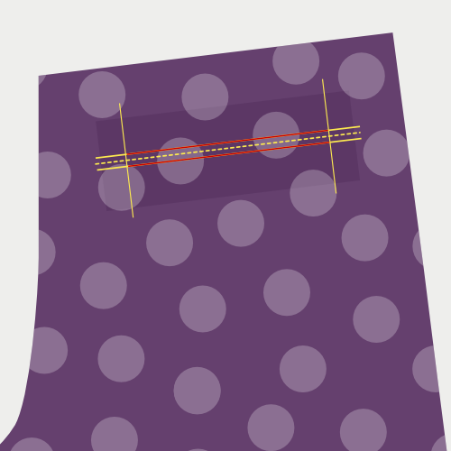
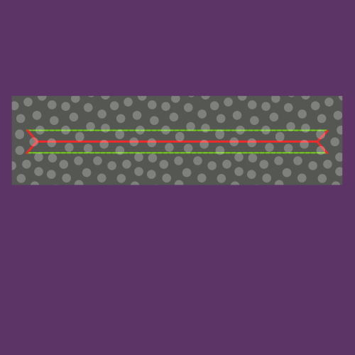
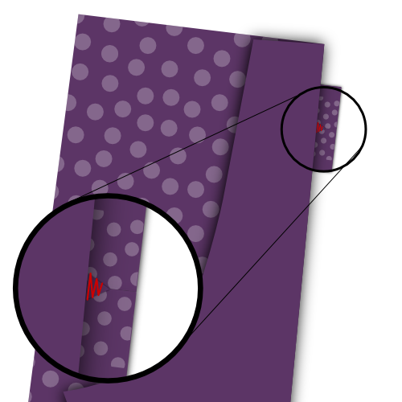

## Vídeo

<YouTube id='PL1gv5yv3DoZOFSXz7yydeV1H8m6pfwstn' playlist />

## Aprender soldaduras con David Page Coffin

The November 2015 edition of [Seamwork Magazine](https://www.seamwork.com/) has a section called [Conquering the Welt](https://www.seamwork.com/issues/2015/11/conquering-the-welt) where David Page Coffin walks you through the construction of welt pockets.

David has written various books on trouser and shirt construction, teaches online sewing classes, and hosts workshops throughout the US, and abroad.

David es un amigo del sitio, y por todas las medidas mucho mejores para explicarlo que yo.

## Antes de empezar

### Lo que necesitas

Para hacer bolsillos de doble soldadura, necesitarás:

- Suministros básicos de costura
- El tejido o patrón en el que quieres hacer el bolsillo
- Dos tiras de tela para las soldaduras
- Una tira de interfaz
- Tejido o de otro tipo adecuado para la bolsa de bolsillo (Ver tela y opciones de color)
- Encara para la bolsa de bolsillo, dependiendo de las opciones de tejido y color

### Parámetros

Dos valores determinan el tamaño de su bolsillo de doble soldadura. Estas son:

- Ancho del bolsillo: Este es el ancho de la apertura del bolsillo de doble soldadura finalizado
- La altura de la soldadura: Esta es la altura de una soldadura, y esta mitad de la altura de nuestro bolsillo de doble soldadura

> En el ejemplo de abajo, uso un ancho de bolsillo de 13 cm y una altura de soldadura de 0,5 cm

## Corte

### Soldaduras de bolsillo

Las soldaduras son dos bandas rectangulares de tejido con las siguientes medidas:

- Longitud: Ancho de bolsillo + 4cm
- Ancho: Altura del mundo x2 + 5cm

Por ejemplo:

- Longitud: 13 cm + 4 cm = 17 cm
- Anchura: (0,5 cm x 2) + 5 cm = 6 cm

Formarán las dos tiras estrechas de tela que forman su doble bolsillo de soldadura.

> Asegúrate de respetar la línea de grano al cortar las dos soldaduras

### Entretela de bolsillo

La interfaz del bolsillo es una sola tira rectangular de interfaz fusible con las siguientes medidas:

- Longitud: Ancho de bolsillo + 4cm
- Ancho: Altura del mundo x2 + 5cm

Por ejemplo:

- Longitud: 13 cm + 4 cm = 17 cm
- Anchura: (0,5 cm x 2) + 5 cm = 6 cm

> Puede haber notado que la interfaz es del mismo tamaño que una soldadura

La entretela se utiliza para estabilizar el bolsillo, y se fusionará a la tela con la plancha.

### Opcional: Pocket hacia

La cara (opcional) del bolsillo es una sola tira rectangular de tela con las siguientes medidas:

- Longitud: Ancho de bolsillo + 4cm
- Ancho: Altura del mundo x2 + 5cm

Por ejemplo:

- Longitud: 13 cm + 4 cm = 17 cm
- Anchura: (0,5 cm x 2) + 5 cm = 6 cm

> Puede que hayas notado que la cara es del mismo tamaño que una soldadura

El rostro es lo que verás cuando pares a través de la apertura de tu bolsillo.

El revestimiento es opcional, si no lo usas, con el bolsillo mostrará cualquier material del que esté hecho la bolsa.

### Bolsa de bolsillo

La forma de la bolsa de bolsa depende del patrón. Para la simplicidad, voy a usar una bolsa rectangular de bolsillo con esquinas redondeadas en la parte inferior como se puede encontrar en los bolsillos traseros de pantalones.

> Normalmente hay una versión más larga y corta de la bolsa de bolsillo. Esto se debe a que un lado está unido a la soldadura superior, mientras que el otro se une a la soldadura inferior.

## Construcción

### Paso 1: Fusionar interfaz en su lugar

Fusionar el bolsillo con el lado malo de su ropa, para que cubra el lugar donde usted hará el bolsillo de soldadura.

> Los patrones típicamente tienen notches que le ayudan a determinar la colocación de un bolsillo de soldado

### Paso 2: Marca el bolsillo de la soldadura en el buen lado de la tela

Marca el pocket de la siguiente forma:

- Marca el ancho del bolsillo con las líneas verticales. Dejar que estas líneas se extiendan para ayudarte a alinear las soldaduras más tarde
- Alinear la apertura central del bolsillo con una línea horizontal. Deja que se extienda para ayudarte a alinear las soldaduras más tarde
- Marca dos líneas horizontales paralelas a la línea central, en un desplazamiento igual a la altura de la soldadura (0,5 cm en nuestro ejemplo)

The part of the horizontal lines parallel to the center line that fall in between the vertical lines is where we'll sew our welts in place. Esto se ve reflejado en las líneas rojas.

### Paso 3: Plegar y pulsar las soldaduras

Doblar las soldaduras paralelas con el lado largo, con el lado bueno.

No los dobléis a la mitad. En lugar de ello, hace que un lado sea más largo que el otro.

Presione el pliegue para que se convierta en un pliegue afilado.

> Al contraponer los bordes, el borde de la soldadura se atenúa, lo que reduce la visibilidad en el exterior de la prenda.

### Paso 4: Soldaduras de Súper

> En las imágenes de arriba, la línea negra de guiones es el centro de la soldadura. La línea roja muestra dónde coser y la línea verde es una costura que ya ha sido cocida.

Coloque la soldadura en el lado bueno de su prenda con el lado inferior doblado hacia abajo, y centémosla horizontalmente.

Alinear el lado plegado con el centro del bolsillo de la soldadura, y ahora desplazarlo el doble de la Altura del Mundo (WH) hacia afuera.

En nuestro ejemplo con una Altura del Mundo de 0.5cm, el pliegue de su soldadura se encuentra a 1cm del centro del bolsillo soldado.

Mantenga su soldadura en su lugar 0,5 cm (WH) del pliegue o, en otras palabras, exactamente en la línea que marcó en su prenda.

Asegúrate de comenzar y detenerte con precisión en las líneas verticales que indican la anchura del bolsillo.

Cuando hayas terminado, coser la segunda soldadura en su lugar. Ten en cuenta que esto será un poco más complicado ya que tendrás que doblar la primera soldadura, y poner parte de su segunda soldadura sobre ella.

### Paso 5: Corta tu pocket

> En la imagen, la línea roja marca cómo cortar el bolsillo y la línea verde muestra las costuras.

Corta tu bolsillo de soldadura cortando a lo largo de la línea horizontal central. Parar a corto de las líneas verticales que marcan los lados del bolsillo y cortan menos de 45 grados hasta el borde de su línea de unión que mantiene las soldaduras hacia abajo.

> Asegúrate de no cortar en tus cintas ni cortar demasiado lejos. Hagamos que sea precisa.

### Paso 6: Invierte las soldaduras al otro lado y presiona

Has estado cosiendo tus soldaduras a la buena cara del tejido. Ahora vamos a volcarlos a la parte trasera, a través de la apertura que acabamos de cortar en el tejido.

Girar las soldaduras hacia la espalda y presionarlas en plano. Tómese su tiempo para trabajar la tela en un buen rectángulo antes de presionarla.

> Asegúrate de pulsar las piezas triangulares de la tela (en el borde corto de tu abertura) hacia el lado

> Estás presionando varias capas de tela. Considere presionar (o abrir) las capas individualmente antes de presionarlas juntos. Esto dará un pliegue más afilado, y un bolsillo de soldadura más limpio.

### Paso 7: Pase los lados de apertura del bolsillo a las soldaduras

 

Pon tu ropa abajo con el lado bueno, y llévalo de nuevo en el lado de su bolsillo de soldadura, asegurándose de mantener sus soldaduras llanas.

Difunde la pieza triangular de tela desde la apertura del bolsillo a las soldaduras.

> Asegúrate de no coser en la apertura del bolsillo, ya que esto mostrará las stitches en la parte frontal

### Paso 8: Pase la bolsa de bolsillo inferior a la soldadura inferior

Ponga su ropa fuera del camino para que pueda coser la bolsa de bolsa a la parte inferior.

También acabe el borde de la soldadura con un zig-zag stitch para que la soldadura se quede plana dentro del bolsillo.

> La bolsa de bolsa se muestra en tela de revestimiento aquí (verde) mucha claridad. También puedes hacer tus bolsas de bolsillo desde otras telas.

### Paso 9: Opcional: Empuje mirando a la bolsa de bolsillo superior

> Este paso es opcional. Adjunte hacia la bolsa de bolsillo si desea que se muestre a través de la apertura del bolsillo.

### Paso 10: Empuja la bolsa de bolsillo superior a la soldadura superior

Doblar la ropa para que puedas coser la bolsa de bolsa hasta la soldadura superior.

> Si aplicó frente a su bolsa de bolsillo, asegúrese de colocarla con la cara hacia las soldaduras.

### Paso 11: Adjuntar las soldaduras a la bolsa de bolsillo

  

Coloque su prenda con el buen costado arriba, y llévala de nuevo en el lateral del bolsillo de soldadura.

Divierte la pieza triangular de tela desde la abertura del bolsillo hasta las bolsas de bolsillo, de la misma manera que lo has cosido hasta las soldaduras antes.

Doble su prenda en la parte superior de la bolsa de soldadura.

Ahora, coser la parte superior del bolsillo abriendo a la bolsa de bolsillo.

### Paso 12: Termina la bolsa de bolsillo

Ahora termina el bolsillo cerrando todos los bordes (el borde superior es opcional).

Para ello, puede aplicar cinta de sesgo, usar un sergador o coser algún otro pedazo de acabado.

¡Después de eso, has terminado!
