## Vidéo

<YouTube id='PL1gv5yv3DoZOFSXz7yydeV1H8m6pfwstn' playlist />

## Apprenez les rabats avec David Page Coffin

L'édition de novembre 2015 de [Seamwork Magazine](https://www.seamwork.com/) a une section appelée [A la conquête des rabats](https://www.seamwork.com/issues/2015/11/conquering-the-welt) où David Page Coffin vous guide à travers la construction de poches passepoilées.

David a écrit plusieurs livres sur la construction de pantalons et de chemises, enseigne des cours de couture en ligne et organise des ateliers partout aux États-Unis et à l'étranger.

David est un ami du site, et est de loin bien mieux placé que moi pour vous expliquer cela.

## Avant de commencer

### Ce dont vous avez besoin

Pour fabriquer une poche à doubles rabats (passepoilée), vous aurez besoin de :

- Fourniture de base pour la couture
- Le tissu ou la pièce du patron dans lequel vous voulez faire la poche
- Deux bandes de tissu pour les rabats
- Une bande d'entoilage
- Doublure ou autre tissu adapté pour le fond de poche (Voir les options de tissu et de couleur)
- Parement pour l'intérieur de la poche, en fonction de vos options de tissu et de couleurs

### Paramètres

Deux valeurs déterminent la taille de votre poche passepoilée. Il y a :

- Largeur de la poche : C'est la largeur de l'ouverture de la poche passepoilée
- La hauteur de rabat : Il s'agit de la hauteur d'un seul rabat, et donc la moitié de la hauteur de notre poche passepoilée

> Dans l'exemple ci-dessous, j'utilise une largeur de poche de 13cm et une hauteur de rabat de 0,5cm

## Coupe

### Rabats de poche

Les rabats sont deux bandes rectangulaires de tissu avec les mesures suivantes :

- Longueur : Largeur de poche + 4cm
- Largeur : Hauteur du rabat x2 + 5cm

Pour notre exemple :

- Longueur : 13 cm + 4 cm = 17 cm
- Largeur : (0.5 cm x 2) + 5 cm = 6 cm

Ils formeront les deux bandes étroites de tissu qui forment votre poche passepoilée.

> Assurez-vous de respecter le droit fil lors de la coupe des deux rabats

### Entoilage de poche

L'entoilage de poche est une seule bande rectangulaire d'entoilage thermocollant avec les mesures suivantes :

- Longueur : Largeur de poche + 4cm
- Largeur : Hauteur du rabat x2 + 5cm

Pour notre exemple :

- Longueur : 13 cm + 4 cm = 17 cm
- Largeur : (0.5 cm x 2) + 5 cm = 6 cm

> Vous avez peut-être remarqué que l'entoilage est de la même taille qu'un rabat

L'entoilage est utilisé pour stabiliser la poche, et sera thermocollé au tissu avec votre fer.

### Optionnel: parement fond de poche

Le parement de poche (optionnelle) est une seule bande rectangulaire de tissu avec les mesures suivantes :

- Longueur : Largeur de poche + 4cm
- Largeur : Hauteur du rabat x2 + 5cm

Pour notre exemple :

- Longueur : 13 cm + 4 cm = 17 cm
- Largeur : (0.5 cm x 2) + 5 cm = 6 cm

> Vous avez peut-être remarqué que le parement est de la même taille qu'un rabat

Le parement est ce que vous verrez quand vous regardez à travers l'ouverture de votre poche.

Le parement est optionnel, si vous ne l'utilisez pas, l'ouverture de la poche révèlera le tissu dont le sac de poche sera fait.

### Sac de poche

La forme du sac de poche dépend du patron. Pour plus de simplicité, je vais utiliser un sac de poche rectangulaire avec des coins arrondis en bas comme vous pouvez le trouver sur les poches arrière du pantalon.

> Il y a généralement une version plus longue et plus courte du sac de poche. Cela est dû au fait que l'un des côtés est attaché au rabat du haut, tandis que l'autre est attaché au rabat du bas.

## Montage

### Étape 1 : Thermocoller l'entoilage en place

Thermocollez l'entoilage de poche sur l'envers de votre vêtement, de sorte qu'il couvre l'endroit où vous ferez la poche passepoilée.

> Les patrons on généralement des repères qui aident à déterminer l'emplacement de la poche passepoilée

### Étape 2 : Marquez la poche passepoilée sur l'endroit du tissu

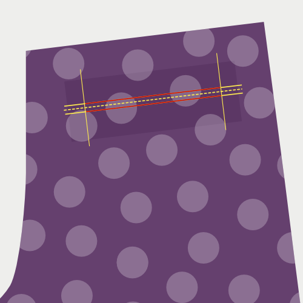

Marquez la poche passepoilée de la façon suivante :

- Marquez la largueur de la poche avec les lignes verticales. Laissez ces lignes dépasser pour vous aider à aligner les rabats plus tard
- Alignez l'ouverture centrale de la poche avec une ligne horizontale. Laissez-la dépasser pour vous aider à aligner les rabats plus tard
- Marquez deux lignes horizontales parallèles à la ligne centrale, à un écart égal à la hauteur d'un rabat (0,5cm dans notre exemple)

La partie des lignes horizontales parallèle à la ligne centrale qui se situe entre les lignes verticales est l'endroit où nous coudrons nos rabats en place. Cela est illustré par les lignes rouges.

### Étape 3 : Pliez et pressez les rabats

Plier les rabats parallèlement au côté long, avec l'endroit visible.

Ne les pliez pas en deux moitiés. Pliez plutôt en laissant un des deux côtés plus long d'1 cm.

Pressez le pli de façon à ce qu'il soit bien aplati.

> En décalant les bords, l'épaisseur des bords du rabat s'atténuent, ce qui réduit le volume et la visibilité sur l'extérieur du vêtement.

### Étape 4 : Coudre les rabats en place

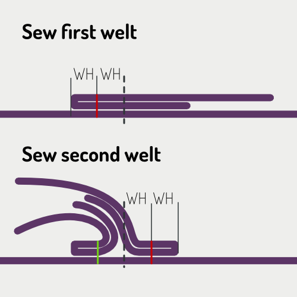

> Dans les images ci-dessus, la ligne noire pointillée est le centre de l'ouverture de poche. La ligne rouge montre où coudre, et la ligne verte est une couture qui a déjà été cousue.

Placez le rabat sur l'endroit de votre vêtement avec le côté plié plus court vers le bas et centrez-le horizontalement.

Alignez le côté plié avec le centre de la poche, et déplacez-le maintenant deux fois plus haut que la Hauteur du rabat ("WH" sur le schéma).

Dans notre exemple avec une Hauteur de rabat de 0,5cm, le pli de votre rabat se trouve à 1cm du centre de la poche passepoilée.

Coudre le rabat en place à 0.5cm (WH) du pli, autrement dit, exactement sur la ligne que vous avez tracée sur votre vêtement.

Assurez-vous de démarrer et d'arrêter précisément sur les lignes verticales qui indiquent la largeur de la poche.

Lorsque vous avez terminé, coudre le deuxième rabat en place. Notez que cela sera un peu plus difficile car vous devrez plier le premier rabat, et placer par-dessus une partie de votre deuxième rabat.

### Étape 5 : Coupez la poche

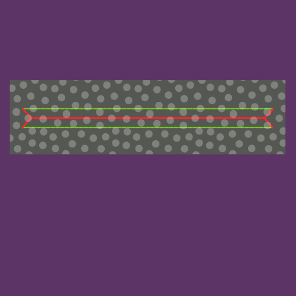

> Dans l'illustration, la ligne rouge indique comment/où couper la poche, et la ligne verte montre les coutures.

Coupez votre poche en découpant le long de la ligne horizontale centrale. Arrêtez-vous près des lignes verticales qui marquent les côtés de la poche et coupez à 45 degrés jusqu'au bord de votre ligne de couture qui maintient les rabats vers le bas.

> Assurez-vous de ne pas couper vos coutures ou de ne pas couper trop loin non plus. Soyez précis.

### Étape 6: Retourner les rabats de l'autre côté et presser

Vous avez cousu vos rabats sur l'endroit du tissu. Maintenant, nous allons les retourner à l'arrière, à travers l'ouverture que nous venons de couper dans le tissu.

Retournez les rabats vers l'arrière, puis pressez bien à plat. Prenez le temps de travailler le tissu pour bien former un rectangle soigné avant de le presser.

> Assurez-vous d'appuyer sur les morceaux de tissu triangulaires (au bord court de votre ouverture) sur le côté

> Vous pressez sur plusieurs couches de tissu. Envisagez de presser vers le bas (ou d'ouvrir) les couches individuellement avant de les presser ensemble. Cela donnera un pli plus marqué, et une poche passepoilée plus propre.

### Étape 7 : Coudre les côtés ouverts de la poche aux rabats

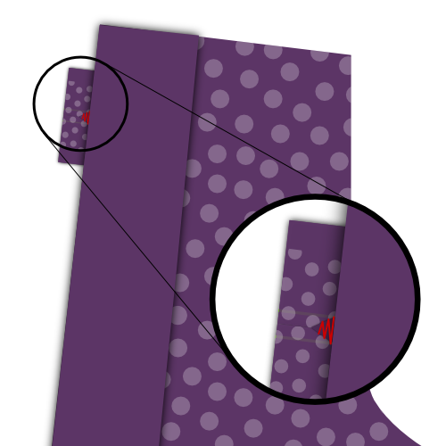 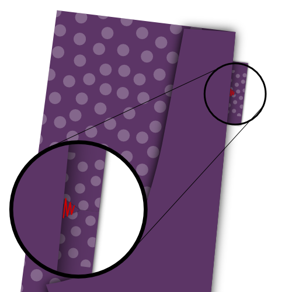

Placez votre vêtement avec l'endroit (l'extérieur) vers le haut, et le repliez-le sur le côté de votre poche, en veillant à ce que vos rabats restent à plat.

Coudre la parties de tissu triangulaire de l'ouverture de la poche jusqu'aux rabats.

> Assurez-vous de ne pas coudre dans l'ouverture de la poche, car cela rendra visibles les points sur le devant

### Étape 8 : Coudre le sac de poche au rabat du bas

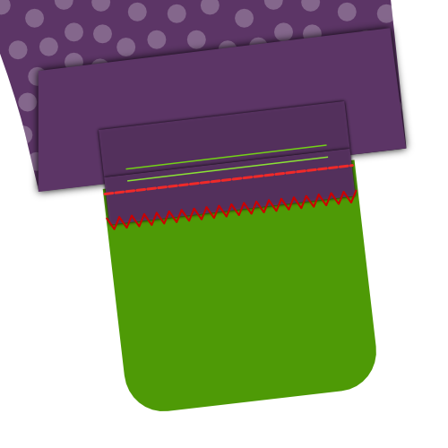

Repliez votre vêtement de façon à ce que vous puissiez coudre le sac de poche à votre rabat du bas.

Finissez également le bord du rabat avec un point zig-zag pour que le rabat reste bien plat à l'intérieur de la poche.

> Le sac de poche est montré dans le tissu de doublure ici (vert) pour plus de clarté. Vous pouvez également faire vos sacs de poche dans un autre tissu.

### Étape 9 : Optionnel : Coudre le parement en haut du sac de poche

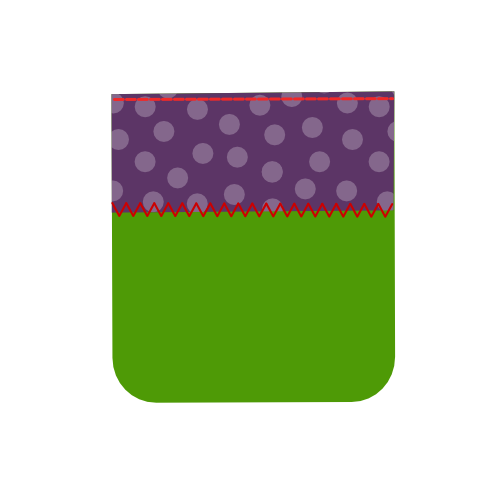

> Cette étape est optionnelle. Fixez le parement en haut du sac de poche si vous voulez le rendre visible à travers l'ouverture de la poche.

### Étape 10 : Coudre le sac de poche au rabat du haut

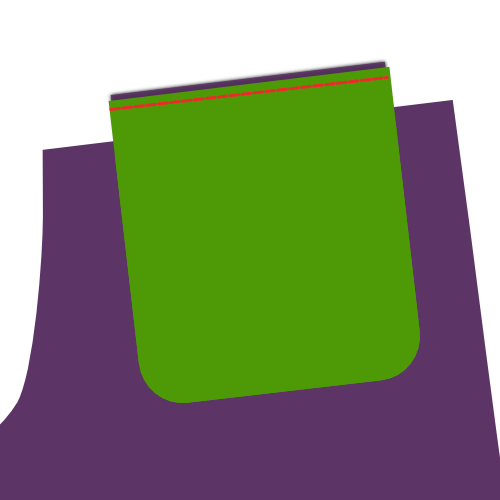

Repliez votre vêtement de façon à ce que vous puissiez coudre le sac de poche à votre rabat du haut.

> Si vous avez appliqué le parement à votre sac de poche, assurez-vous de le placer de façon visible entre les rabats.

### Étape 11: Attachez les rabats au sac de poche

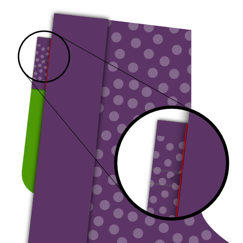 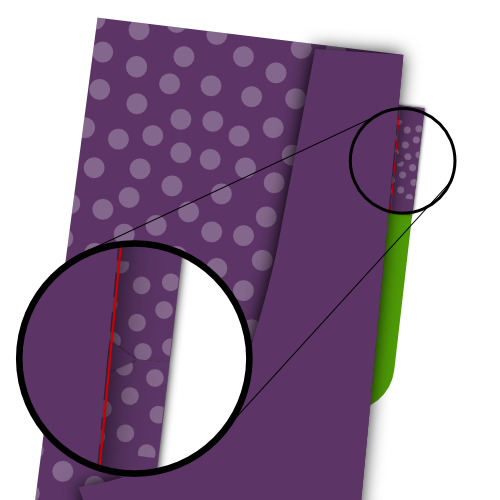 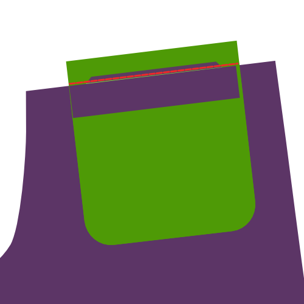

Placez votre vêtement avec l'endroit vers le haut, et repliez-le sur le côté de la poche.

Coudre la partie de tissu triangulaire depuis l'ouverture de la poche vers les sacs de poche, comme vous l'avez cousue jusqu'aux rabats plus tôt.

Repliez votre vêtement par-dessus votre poche passepoilée.

Maintenant, cousez le haut de l'ouverture de la poche au sac de poche.

### Étape 12 : Terminer le sac de poche

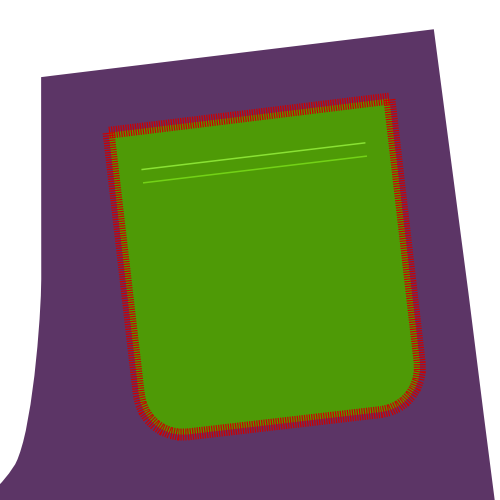

Finissez maintenant la poche en fermant tous les bords (le bord supérieur est optionnel).

Pour ce faire, vous pouvez appliquer du biais, utiliser une surjeteuse ou coudre un autre point de finition.

Après ça, vous avez fini !
