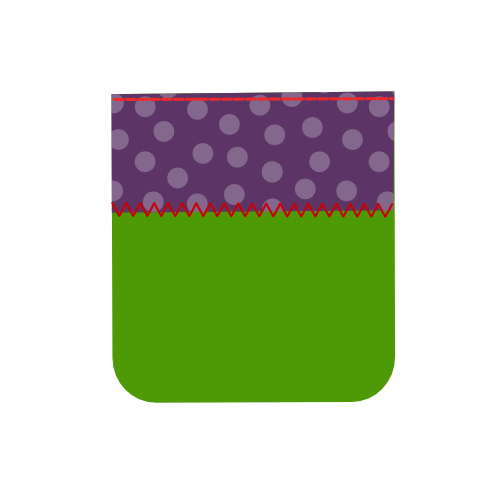
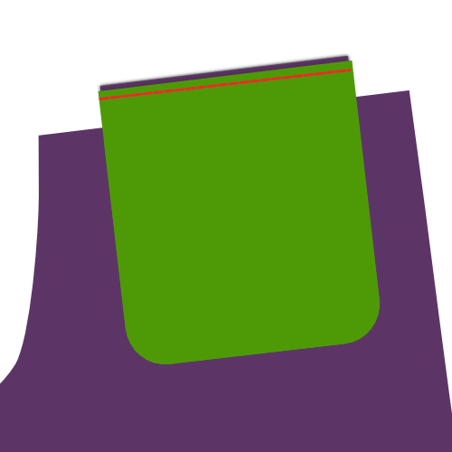

## Video

<YouTube id='PL1gv5yv3DoZOFSXz7yydeV1H8m6pfwstn' playlist />

## Leer paspelzakken met David Page Coffin

The November 2015 edition of [Seamwork Magazine](https://www.seamwork.com/) has a section called [Conquering the Welt](https://www.seamwork.com/issues/2015/11/conquering-the-welt) where David Page Coffin walks you through the construction of welt pockets.

David has written various books on trouser and shirt construction, teaches online sewing classes, and hosts workshops throughout the US, and abroad.

David is een vriend van deze site, en vooral veel beter geschikt om dit uit te leggen dan ik.

## Voor je begint

### Wat je nodig hebt

Om een dubbele paspelzak te maken heb je dit nodig:

- Basis naaimateriaal
- De stof of het patroondeel waar je de zak in wil maken
- Twee stroken stof voor de paspels
- Een strookje tussenvoering
- Voering of een andere geschikte stof voor de binnenzak (Zie stof- en kleuropties)
- Een beleg voor de binnenzak, afhankelijk van je stof- en kleuropties

### Parameters

Twee waarden bepalen de afmeting van je dubbele paspelzak. Dit zijn:

- Breedte van de zak: dit is de breedte van de opening van de afgewerkte dubbele paspelzak
- Hoogte van de paspel: dit is de hoogte van één paspel, en dus de helft van de hoogte van een dubbele paspelzak

> In dit voorbeeld gebruik ik een zakbreedte van 13 cm en een paspelhoogte van 0.5 cm

## Knippen

### Paspels

De paspels zijn twee rechthoekige stroken stof met de volgende afmetingen:

- Lengte: zakbreedte + 4 cm
- Breedte: Hoogte van de paspel x 2 + 5 cm

Voor ons voorbeeld:

- Lengte: 13cm + 4cm = 17cm
- Breedte: (0,5cm x 2) + 5cm = 6cm

Deze vormen de twee smalle stroken stof die je paspelzak maken.

> Let op dat je de draadrichting respecteert bij het uitknippen

### Tussenvoering zak

De tussenvoering voor de zak is een enkele rechthoekige strook kleefbare tussenvoering met de volgende afmetingen:

- Lengte: zakbreedte + 4 cm
- Breedte: Hoogte van de paspel x 2 + 5 cm

Voor ons voorbeeld:

- Lengte: 13cm + 4cm = 17cm
- Breedte: (0,5cm x 2) + 5cm = 6cm

> Je hebt misschien opgemerkt dat de tussenvoering dezelfde afmeting heeft als een paspel

De versteviging wordt gebruikt om de zak te stabiliseren en wordt met je strijkijzer aan de stof vastgemaakt.

### Optioneel: zakbeleg

Het (optionele) zakbeleg is een enkele rechthoekige strook stof met de volgende afmetingen:

- Lengte: zakbreedte + 4 cm
- Breedte: Hoogte van de paspel x 2 + 5 cm

Voor ons voorbeeld:

- Lengte: 13cm + 4cm = 17cm
- Breedte: (0,5cm x 2) + 5cm = 6cm

> Je hebt misschien opgemerkt dat het beleg dezelfde afmeting heeft als een paspel

Het beleg is wat je zal zien als je door de zakopening kijkt.

Het beleg is optioneel, maar als je het niet gebruikt zie je het materiaal waar je binnenzak van gemaakt is.

### Binnenzak

De vorm van het zakdeel hangt af van het patroon. Voor de eenvoud gebruik ik een rechthoekig zakdeel met afgeronde hoeken zoals je zou vinden aan de achterzak van een broek.

> Er is gewoonlijk een langere en kortere versie van het zakdeel. Dit is omdat één kant vasthangt aan de bovenste paspel, terwijl de andere aan de onderste bevestigd wordt.

## Constructie

### Stap 1: kleef de tussenvoering op z'n plek

Strijk de strook tussenvoering op de verkeerde kant van de stof, zodat het de plek waar de paspelzak komt bedekt.

> Patronen hebben gewoonlijk merktekens die je helpen de plaats van je paspelzak te bepalen

### Stap 2: Markeer de paspelzak op de juiste kant van de stof

Markeer de paspelzak op deze manier:

- Markeer de zakbreedte met verticale lijnen. Laat deze lijnen iets verder doorlopen, dit helpt later om de paspels op de juiste plek te leggen
- Markeer het midden van de zakopening met een horizontale lijn. Laat ook deze lijn iets verder doorlopen om het je later makkelijker te maken
- Markeer twee horizontale lijnen, parallel aan de middenlijn, op dezelfde afstand als de paspelhoogte (in ons voorbeeld is dit 0.5 cm)

The part of the horizontal lines parallel to the center line that fall in between the vertical lines is where we'll sew our welts in place. Dit is aangeduid met de rode lijnen.

### Stap 3: Vouw en strijk de paspels

Vouw de paspels parallel met de lange zijde, met de goede kant naar buiten.

Vouw ze niet in de helft. In plaats daarvan maak je één zijde 1 cm langer dan de andere.

Strijk deze vouw zodat ze een scherpe plooi wordt.

> Door de randen van de paspel ongelijk te maken verminder je bulk en zichtbaarheid van de paspels aan de buitenkant van het kledingstuk.

### Stap 4: Stik de paspels op hun plaats

> In de beelden hierboven geeft de zwarte stippellijn het midden van de paspel aan. De rode lijn toont waar gestikt moet worden, en de groene lijn is een naad die al gestikt is.

Plaats de paspel op de goede kant van je stof met de korter geplooide kant naar beneden, en centreer alles horizontaal.

Leg de geplooide kant op het midden van de zakopening, en schuif het twee keer de Paspelhoogte (PH) naar buiten.

In ons voorbeeld met een Paspelhoogte van 0.5 cm ligt de vouw van je paspel 1 cm van het midden van de zakopening.

Stik de paspel vast op 0.5 cm (PH) van de vouw, of met andere woorden, exact op de lijn die je op je patroondeel gemarkeerd hebt.

Let op dat je exact begint en stopt aan de verticale lijnen die de zakbreedte aangeven.

Wanneer je dit gedaan hebt stik je de tweede paspel op dezelfde manier vast. Merk op dat dit een beetje lastiger is omdat je de eerste paspel opzij moet plooien, en een stuk van de tweede paspel over de eerste heen leggen.

### Stap 5: Knip je zak open

> Op de afbeelding geeft de rode lijn aan hoe en waar de zak opengeknipt wordt, en toont de groene lijn de naden.

Knip je paspelzak open door langs de middelste horizontale lijn te knippen. Stop een stukje voor de verticale lijnen die de zijkanten van de zakopening aangeven en knip in een hoek van 45 graden naar het uiteinde van het stiksel dat de paspels bevestigt.

> Let op dat je niet door je stiksel knipt, of er voorbij. Ga voor precisiewerk.

### Stap 6: draai de paspels naar de andere kant en strijk

Je hebt je paspels aan de goede kant van de stof vastgestikt. Nu gaan we ze naar de verkeerde kant keren, door de opening die we net in de stof geknipt hebben.

Keer de paspels naar de achterkant, en strijk ze plat. Neem de tijd om de zakopening tot een mooie rechthoek te vormen voor je strijkt.

> Zorg dat je de kleine driehoekige stukjes stof (aan de zijkant van de zakopening) naar opzij strijkt

> Je strijkt verschillende lagen stof. Probeer de lagen individueel van elkaar naar beneden (of open) te strijken voor je alles samen strijkt. Dit zorgt voor een scherpere vouw, en een nettere paspelzak.

### Stap 7: Stik de zijkant van de zakopening aan de paspels

 

Leg je patroondeel neer met de goede kant bovenaan, en vouw het terug tot aan de zijkant van de paspelzak, zorgend dat je paspels plat blijven liggen.

Stik het driehoekige stukje stof van de zakopening vast aan de paspels.

> Let op dat je niet in de zakopening stikt, anders zijn de steken zichtbaar aan de goede kant

### Stap 8: Stik het onderste zakdeel aan de onderste paspel

Vouw je stof uit de weg zodat je het zakdeel aan de onderste paspel kan vaststikken.

Werk de rand van de paspel af met een zigzagsteek zodat de paspel plat blijft liggen in de zak.

> Het zakdeel wordt hier in (groene) voering gemaakt voor de duidelijkheid. Je kan ook andere stof gebruiken voor je zakdelen.

### Stap 9: Optioneel: Stik het beleg aan het bovenste zakdeel

> Deze stap is optioneel. Bevestig een beleg aan het bovenste zakdeel als je wil dat dit is wat je door de zakopening heen ziet.

### Stap 10: Stik het bovenste zakdeel aan de bovenste paspel

Vouw je stof uit de weg zodat je het zakdeel aan de bovenste paspel kan vaststikken.

> Als je een beleg aan je zakdeel bevestigd hebt, let dan op dat je het zakdeel met het beleg op de paspels legt.

### Stap 11: Bevestig de paspels aan het zakdeel

  

Leg je patroondeel met de goede kant omhoog, en vouw het terug tot aan de zijkant van de paspelzak.

Stik het driehoekige stukje stof van de zakopening vast aan de zakdelen, net zoals je het eerder aan de paspels bevestigd hebt.

Plooi de stof bovenaan de paspelzak uit de weg.

Stik nu de bovenkant van de zakopening aan het zakdeel.

### Stap 12: Binnenzak afwerken

Werk nu de zak af door alle randen te sluiten (de bovenrand is optioneel).

Om dit te doen kan je biaislint gebruiken, een overlock, of een andere afwerksteek.

Als je dit gedaan hebt ben je klaar!
