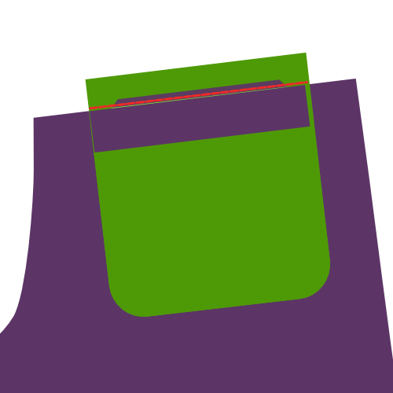

## Відео

<YouTube id='PL1gv5yv3DoZOFSXz7yydeV1H8m6pfwstn' playlist />

## Вчимося шити листочки з Девідом Пейджем Коффіном

У листопадовому випуску журналу ["Seamwork"](https://www.seamwork.com/) 2015 року є стаття ["Долаємо листочку"](https://www.seamwork.com/issues/2015/11/conquering-the-welt) ("Conquering the Welt", стаття англійською), в якій Девід Пейдж Коффін розповідає про конструювання кишень з листочками.

Девід написав декілька книг про конструювання штанів та сорочок, викладає шиття онлайн та проводить майстеркласи у США та закордоном.

Девід є другом цього вебсайту та загалом пояснює цю тему набагато краще, аніж я. *Примітка перекладача: журнал "Бурда" також має статтю ["Кишеня з листочкою: шиємо крок за кроком"](https://burdastyle.ua/encyclopedia/anatomiya-modeli/tehnologiya-shyttya/kyshenya-z-lystochkoyu-shyyemo-krok-za-krokom).

## Перш ніж почати

### Що Вам потрібно

Для виготовлення кишень з подвійною листочкою знадобляться наступні речі:

- Базові матеріали для шиття
- Тканина або деталь викрійки, на якій Ви хочете зробити кишеню
- Дві смужки тканини для листочки
- Смужка клейового матеріалу (як флізеліну чи дублерину)
- Підкладка чи інша гідна тканина для мішковини кишені (див. вибір тканини та кольору)
- Облицювання для мішковини кишені, залежно від Вашої тканини та кольору

### Виміри

Два виміри визначають розмір кишені з подвійною листочкою. А саме:

- Ширина кишені: це ширина отвору готової кишені з подвійною листочкою
- Висота листочки: це висота одинарної листочки, тобто це половина висоти нашої кишені з подвійною листочкою

> У моєму прикладі нижче ширина кишені — 13 см, висота листочки — 5 мм

## Крій

### Листочка

Листочки — це дві прямокутні смужки таких розмірів:

- Довжина: ширина кишені + 4 см
- Ширина: висота листочки ×2 + 5 см

В нашому випадку це:

- Довжина: 13 см + 4 см = 17 см
- Ширина: (5 мм × 2) + 5 см = 6 см

Ці дві вузькі смужки тканини й сформують нашу подвійну листочку.

> Зверніть увагу на структуру ниток тканини під час крою листочки

### Дублеринова деталь кишені

Це одна смужка клейового матеріалу з такими вимірами:

- Довжина: ширина кишені + 4 см
- Ширина: висота листочки ×2 + 5 см

В нашому випадку це:

- Довжина: 13 см + 4 см = 17 см
- Ширина: (5 мм × 2) + 5 см = 6 см

> Як Ви могли помітити, дублеринова деталь має такі ж заміри, як і сама листочка

Клейовий матеріал використовується для стабілізації кишені та прикріплюється до тканини за допомогою праски.

### За бажанням: облицювання кишені

(Необов'язкове) облицювання кишені — це одна прямокутна смужка такого розміру:

- Довжина: ширина кишені + 4 см
- Ширина: висота листочки ×2 + 5 см

В нашому випадку це:

- Довжина: 13 см + 4 см = 17 см
- Ширина: (5 мм × 2) + 5 см = 6 см

> Як Ви могли помітити, облицювання має такі ж заміри, як і листочка

Облицювання — це те, що Ви побачите, коли зазирнете в отвір кишені.

Облицювання є необов'язковим, без нього Ви лишень побачите тканину, з якої зроблена мішковина кишені.

### Мішковина кишені

Форма мішковини кишені залежить від викрійки. Для наочності я використовуватиму прямокутну мішковину з заокругленими краями, як на задніх кишенях багатьох штанів.

> Зазвичай одна зі сторін мішковини довша, а інша — коротша. Це тому, що одна і сторін прикріплюється до верхньої частини листочки, а інша відповідно до нижньої.

## Збірка

### Крок 1: Закріпіть клейовий матеріал

Припрасуйте клейовий матеріал до виворітного боку вбрання на місці, де Ви плануєте робити кишеню з листочкою.

> Викрійки зазвичай мають особливі позначки, які вказують на місце розташування кишені

### Крок 2: Розмітьте прорізну кишеню на лицьовому боці тканини

Розмітьте прорізну кишеню наступним чином:

- Відзначте ширину кишені вертикальними лініями. Продовжіть ці лінії, вони згодом допоможуть Вам вирівняти листочку
- Вирівняйте центральний отвір кишені за горизонтальною лінією. Продовжіть цю лінію, щоб згодом вирівняти листочку
- Проведіть дві горизонтальні лінії, паралельні до центральної, на відстані висоти листочки (5 мм у нашому випадку)

Частина горизонтальних ліній, паралельних до центральної, що знаходяться між вертикальними, — це місце, де лягатимуть наші шви. На рисунку вони зображені червоним кольором.

### Крок 3: Складіть і пропрасуйте листочку

Складіть листочку за довжиною лицьовим боком назовні.

Не складайте їх навпіл. Замість цього зробіть одну сторону на 1 см довшою за іншу.

Пропрасуйте згин, аби він став гострою складкою.

> Завдяки зміщенню країв, край листочки плавно зникає, що робить кишеню менш громіздкою на вбранні.

### Крок 4: Пришийте обидві частини листочки

> На зображенні вище чорна пунктирна лінія — це центр листочки. Червона лінія вказує на місце стьобання, а зелена — на вже зшитий шов.

Розмістіть листочку на лицьовому боці вбрання коротшою стороною донизу та відцентруйте її горизонтально.

Прикладіть згин листочки до центру кишені та далі зсуньте її вниз на подвійну висоту листочки (WH на рисунку).

У нашому випадку висота листочки 5 мм, тобто згин нашої листочки має лежати на відстані 1 см від центру кишені.

Пришийте листочку на відстані 5 мм від згину, тобто на лінії, яку ми відмітили на нашому вбранні раніше.

Переконайтеся, що Ви почали та закінчили шов на вертикальних лініях, що вказують ширину кишені.

Закінчивши, пришийте другу частину листочки. Це буде трохи складніше, адже Вам прийдеться відігнути попередню частину та розмістити цю поверх неї.

### Крок 5: Розріжте кишеню

> На зображенні червона лінія вказує на місце розрізу кишені, коли зелені показують шви.

Проріжте кишеню вздовж центральної горизонтальної лінії. Зупиніться не дорізаючи до вертикальних ліній, що вказують на ширину кишені, та зробіть надсічки під кутом 45° до країв швів листочки.

> Переконайтеся, що Ви не розрізаєте шви та не розрізаєте занадто глибоко. Зробіть це без похибки.

### Крок 6: Просуньте частини листочки всередину та пропрасуйте

Ви пришили листочку до лицьового боку тканини. Тепер ми маємо просунути її всередину через отвір, який ми щойно прорізали в тканині.

Отже, просуньте обидві частини листочки всередину та пропрасуйте їх плазом. Складіть тканину в акуратні прямокутники перш ніж припрасувати її, не поспішайте.

> Переконайтеся, що витичні трикутні шматочки тканини притиснуті по боках

> Ви притискаєте кілька шарів тканини. Зауважте, що Ви можете працювати з кожним шаром тканини окремо, аніж прасувати їх одночасно. Так Ви отримаєте чіткішу складку та охайнішу прорізну кишеню.

### Крок 7: Пришийте бокові трикутнички до листочки

 

Покладіть вбрання лицьовим боком догори й складіть його збоку так, аби обидві частини листочки та витичні трикутники лежали плазом на поверхні стола.

Пришийте трикутнички до листочки.

> Переконайтеся, що Ви не шиєте крізь отвір кишені, адже подібні стібки будуть видними з лицьового боку

### Крок 8: Пришийте нижню кишеню сумки до нижнього шва

Складіть одяг так, щоб можна було пришити кишеньковий мішечок до нижнього шва.

Також обробіть край шва зигзагоподібною строчкою, щоб шов залишався рівним всередині кишені.

> Кишенькова сумка показана в підкладковій тканині тут (зеленого кольору) з більшою чіткістю. Ви також можете зробити кишенькові сумки з іншої тканини.

### Крок 9: Необов'язково: Пришийте лицьову сторону до верхньої кишені сумки

> Цей крок не є обов'язковим. Прикріпіть лицьовою стороною до верхньої кишені сумки, якщо ви хочете, щоб її було видно через отвір кишені.

### Крок 10: Пришийте верхню кишеню сумки до верхнього шва

Виверніть виріб так, щоб можна було пришити кишеньковий мішечок до верхнього шва.

> Якщо ви наклеїли обшивку на кишенькову сумку, обов'язково покладіть її лицьовою стороною до швів.

### Крок 11: Прикріпіть шви до кишенькової сумки

  

Покладіть виріб лицьовим боком догори і складіть його збоку від прорізної кишені.

Пришийте трикутний шматок тканини від отвору кишені до кишенькових мішків так само, як ви пришивали його до швів раніше.

Загніть одяг у верхній частині прорізної кишені.

Тепер пришийте верхню частину отвору кишені до сумки-кишені.

### Крок 12: Закінчіть кишенькову сумку

Тепер зашийте кишеню назад, закривши всі краї (верхній край необов'язковий).

Для цього можна застосувати косу бейку, використати серпянку або виконати іншу оздоблювальну строчку.

Після цього все готово!
