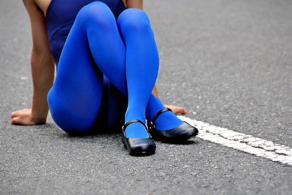

Ease is the amount of fabric that is added to a garment in addition to what is strictly required to make the garment fit.

Without ease, a garment would fit you so precisely that you might not be able to get in to it, or would have problems moving in it.

Einfach, dass Sie sich in einem Kleidungsstück bewegen können wird als Tragekomfort bezeichnet. Zusätzliche Leichtigkeit kann über den Funktionsumfang hinaus hinzugefügt werden. Dies nennt man Design-Leichtigkeit und wird verwendet, um eine bestimmte visuelle Wirkung zu erzielen.

Ease kann auch umgekehrt arbeiten. When the fabric stretches, we can choose to use less fabric than what is needed to make the garment fit. Dies nennt man **negative Leichtigkeit**.

Negatives Leichtgewicht wird bei dehnbaren Materialien verwendet, bei denen das Kleidungsstück eng passen muss. Zum Beispiel in Badebekleidung, Strumpfhose, Unterwäsche oder Sportbekleidung.

> Pictures by [Quinn Dombrowski](https://www.flickr.com/photos/quinnanya/8885126989/) and [sutiblr](https://www.flickr.com/photos/30788655@N08/4743320893) 
