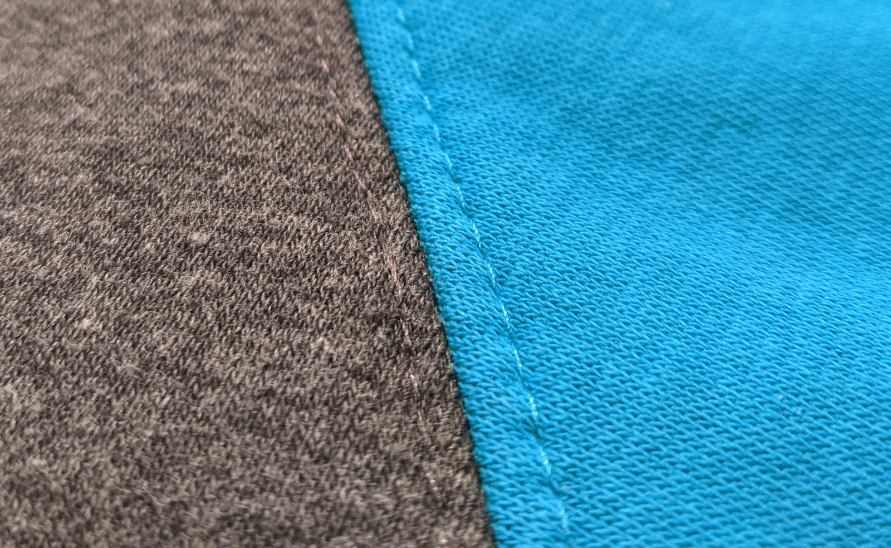

La surpiqûre nervure est un type spécifique de _surpiqûre_. Elle est spécifique en raison de son emplacement. Faire une surpiqûre nervure signifie faire une surpiqûre juste à côté d'une couture, généralement environ 3 mm ou 1/8 de pouce à côté de celle-ci.

La surpiqûre nervure peut être utilisée pour renforcer les coutures, pour maintenir le tissu en place en cousant la couture ou la doublure, et pour obtenir un effet décoratif.

<Tip>

Pour de meilleurs résultats, utilisez une aiguille de couture pour optimiser la surpiqûre

</Tip>
