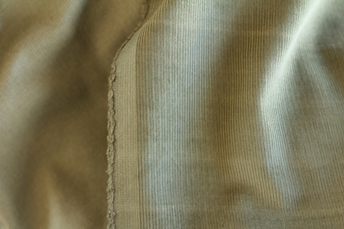

Der Fadenlauf eines Stoffes wird durch die Ausrichtung der Garne in einem Gewebe bestimmt. Genauer gesagt wird der Fadenlauf dadurch bestimmt, wie die Kettfäden verlaufen.

Gewebter Stoff wird durch das Weben des sogenannten Schussfadens zwischen den Kettfäden erzeugt. Die Kettfäden verlaufen entlang der Länge einer Stoffrolle, parallel zum Webrand, während die Schussfäden über ihre Breite hinweg hin und her verläuft.

Der Fadenlauf wird auf einem Schnittmuster angegeben. Beim Ausschneiden des Schnittmusters ist es wichtig, den aufgezeichneten Fadenlauf mit dem Fadenlauf des Stoffes auszurichten.

> Für mehr Details zu Schuss- und Kettfäden: [Weben auf Wikipedia (engl. *weaving*)](http://en.wikipedia.org/wiki/Weaving)

> ##### Verwirrt? Denk' an Holz
> 
> Holz ist nicht gewebt, sondern wächst in verschiedenen Schichten basierend auf den Jahreszeiten (Wachstumsringe). Die Art und Weise, wie diese Schichten ausgerichtet sind, ist für Holzarbeiter wichtig. Sie beeinflussen, in welchem Ausmaß das Holz nach dem Schneiden verformt wird und wie es sich biegt, sowie ein paar andere Parameter.
> 
> Genau wie Holzarbeiter/-innen dies berücksichtigen, bevor sie das Holz schneiden, solltest du den Fadenlauf berücksichtigen, bevor du deinen Stoff ausschneidest.
